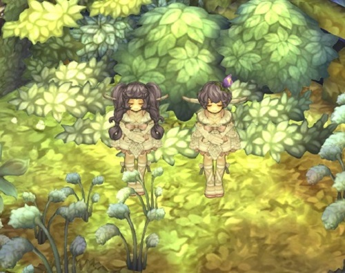
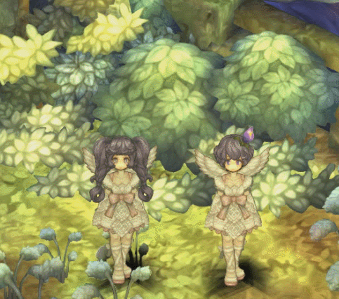
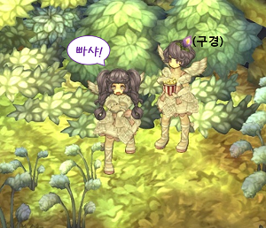
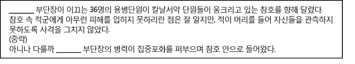
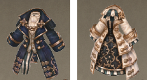

# 제 2회 트리 오브 세이비어 관심도 테스트

안녕하세요. **GM바이올렛**, **GM비비추**입니다.

구원자님 모두 황금 추석 연휴 즐겁게 보내셨나요?  
저희는 TOS 모든 이벤트들을 120% 즐기며 행복한 추석 연휴를 보냈답니다.  
또 추석 연휴 하면 빠질 수 없는 송편도 먹으며 ~~모든 캐릭터에게 송편 헬멧 코스튬을 씌워주웠습니다…!~~

저희가 함께 찾아온 이유가 궁금하실 텐데요.  
더 재미있고, 알찬 콘텐츠로 다시 돌아오겠다는 약속을 지키기 위해 **GM 바이올렛**과 **GM비비추**가 함께 찾아왔습니다. +_+

지난 번, 퍼즐과 지역 맞추기 문제를 단번에 모두 맞추시는 구원자님을 보며 깜짝 놀랬었는데요!  
보다 더 밀도 높은 TOS 지식을 확인해보고자 야심차게 준비했습니다.

&nbsp;

이름하여 **[제 2회 TOS 관심도 테스트!]**

아&#126;&#126;주 오래 전에 [제 1회 TOS 관심도 테스트]가 진행되었는데요.

이번에도 역시 정답을 모두 맞힌 구원자 여러분께는 추첨을 통해  
'넥슨캐시'를 드릴 예정이니, 많은 참여를 부탁드립니다.

제 2회 TOS 관심도 테스트는 총 **10문제**로 구성되어 있습니다.  
아홉 문제는 객관식이며 공식 홈페이지의 게임 정보와 GOS 매거진을 참고하시면 보다 더 쉽게 정답을 맞추실 수 있습니다.  
그리고 마지막 한 문제는 단답 서술형으로, 다섯 글자를 이용해 TOS를 표현할 수 있는 5자토크를 지어 주시면 됩니다! (♡)

그럼~ 시작 해볼까요?

&nbsp;

**제 2회 TOS 관심도 테스트 문항**  
규칙 1. 정해진 기간 안에 양식에 맞춰 댓글로 정답을 기재합니다.  
규칙 2. 풀기 어려운 문제는 공식 홈페이지의 게임 정보, GOS 매거진을 참고 부탁드립니다.

&nbsp; 

**1. 덫을 설치하고 적군을 자신의 트랩으로 유인하여 공격하는 클래스는 누구일까요?**

① 몽크 &nbsp;&nbsp;&nbsp;② 템플러 &nbsp;&nbsp;&nbsp;③ 새퍼 &nbsp;&nbsp;&nbsp;④ 알캐미스트

&nbsp;

**2. 살러스 수녀원 미션이 아닌 것은 무엇일까요?**

① 협곡지대 미션 &nbsp;&nbsp;&nbsp;② 칠채곡 미션 &nbsp;&nbsp;&nbsp;③ 왕릉 미션 &nbsp;&nbsp;&nbsp;④ 캐슬 미션

&nbsp;

**3. 다음 중 오르샤 마을과 페디미안 마을의 클래스 마스터 NPC의 합은 몇 명일까요?**
&nbsp;&nbsp;&nbsp; ※히든 클래스를 해금해야 나타나는 클래스 마스터는 포함하지 않습니다.

① 4명 &nbsp;&nbsp;&nbsp;② 25명 &nbsp;&nbsp;&nbsp;③ 29명 &nbsp;&nbsp;&nbsp;④ 30명
 
&nbsp;

**4. 다음 지문은 왕국 문헌을 발췌한 내용으로 빈 칸에 들어갈 단어로 알맞은 것은 무엇일까요?**

①크리크 &nbsp;&nbsp;&nbsp;② 그에라 &nbsp;&nbsp;&nbsp;③ 우스카 &nbsp;&nbsp;&nbsp;④ 프엥크

&nbsp;

**5. 다음 중 여신의 상징과 이름이 올바르게 짝지어지지 않은 것을 골라 주세요.**

① 태양의 여신 – 사울레  
② 인연의 여신 – 아우스테야  
③ 대지의 여신 – 제미나  
④ 바다의 여신 – 바카리네

&nbsp;

**6. 다음 중 “꿀 때문이야” 퀘스트를 받을 수 있는 장소는 어디일까요?**

① 테넌츠 농장 &nbsp;&nbsp;&nbsp;② 샤튼 농장 &nbsp;&nbsp;&nbsp;③ 우키스 경작지 &nbsp;&nbsp;&nbsp;④ 다이나 양봉지

&nbsp;

**7. 그림자로 가려진 해당 몬스터의 이름은 무엇일까요?**

① 트리암불로 &nbsp;&nbsp;&nbsp;② 우펜트 &nbsp;&nbsp;&nbsp;③ 요노움 &nbsp;&nbsp;&nbsp;④ 이노움

&nbsp;

**8. 아래 그림의 코스튬을 착용할 수 있는 클래스는 무엇일까요?**

①카발리스트 &nbsp;&nbsp;&nbsp;② 펜서 &nbsp;&nbsp;&nbsp;③ 세이지 &nbsp;&nbsp;&nbsp;④ 쏘마터지

&nbsp;

**9. 2016년 4월 4일 식목일 이벤트로 구원자님께서 지어주신 뱅갈 고무나무의 이름은 무엇일까요?**

① 초록이 &nbsp;&nbsp;&nbsp;② 초롱이 &nbsp;&nbsp;&nbsp;③ 사랑이 &nbsp;&nbsp;&nbsp;④ 행복이

&nbsp;

**10. TOS를 다섯 글자로 표현해 주세요. (5자토크)**

예) 트오세짱짱, 토스고고혓
 
&nbsp;

&nbsp;&nbsp;&nbsp;&nbsp;&nbsp;&nbsp;&nbsp;&nbsp;&nbsp;&nbsp;&nbsp;&nbsp;&nbsp;&nbsp;&nbsp;&nbsp;&nbsp;&nbsp;&nbsp;&nbsp;&nbsp;&nbsp;&nbsp;&nbsp; **-수고하셨습니다.-**

&nbsp;

&nbsp; 

**[유의 사항]**

**1. 기간:** 2017년 10월 10일(화) GOS 매거진 등록 후 ~ 2017년 10월 15일(일) 23시 59분까지  
**2. 참여 방법:** 이벤트 기간 동안 제2회 TOS 관심도 테스트 게시글에 정답을 댓글로 등록  
&nbsp;&nbsp;&nbsp; 댓글 예시) 1) X번 / 2) X번 / 3) X번….  
**3. 이벤트 상품:** 모두 정답을 남겨주신 구원자님 중 50명을 추첨하여 ‘넥슨캐시’ 5천원 지급  
**4. 당첨자 발표:** 10월 17일(수)에 공지사항으로 안내  

※ 중복으로 댓글을 남기신 경우, 가장 최근에 남긴 댓글로 이벤트에 참여됩니다.  
※ 작성한 10번 문항이 운영정책 [7. 홈페이지 운영정책]에 위반될 경우 사전 통보 없이 삭제되거나, 당첨자 대상에서 제외될 수 있습니다.  
※ 참여 방법과 양식을 지키지 않을 경우 당첨자 대상에서 제외될 수 있습니다.
