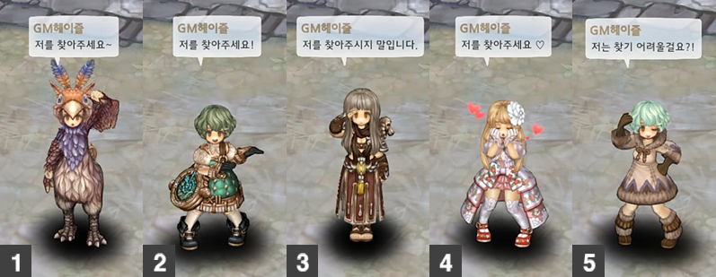
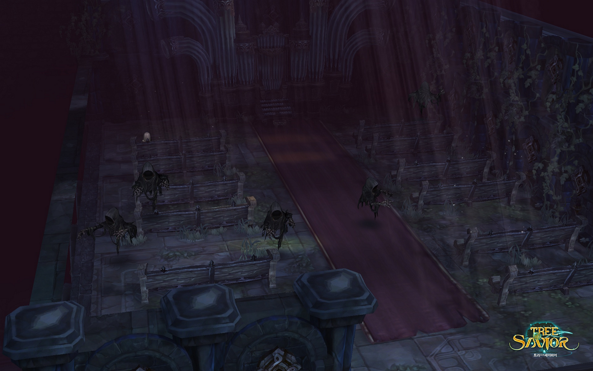
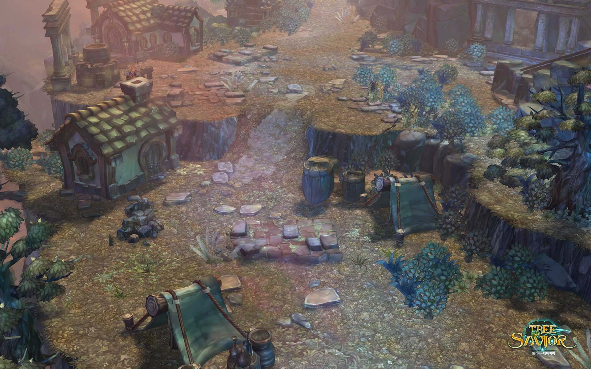
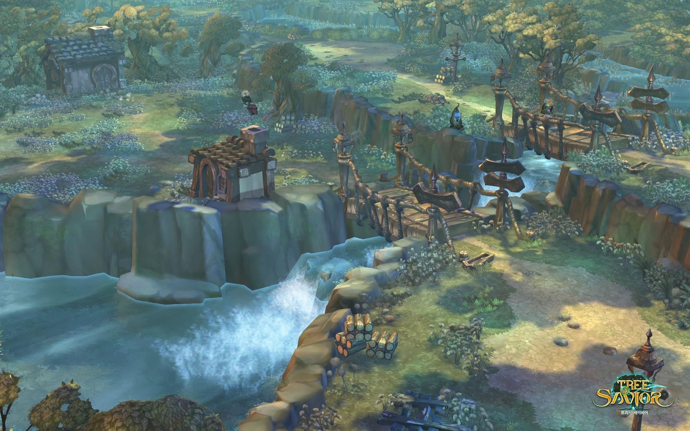

&nbsp;

# 꼭꼭 숨은 GM을 찾아라!

요즘 구원자 여러분을 직접 뵈어 너무나도 기쁜 **GM헤이즐**입니다.

점점 더워지고, 습해지는 날씨에 잘 지내고 계신가요?  
전 벌써부터 선풍기 없이는 잠을 이루지 못하겠더라구요.

게임 속에서라도 더위 + 장마를 피하기 위해 ‘코루 숲’ 한 켠에 자리를 잡아 보았습니다.

하지만 얼마 못가 블루데이지에게 들키고 말았답니다...ㅠㅠ

&nbsp;

구원자 여러분!

게임 배경 속에 숨어있는 저를 찾으면서 잠시 쉬어가는 시간을 가져보세요.  
보호색을 띄고 있어서 꼼꼼히 살피셔야 한답니다. ^^

그럼 **「숨은 GM 찾기」** 스타트~!

※  이미지를 클릭하면, 보다 큰 사이즈로 보실 수 있습니다.  
※  뒤로 갈수록 난이도가 어려워지며, 캐릭터의 일부만 빼꼼히 보입니다.  
※  본인이 찾은 정답을 댓글로 공유해 주세요! (Ex. 2, 3, 1, 5, 4)

&nbsp;

### ▣ 문제 1 &nbsp;&nbsp;테넷 성당 지하 1층 (쉬움)

어두컴컴한 테넷 성당 지하 1층입니다. 으스스한 분위기를 고조시키기 위해 할로우벤터가 특별 출현했답니다.

&nbsp;

### ▣ 문제 2 &nbsp;&nbsp;코루 숲 (보통)

초록이 무성한 코루 숲! 연출한 저조차도 다시 보니 어렵네요… 과연 구원자 여러분은?!

&nbsp;

### ▣ 문제 3 &nbsp;&nbsp;테넌츠 농장 (어려움)

거대 민들레로 가득한 테넌츠 농장입니다. 저 멀리 포도밭도 보이네요~  
이곳엔 과연 누가 숨어 있을까요?

&nbsp;

### ▣ 문제 4 &nbsp;&nbsp;페디미안 외곽 (매우 어려움)

그리타를 만나 마법사의 탑을 모험하게 되는 페디미안 외곽입니다.
주변과 물아일체된 저를 찾으실 수 있을까요?

&nbsp;

### ▣ 문제 5 &nbsp;&nbsp;다이나 양봉지 (베리베리 어려움)

라입타 시내가 흐르고 있는 다이나 양봉지의 풍경입니다.
앞의 문제들이 생각보다 쉬웠다구요? 이번엔 절대 못 찾으실걸요! (진지)

&nbsp;

어때요, 다 찾으셨나요? 댓글로 구원자님의 날카로운 매의 눈을 뽐내 주세요!
정답은 다음 편에 공개하겠습니다~

&nbsp;

