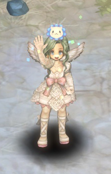

&nbsp;

# 2017 NDC 아트 전시회 스케치

안녕하세요,

GM포포트리입니다!

&nbsp;

바로 어제부터 넥슨에서 주최하는 게임 개발자 컨퍼런스인,  
NDC (NEXON DEVELOPERS CONFERENCE) 가 시작되었는데요,

NDC 아트 전시회에 마기님의 작품이 전시되었다는 소식을 듣고,  
GM포포트리가 직접 NDC 아트 전시회를 다녀와보았습니다!

&nbsp;

**[NDC가 진행 중입니다!]**

넥슨 사옥 앞에는 NDC 기간임을 알리는 깃발과 공연을 위한 스테이지를 확인하실 수 있는데요,

**[마침 공연이 없을 때 방문해서 공연 실황은 담지 못했습니다. T-T]**

스테이지를 지나면 넥슨 사옥 입구를 확인하실 수 있고,

**[여기가 NDC 아트 전시회로 가는 던전 입구!]**

넥슨 사옥 깊숙한 곳에서 NDC 아트 전시회가 진행되고 있습니다.  
정말 다양한 작품들이 전시되고 있는데요!

**[전시회는 1층과 2층으로 나뉘어 구성되어 있습니다]**

지금부터 GM포포트리가 마기님의 작품을 하나씩 찾아보도록 하겠습니다.

&nbsp;

**1. 트리 오브 세이비어 1주년 기념 화폐**

전시회 입구를 지나 안쪽으로 이동하시면  
낯익은 화풍의 그림을 발견하실 수 있는데요!

트리 오브 세이비어 1주년 기념 화폐 10종을 만나실 수 있습니다.

**[우와 돈이다!]**

멀리서 봐도 높은 퀄리티의 작품인 것을 확인하실 수 있는데요,  
가까이에서 확인하시면 세심한 디테일들이 눈에 띕니다.

**[개인적으로 좋아하는 유라테 여신의 지폐를 찍어보았습니다.]**

보시다시피 실제 지폐와 비슷한 느낌으로 제작이 되었는데요,  
디테일을 살리기 위해 금선까지 구현되어 있는 모습이 정말 인상적이었습니다!

**[아우슈리네, 라이마, 길티네, 바카리네, 제미나 화폐]**

**[바이보라, 유라테, 가비야, 아우스테야, 라다 화폐]**

실제로 보면 더욱 아름답습니다. ㅠ_ㅠ

기념 화폐는 화폐 단위가 올라갈수록 더욱 화려하게 제작하셨다고 하는데요,  
극단적으로, 단위가 50만인 아우슈리네와 10인 라다를 비교해보면 차이가 정말 분명하게 보입니다..

**[아우슈리네 여신의 단독샷은 처음 보는 것 같네요 +_+]**

실제 화폐 퀄리티가 뛰어난 만큼, 이후에 꼭 실제로도 만나볼 수 있었으면 좋겠네요!
 
&nbsp;

**2. 몽크 3서클, 레인저 3서클, 하이랜더 3서클**

기념화폐에서 조금만 몸을 틀어서 이동하면 다시 한 번 낯익은 그림들이 등장하는데요,  
몽크, 레인저, 하이랜더 3서클 코스튬을 그린 일러스트들을 만나실 수 있습니다.

**[조명 때문에 잘 안보이네요, 죄송합니다 T-T]**

게임에서만 보던 코스튬들을 커다란 그림으로 만나니  
코스튬의 디테일한 부분들을 더 확실히 확인할 수 있었습니다!

또한, 마기님의 작품들은 스케치 단계에서부터 디테일이 살아있기로 유명한데요,  
자세한 그림이 궁금하신 구원자 분들을 위해 GM포포트리가 입수한  
각 직업의 3서클 일러스트와 스케치 버전을 소개해드립니다!

**[몽크 3서클 코스튬]**

**[레인저 3서클 코스튬]**

**[하이랜더 3서클 코스튬]**

기회가 된다면 다른 클래스의 3서클 코스튬 일러스트도 볼 수 있었으면 좋겠네요. +_+

&nbsp;

**3. 아우슈리네와 9명의 여신들**

3서클 코스튬 바로 옆을 보시면, 구원자 분들께서  
그 동안 열심히 찾아 헤매었던 여신들의 모습을 보실 수 있습니다.

**[카메라의 한계를 느끼고 있습니다]**

구원자 분들께 생생한 현장을 전해드리기 위해 사진을 찍다보니  
전시회의 조명으로 인해 자세한 확인이 어렵네요, T-T

그래서, 구원자 분들을 위해 선명한 화질의 원본 파일을 준비하였습니다. +_+

**[아아 아름다우신 여신님들!]**

지금까지 NDC에 전시된 마기님의 작품들을 살펴보았는데요,  
마기님 특유의 화풍과 디테일 가득한 작품을 실제로 만나볼 수 있어서 정말 좋은 기회였던 것 같습니다!

NDC는 이번 주 목요일, 04월 27일까지 진행될 예정입니다.

만약, NDC 아트 전시회에 관심 있으신 구원자 분들이 계시다면,  
NDC가 종료된 이후에도 아트 전시회는 판교 넥슨 사옥에 전시될 예정이며

판교 넥슨 사옥에 방문하시면 마기님의 작품 외에 다른 아티스트 분들의 작품도  
함께 확인하실 수 있는 점, 안내드립니다!

&nbsp;

또한, 마기님께서 직접 밝히신 NDC 출품작 비하인드 스토리와  
지금까지의 트리 오브 세이비어 작업에 대한 이야기를 담은 인터뷰 기사도  
인벤 뉴스를 통해 공개되었으니 참고 부탁드립니다. +_+

&nbsp;

그럼 GM포포트리는 다음에 더욱 재미있는 GOS매거진으로 찾아 뵙겠습니다.

감사합니다!