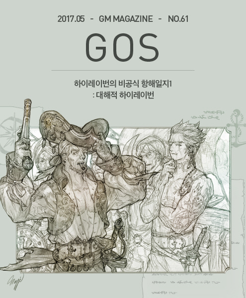
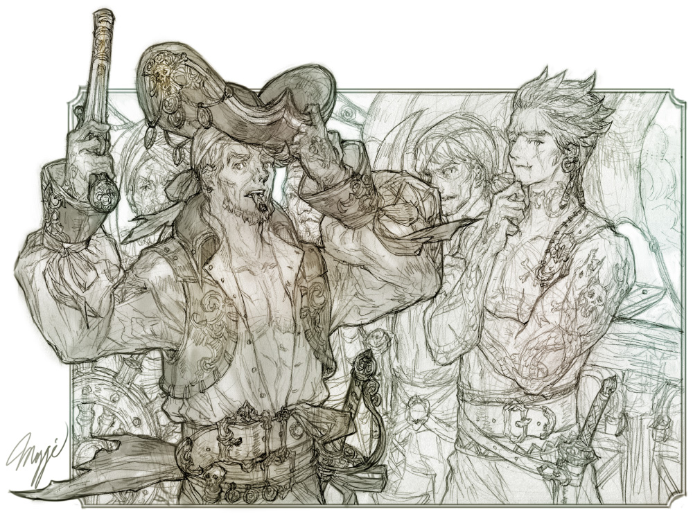
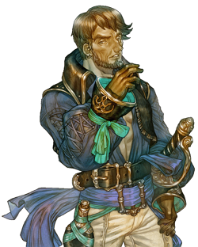

&nbsp;

# 하이레이번의 비공식 항해일지1: 대해적 하이레이번

### 하이레이번의 비공식 항해일지1

글: 허안  
삽화: 마기

&nbsp;  

&nbsp;

대해적 블라디슬로바스. 그가 걸음을 옮길 때마다 그의 발자국엔 그가 쓰러뜨린 적의 피로 찰랑거렸으며, 마족도 고개를 숙이고 뒷걸음 칠 정도로 사악하고 잔혹하기 그지 없었다. 그 무자비한 블라디슬로바스 앞에 채 솜털도 벗겨지지 않은 하이레이번이 서 있었다. 철썩이는 파도, 흔들리는 조각배..머리 위를 떠도는 갈매기들마저 숨죽여 바라보고 있었다. 이 싸움의 승리자에겐 아무것도 없었다. 그저 대해적의 이름을 지키느냐, 빼앗느냐 그것뿐. 하이레이번은 자신의 커틀러를 빼어 들고 눈 앞에 있는 블라디슬로바스에게 질풍같은 공격을 시작했다. 가슴팍을 향해서 찌르기 한 번, 양 옆구리를 향해서 두 번. 그러나 블라디슬로바스에겐 너무 빤히 보이는 공격이었다.  블라디슬로바스는 하이레이번의 커틀러스를 맞받아 친 뒤, 발로 하이레이번의 명치를 걷어 차 쓰러뜨렸다. 그리곤 마치 어린 해적을 가르치듯이.. 칼자루 끝으로 하이레이번을 마구 내려쳤다. 간신히 빠져나와서 다시 자세를 고쳐 잡은 하이레이번. 하지만 이미 하이레이번은 지쳐 있었고 전세는 블라디슬로바스에게로 기운 것 같았다.

&nbsp;

&nbsp;

하이레이번은 침을 꿀꺽 삼켰다. 아마 항복한다면, 잔인하지만 유능한 해적인 블라디슬로바스는그를 부하로 삼을지도 몰랐다. 끝낼 수 있었으면서도 한 수 늦춰준 것을 보면 그럴 가능성이 있었다. 그러나 하이레이번은 마음속으로 고개를 저으며 상대가 볼 수 없는 그 마음속에서 블라디슬로바스에게 교활한 미소를 지어주었다. 그리곤 그에게 달려들어 고집스럽게도 같은 공격을 되풀이했다. 그에게 통하지 않을 것을 알면서도..블라디슬로바스는 이제 젊은 하이레이번을 가지고 노는 게 지겨워졌다. 이번엔 칼자루가 아닌 칼 끝을 하이레이번의 핏줄 선 목에 꽂으리라. 그러나 하이레이번은 갑자기 몸을 틀더니, 허리춤에서 권총을 꺼내 방아쇠를 당겼다. 탄환은 정확히 블라디슬로바스의 미간에 박혔고, 그의 커다란 몸뚱이는 천천히 하이레이번 쪽으로 넘어졌다. '철썩!' 그 작은 조각배는 블라디슬로바스와 하이레이번의 무게를 이기지 못하고 그만 뒤집히고 말았다. 파도는 계속 조각배의 옆구리를 때렸고, 숨 죽여 구경하던 갈매기들도 꺼억꺼억 울어댔다. 그리고 바다 위엔 아무도 없었다. 그렇게 대해적의 이름은 파도에 휩쓸려갔다.

&nbsp;

&nbsp;

먼 바다가 조각배와 두 명의 대해적을 삼킨 장소에서 멀리 떨어진 곳에 거대한 하나의 배가 있었다. 그 위에서 두 무리의 남자들이 나뉘어서 각기 배의 이물과 고물을 중심으로 중간을 비우고 진영을 형성하고 있었다.

&nbsp;

보통 이런 상황에서는 서로가 서로를 쳐다보고 있기 마련이지만, 그들은 곁눈으로 가끔 서로를 보면서도 대부분의 시선은 다른 방향을 보고 있었다. 그 방향은 그들 양측 무리의 두목이 조각배 하나에 같이 타고 떠난 방향이었다.

&nbsp;

이틀 밤낮을 쉬지 않고 싸운 양측의 전투는 결국 단 한 척의 배만을 남겼다. 그리고 그 시간 동안 적으로 싸운 남자들은 이제는 전투를 중지한 채, 무언의 대치를 이어가고 있었다. 한 쪽은 원래 이 배의 주인들이었고, 다른 쪽은 전투의 와중에 자신들의 배가 침몰당하고 적선에 올라 백병전을 벌이던 남자들이었다.

&nbsp;

그러나 합의된 사항이 지켜진다면, 두 무리의 남자들은 오늘 이후 누가 원래 이 배의 사람들이었느냐에 상관없이 모두 이 배의 선원들이 될 예정이었다. 그러나 누가 이 배의 선장이 될지 누가 그들의 두목이 될지는 정해지지 않았다. 블라디슬로바스나 하이레이번 둘 중 살아서 돌아오는 쪽이 그 역할을 맡도록 그들 모두가 동의하였다. 블라디슬로바스를 거역할 해적은 없었으며, 젊은 하이레이번이 그를 죽였다면, 그 역시 마찬가지였다.

&nbsp;

지루한 무언의 대치는 고물쪽을 차지한 블라디슬로바스의 부하 가운데 한 사람이 입을 열면서 처음 깨졌다. 블라디슬로바스의 2항사로 시독SeaDog이라는 별명으로 불리는 남자였다. 가슴팍에 큰 개가 그려진 문신을 지닌 큰 덩치를 약간 세우며 이렇게 입을 열었다. “만약 다음 번 해가 질 때까지도 아무도 돌아오지 않는다면, 닻을 올리고 이 해역을 떠나는 편이 낫지 않겠나?”

&nbsp;

이물쪽을 차지하고 있던 하이레이번의 생존자 무리 가운데 가장 선임자인 3항사가 반걸음 앞으로나섰다. 여자의 다리통 굵기의 팔뚝을 지녔고, 그 팔뚝을 타고 오르는 바닷뱀의 문신을 한 오세아니드Oceanid라는 어울리지 않는 이름을 지닌 남자의 입에서 시독의 질문에 대한 답변이 나왔다. “베르니케 섬 근처에 갈 때까지 싸우지 않겠다고 유라테 여신을 두고 맹세한다면 그렇게 하지.”

&nbsp;

시독이 주저 없이 그 말을 받았다. “베르니케 섬에 도달하기 전에 이 배위에서 싸움을 하는 자들은 영원히 키보토스의 바닥짐이 되어 굴러다닐 것을 유라테 여신께 맹세한다.”

&nbsp;

시독이 이렇게 말하자 오세아니드 역시 같은 말을 반복했고, 곧 동시에 이물과 고물에서 양측 모두 같은 말을 외쳤다.

&nbsp;

모두의 맹세의 외침이 끝나자 시독이 하늘을 살짝 올려다보고는 말했다. “만약 그전에라도 폭풍이 분다면 그렇게 했으면 좋겠군. 뭐 그럴 날씨로는 보이지 않지만..”

&nbsp;

오세아니드 역시 오래 묵은 뱃사람이라 누구에게 묻지 않아도 아직은 폭풍의 조짐은 느낄 수 없었으나 시독의 말에 동의하는 표정을 지으며 말했다. “어차피 양측의 남은 인원으로는 폭풍을 감당하면서 배를 움직이는 일은 불가능하다. 뭐 다시 한 번 말해두지만, 유라테 여신께서 좋은 날씨를 주셔도 현재 양측의 인원을 다 달려들어 합심해야 겨우 베르니케 섬까지 항해할 수 있을 테니 그 때까지는 싸우고 싶어도 싸울 수 없지.”

&nbsp;

그랬다. 디슬로바스와 하이레이번의 부하들이자 왕국의 바다를 누비는 해적들인 그들이 약속을 매우 잘 지키는 사람들이라 각자 자기 두목들의 결투 결과를 기다리는 것은 아니었다.

&nbsp;

겉만 보면 그들의 두 선장은 왕국의 바다를 지배하는 대해적의 이름과 마지막 남은 이 배의 선장 자리와 한 무리는 적의 부하들이었던, 두 무리의 해적들의 두목 자리를 걸고 결투를 떠난 것으로 보였다. 그러나 그것은 사실이 아니었다. 한 가지 점에만 합의한다면 그들의 두 무리 부하들은 지금이라도 서로의 혹은 상대방의 선장을 버려두고 닻을 올리고 배를 움직여 떠나버릴 수도 있었다. 그리고 그런 행위야 말로 그들의 그간 행태와 그들의 성격에 잘 들어맞는 일이었다.

&nbsp;

그들이 그렇게 하지 못하는 이유는 지난 이틀간의 해상전이 너무 치열했기 때문이었다. 그들은 이제 새로 선장을 정하는 일로 다투고 싶지 않았다. 아니 다투고 싶었지만, 그것이 그들 모두에게 이익이 되지 않는다는 점을 명확히 알고 있었다.

&nbsp;

블라디슬로바스와 하이레이번 둘 중 하나가 돌아온다면, 그가 누구든 그들 모두의 선장이 될 것이다. 그러나 돌아오지 않는다면 일단은 이 해역을 떠나겠지만, 결국 누가 선장이 되느냐를 놓고 다시 싸움이 벌어질 수밖에 없었다. 이틀간의 치열한 전투 끝에 남은 인원이 다시 반이나 반의 반으로 줄어도 배를 운용하는데 문제가 없을 정도로 육지나 항구에 가까운 곳까지 예컨대 베르니케 섬까지 간 다음의 일이지만 말이다.

&nbsp;

그 정도까지 인원이 줄면, 누가 두목이 되든 과거의 위세를 회복하는 일은 무척 어려울 것이고, 결국은 다른 해적들의 밑으로 들어가거나 당할 수도 있었다.

&nbsp;

한 척의 배와 그것을 양측이 합쳐야 겨우 운용하여 위험한 이 해역을 벗어날 정도의 인원만 남을 때까지, 이틀간의 전투를 벌인 뒤에야 깨닫게 된 사실 때문에 양측 두목에서 말단에 이르기까지, 이 대결은 수장들간의 결투로 승부를 결정짓는다는 합의에 도달하였고, 이런 상황 가운데 두 무리는 어느 쪽이든 승자가 돌아오기를 정해진 시간까지 기다리고 있었다.

&nbsp;

시독과 오세아니드로 대표되는 양측은 다시 침묵에 잠겼다. 말끝에 혹은 불편한 시선 끝에 다시 언제든 싸움이 발화될 수 있었기 때문이다. 따라서 가능한 상대가 아닌 멀리 수평선이나 뱃전에 시선을 두었다. 어느 시선 끝에 ‘너 이 자식 눈빛이 건방져.’ 라는 한 마디면 만사가 망쳐질 수 있었기 때문이었다. 살아남은 양측의 현재 선임이 시독과 오세아니드라는 그래도 머리를 조금 쓰는 성향의 해적이라 그 점에서는 다행이었다.

&nbsp;

&nbsp;

그리고 마침내 누군가 뱃전에 걸린 줄사다리를 이용해 올라오는 소리를 들을 수 있었다. 정상적인 배라면 항상 있어야 할 망꾼 자리 돛대 위에는 사정상 서로가 서로를 견제하느라 아무도 배치할 수 없었기에 누가 올라오는지 보려면 몸을 내밀어 아래를 내려다 볼 수밖에 없었으나 양측 중 아무도 뱃전으로 갈 생각을 하지 않았다.

&nbsp;

선장들이 타고 나간 조각배가 노를 저어 다가오는 소리도 듣지 못했으니 아마도 지금 올라 오고 있는 사람은 헤엄을 쳐서 돌아온 것이 분명했다. 그렇다고 하기에는 믿기 힘들 정도로 먼 거리라고 생각되었지만, 다른 누군가가 뜬금없이 헤엄쳐 배에 접근한다고는 생각할 수 없는 해역이었다.

&nbsp;

갑판을 메운 사람들이 올라오는 자의 기척에 집중하고 있었고, 결국 그 사람의 손이 뱃전을 굳게 붙잡았다. 그러나 뱃전에 올라온 손은 누구에게도 낯익지 않았다. 피와 바닷물 그리고 햇볕의 세례를 받으며 먼 거리의 바다를 몸으로 헤엄쳤다면 그럴 수 있었다. 누구도 그 손을 돕기 위해 접근할 수 없었다. 무언의 분위기가 그것을 막고 있었다. 행여라도 자기들의 원래 선장이 아니기에 밀어버리거나 해치려고 접근한다고 반대측이 오해할 수 있었기 때문이었다. 시독과 오세아니드 역시 누구냐고 묻지 않고 조용히 두 눈과 두 귀로 뱃전에 집중하고 두 손으로는 자기 측의 생존자들이 움직이지 않도록 막는 자세를 취했다.

&nbsp;

이윽고 뱃전을 붙잡은 그 손이 힘겹게 무겁기 그지 없는 몸을 끌어당겨 한 사람의 얼굴이 마침내 뱃전 위로 올라왔다. 원래 부하들도 알아보기 힘들만큼 피로와 부상의 고통, 그 이상의 무엇을 담고 있는 하이레이번의 얼굴이었다.

&nbsp;

원래 누구의 부하였던지 해적들은 승자가 있다는 사실에 오랜 만에 유라테 여신에게 마음속으로 감사를 드렸다.

&nbsp;

하이레이번은 완전히 배 위로 올라온 후 갑판의 해적들을 천천히 좌에서 우로 훑어보면서 이렇게 말했다.

&nbsp;

“너희 모두에게 내 배에 승선을 허락한다.”

&nbsp;

마치 그 혼자 있던 배에 다른 해적들이 방금 힘겹게 올라온 상황을 묘사하는 듯한 말투였다. 사실과는 일치하지 않는 말이지만, 뱃사람들에게 승선허가는 매우 중요한 의식이었다. 다른 어떤 예식이나 취임식 따위가 없어도 그것으로 모든 문제가 해결되었다는 사실을 모두가 알았다. 그리고 이제 와서 불복할 해적도 나오지 않았다. 그 사실을 확인한 하이레이번이 다시 말했다.

&nbsp;

“나를 선장실로..”

&nbsp;

미처 말을 맺지 못하고 쓰러지는 하이레이번이 갑판 바닥에 닿기 전에 조금 전까지 꼼짝도 하지 않던 사람들이라고는 믿어지지 않을 정도의 속도로 부하들이 달려들어 그를 부축했다. 이미 기절한 선장은 옛 부하들과 새 부하들의 손으로 선장실에 눕혀졌다.

&nbsp;

&nbsp;

**&lt;다음 편에서 계속됩니다&gt;**

&nbsp;

&nbsp;

### 하이레이번(Hayravern), 커세어 마스터.

해적의 대표자로서 위신과 위엄은 있으나 그는 기본적으로 악당이며, 범죄자이다. 민간 수송선의 화물을 강탈하고, 다른 해적을 습격해 죽이고, 사로잡은 자들은 몸값을 받고 팔아넘기는 일이 그의 일상이다. 바다의 여신 유라테의 사제들은 명맥이 끊긴 것이나 다름 없어서 그는 여신의 규범에서도 가장 자유로운 악당이다. 그를 상대하는 자는 바닷사람의 규율과 해적의 법칙을 참조해야 하며 다른 도덕적 규율은 무의미하다. 바다에서 이익을 얻고 그곳에 머무르며 최고의 해적으로 모든 뱃사람을 두렵게 하는 일이 그의 인생관이다. 최근 신수의 날로 해적활동도 타격을 받았기에 그는 현재 육상에 있으며 재기에 힘쓰고 있다.