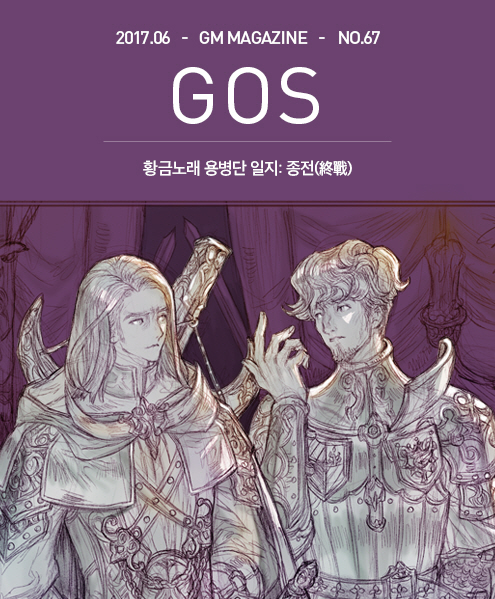
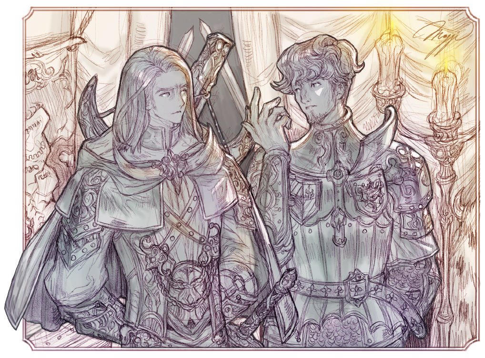

&nbsp;

# 황금노래 용병단 일지: 종전(終戰)

### 황금노래 용병단 일지: 종전(終戰)

글: 허안  
삽화: 마기

&nbsp;  

&nbsp;

“이건 월권입니다. 장군!”

&nbsp;

&nbsp;&nbsp;&nbsp;슈바르츠라이터 마스터 워시스 크리크가 목소리를 높여 자신과 마주 보고 앉은 비슷한 연령대의 청년에게 말했다. 장소는 그의 야전 막사였고 간단한 탁자를 두고 등받이가 없는 의자에 단둘이 마주 앉은 자세였다.

&nbsp;

&nbsp;&nbsp;&nbsp;“아닙니다.” 그렇게 말하는 맞은 편의 청년은 왕국군의 라민 장군이었다.

&nbsp;

&nbsp;&nbsp;&nbsp;“아니라고요? 영지 간의 분쟁은 의전대신의 권한입니다. 베이키얼 의전대신께서는 이곳 영지민의 의향과 선대로부터의 인연을 고려하시어 특별히 이번 영지 분쟁 건을 당사자들에게 일임하셨단 말입니다. 물론 영지민의 생명과 재산을 절대 다쳐서는 안 되고, 상대측 영지병과는 전투가 가능하나, 부상자는 몰라도 사망자는 용납하지 않는다는 단서가 달려있긴 하지만 말입니다. 아무튼 이것은 군부가 개입할 일이 아닙니다. 민간 귀족의 영지 다툼에 왕국군이 간섭한다면 굳이 내가 나서지 않아도 많은 사람이 앞다투어 군무대신께 항의할 테고, 국왕께서도 절대 묵과하지 않으실 겁니다.”

&nbsp;

&nbsp;&nbsp;&nbsp;“물론 군무대신께서는 의전대신의 권한에 간섭할 권리도 없고, 그럴 의향도 없습니다. 그건 왕실 친위대인 왕실기사단이나 군부의 다른 장군들 역시 마찬가지입니다.”

&nbsp;

&nbsp;&nbsp;&nbsp;“그러나 내 눈앞에 왕국군의 라민 장군이 있고, 그분 입에서 나오는 말이라 전혀 신뢰성이 없군요.”

&nbsp;

&nbsp;&nbsp;&nbsp;“공식적으로는 나와 동료들은 휴가 중입니다. 물론 군무대신께서는 휴가기간 중 왕국 각지를 다니며 군사 용지로 사용할 땅을 물색하라는 겸사겸사의 명령도 함께 받긴 했습니다. 그런데 여기 막 주인을 잃은 땅이 있는데 군사적으로도 괜찮은 땅인 것 같으니 이 땅을 확보하려 합니다. 따라서 이 영지를 두고 다른 귀족들이 다투는지 마는지 그 귀족들이 용병단을 고용해서 오랜 시간 대치 중인지 아닌지 그런 상황은 우리의 관심사가 아닙니다. 영지분쟁이 없었어도 우리는 여기를 군사용지로 전용하려 했다는 것이 우리의 공식적인 입장입니다.”

&nbsp;

&nbsp;&nbsp;&nbsp;워시스 크리크는 라민 장군의 말을 잠시 생각하다가 이렇게 말했다. “왕국군 장군 라민의 공식입장을 들었습니다. 그러나 라민 장군님의 실제 처지가 무엇인지 듣고 싶군요.”

&nbsp;

&nbsp;&nbsp;&nbsp;“네, 사실 영지 분쟁이 없었다면, 솔직히 말해서 우리가 군사용지 운운하며 끼어들지 않았을 겁니다.” 이 말을 한 후 라민 장군은 잠시 고민하다가 말을 이었다. “마스터 워시스 크리크.” 슈바르츠라이터 마스터 워시스 크리크는 라민 장군이 돌연 무게를 잡고 자신의 직함과 이름을 부르자 자세를 가다듬고 상대를 보았다. 라민 장군은 워시스 크리크가 들을 준비가 되어 있다고 생각하자 다시 입을 열었다. “정말로 솔직히 말씀드리겠습니다. 제 행위는 명백히 월권이 맞습니다. 의전대신의 일에 끼어드는 것도 맞고, 상부에서 맡긴 일도 아닌데 몽크 마스터 올파스 그림과 크리오맨서 마스터 알리스터 크로울리에게 주목하고 있으며, 또한 별의 탑이 그 강대한 무력의 화살을 갑자기 언제 어디로 돌릴지 걱정스럽습니다. 그리고 지금 언급한 사항들은 왕국의 안위를 위협하는 혹은 위협할 수 있는 요소들입니다. 그리고 군인의 입장에서는 공식적으로는 간섭할 수 없고, 실은 관심을 지니고 관찰하고 있다는 점이 알려지면 큰일 날 일입니다. 만약 이 우려가 현실로 나타난다면 그때야 개입할 수 있는 일들입니다.”

&nbsp;

&nbsp;&nbsp;&nbsp;“순전히 정론으로만 말한다면, 정작 일이 벌어지면 왕실과 조정의 명을 받아 군을 이끌고 그것을 해결하는 것이 군인의 본분이 아닙니까?”

&nbsp;

&nbsp;&nbsp;&nbsp;“그런 딱딱한 정론이 싫어서 장차 왕국의 대장군감이라는 평가를 팽개치고 용병단을 만들어 나가신 분이 그렇게 말씀하시는 겁니까? 제가 솔직히 말씀드리는 것은 마스터 크리크님이라면 말이 통하리라 생각했기 때문입니다.”

&nbsp;

&nbsp;&nbsp;&nbsp;“그래서 라민 장군께서는 일단 일이 벌어지고 나서 군을 동원하면 왕국에 끼치는 피해가 클 테고, 부하들도 다칠 테니 고지식하게 원리원칙을 지키면서 앉아만 있을 수는 없다. 그러니 불법적인 일이 아니라면 뭐라도 해야겠다. 뭐 그런 견해를 지니고 계신 거군요.”

&nbsp;

&nbsp;&nbsp;&nbsp;“그렇습니다. 왕국법을 어기지 않는 범위에서라면 당연히 나쁜 사태가 일어나기 전에 예방하고 준비하는 것이 왕국군의 장군된 자의 의무라고 생각합니다.”

&nbsp;

&nbsp;&nbsp;&nbsp;“좋습니다. 저도 그 견해에 마음이 끌립니다. 다만 제가 왕국의 대장군감이라는 평가는 사양하겠습니다. 그건 라민 장군 본인을 위해 남겨두시는 편이 좋을 듯합니다.”

&nbsp;

&nbsp;&nbsp;&nbsp;“제 위로 경륜 높고 무예가 뛰어난 장군들이 적지 않습니다. 왕국군 총사령관 자리에 제 차례는 오지 않을 듯합니다.”

&nbsp;

&nbsp;&nbsp;&nbsp;“겸양은 그쯤 해두시고, 하던 말씀을 계속 하시죠.”

&nbsp;

&nbsp;&nbsp;&nbsp;“베이키얼 의전대신은 누가 봐도 탁월한 능력을 지닌 관료고, 총명합니다. 심지어 어떤 사람들은 프리미어 에미넌트의 명성을 이을 명재상감이라고 하는 사람도 있습니다. 그러나 지난 몇 년간 이분의 일 처리를 보면 개별 사안으로는 흠잡을 곳이 없는데도 불구하고, 미묘하게 눈에 거슬리는 점이 있습니다. 예를 들면 이번 영지 분쟁이 딱 그런 사례입니다. 선대 영주의 선정을 기억하는 영지민들은 돌아가신 영주님의 아드님들인 두 분 영주 가운데 아무나 통치해도 좋으니 둘 중 한 분으로 정하는 태도고, 의전대신은 그렇다면 크게 다투지만 않는다면 알아서 자체적으로 해결하도록 해주겠다. 다만 이런저런 선은 넘으면 안 된다. 겉으로는 나무랄 곳이 없는 조치입니다만….”

&nbsp;

&nbsp;&nbsp;&nbsp;“만약 양측 영주가 고용한 용병단이 칼날서약단과 황금노래단이 아니었다면, 사태가 지금처럼 지킬 것 지키면서 대치국면의 전투로 흐르지는 않았겠죠. 결과적으로 무슨 일이 일어나도 그건 영지민들이나 용병단의 책임이 되지만, 의전대신에게는 분쟁을 유도하고 심지어 확대하려는 교묘한 의도가 숨어있는 것 아니냐? 물론 증거는 없지만… 뭐 그런 이야기가 되는 겁니까?”

&nbsp;

&nbsp;&nbsp;&nbsp;“역시 총명하시군요. 마스터 크리크. 증거만 없는 게 아니라 이미 말씀드렸듯이 과정과 논거가 뚜렷해서 아무도 흠잡을 수 없을 정도입니다. 게다가 저는 두 분 마스터와 용병단이 이곳에 묶여 있는 사실이 다른 효과를 어딘가에서 불러일으키고 있는 것이 아닐까 하는 의심도 하고 있습니다.”

&nbsp;

&nbsp;&nbsp;&nbsp;“장군의 말씀 잘 알겠습니다. 그런데 이것은 본격적인 우리 일에 들어가지 전에 해결하고 싶은 호기심 거리입니다만, 마스터들과 별의 탑도 주의 깊게 보신다고요.”

&nbsp;

&nbsp;&nbsp;&nbsp;“크리크님 자신 역시 마스터니 잘 아시겠지만, 마스터의 지위는 특별히 왕국에서 따로 작위를 받지 않아도 상급귀족의 대우를 받습니다. 물론 그보다 중요한 문제는 마스터는 실력으로 쟁취하고 인정받는 자리라는 점입니다. 그런 능력자들인 마스터 가운데 그 능력을 사적으로 이용하려 든다면 장차 큰 위해가 될 수 있습니다. 저는 그럴 가능성이 높은 마스터라고 생각되는 분들을 주목해야 한다고 봅니다.”

&nbsp;

&nbsp;&nbsp;&nbsp;“하지만 마스터 가운데는 원래부터 나쁜 사람도 있습니다. 대표적인 것이 커세어 마스터 하이레이번 아닙니까?”

&nbsp;

&nbsp;&nbsp;&nbsp;“저는 개인적으로 로멜 국왕께서 왕국 해군을 보충하기 위해 해적 선장들을 사략선장으로 임명하시고 마스터의 지위를 상징하는 증표를 내리신 일은 이제라도 철회되어야 한다고 생각합니다. 망할 해적 녀석들이 무려 800년 전에 받은 증표를 대대로 이어받으면서 왕국이 공인한 해적 마스터라고 거드름을 피우는 일은 이제 막아야 한다고 봅니다.”

&nbsp;

&nbsp;&nbsp;&nbsp;“그러나 선대 국왕의 증표를 철회시키는 일은 어렵고, 그 증표는 분명히 실력으로 서로 뺏고 뺏기면서 전해져 내려오는 것이니 실력을 증명하여 오르는 자리인 마스터라는 자리의 성격에 부합하는 바가 있다는 내용이 600년 전 카듀멜 국왕의 포고문에 담기는 바람에 후대 국왕들께서도 결국 그 증표를 무효화하지 못하고 결국 오늘날 하이레이번의 손에까지 들어갔고, 자기도 나라의 인정을 받는 마스터입네 할 수 있는 것이죠.”

&nbsp;

&nbsp;&nbsp;&nbsp;“불경한 언사이긴 하지만, 그것만 봐도 누가 뭐라 해도 카듀멜 국왕은 좋지 못한 군주였습니다.”

&nbsp;

&nbsp;&nbsp;&nbsp;“왕국에 카듀멜 국왕이 폭군이었다는 사실 모르는 사람 있습니까? 그 이야긴 그만하지요.”

&nbsp;

&nbsp;&nbsp;&nbsp;“제가 해군 소속이 아니라 하이레이번을 직접 토벌할 수 없어서 유감입니다.”

&nbsp;

&nbsp;&nbsp;&nbsp;“그런데 장군께서는 별의 탑도 걱정하신다고요? 그것은 정말 의외입니다. 샤펜스타는 지난 수 세기 동안 왕국의 든든한 동맹이고 지금 가이캉 메켄 단장도 괜찮은 사람 같은데 말입니다.”

&nbsp;

&nbsp;&nbsp;&nbsp;“네, 저도 그들이 전통이 변하지 않고 수 세기를 이어온 점을 높이 평가합니다. 지금 메켄 단장도 능력과 성품 모두 괜찮다는 평가도 동의합니다. 다만, 샤펜스타는 수도 많고, 실력도 장난 아닌데 자치권까지 지니고 있습니다. 지금까지는 그들이 초대 단장 리디아 샤펜의 유지를 잘 이어왔지만, 앞으로도 그런다는 보장은 없습니다. 순수한 군인의 관점으로 보면 지금 당장 샤펜스타가 별깃든 호수를 영토로 하여 독립국가를 세운다고 나서도 왕국군은 속수무책입니다. 세상에 난공불락의 요새는 없으며, 어떤 요새라도 보급이 끊기고 장기적인 포위를 당한 채 외부의 지원을 받지 못한다면 함락당하기 마련이다…”

&nbsp;

&nbsp;&nbsp;&nbsp;“글칸 도니휴의 저서, 전쟁론 제3장에 나오는 말이죠.” 워시스 크리크가 그렇게 말을 끊었지만, 라민 장군은 평온한 표정으로 고개를 끄덕이며 말을 이었다.

&nbsp;

&nbsp;&nbsp;&nbsp;“그러나 개국공신이며 명장인 글칸 도니휴 장군의 말씀과는 달리 별의 탑은 정말 난공불락입니다. 현실은 이론을 종종 초월한다고나 할까요? 만약 샤펜스타 단원들이 별의 탑에 박혀서 농성을 하고 그들이 늙어서 활시위를 당기지 못할 정도로 세월이 흐른 뒤에야 거길 점령할 수 있다면, 그건 사실상 난공불락이라고 해야 합니다. 그런데 여신께서 도와주시는 행운이 없다면 자카리엘 대왕과 개국전쟁 당시의 명장들이 모두 살아 돌아오신다고 하여도 별의 탑을 함락하는 방법은 샤펜스타 단원들이 늙어 죽길 바라는 방법밖에 없다고 봅니다.”

&nbsp;

&nbsp;&nbsp;&nbsp;“하지만 실제로는 이론과 달리 농성 요새는 내부의 배신자 한 명으로도 무너질 수 있습니다.”

&nbsp;

&nbsp;&nbsp;&nbsp;“네 실제 역사에서는 왕왕 그런 일이 벌어집니다. 문제는 별의 탑을 상대로는 그런 행운 말고는 기대할 것이 없다는 점입니다. 저는 왕국의 장군으로서 언제든지 자신들의 마음만 바꿔 먹으면 왕국법 따위는 무시하고 살 수 있는 집단이 있다는 그 가능성은 항상 주시해야 할 일이라고 생각합니다.”

&nbsp;

&nbsp;&nbsp;&nbsp;“좋습니다. 아직 일어나지 않은 일에 대한 한담은 이만 해두고 우리 앞의 일을 다시 논의하죠. 그래서 라민 장군께서는 현재 이 영지분쟁과 두 용병단의 대치 상황을 어떻게 타파할 생각입니까?”

&nbsp;

&nbsp;&nbsp;&nbsp;“현 상황을 보면, 마스터 그에라님이나 마스터 크리크님이나 서로 어쩌지 못하고 대처하고 노려보고 있는 상황입니다. 양측 영주님들이 줄 돈은 이미 정해져 있으니 시간을 끌수록 두 분 다 금전적으로 손해인데 몇 차례 붙어봤지만, 승부를 내지 못했고, 그렇다고 본격적으로 붙으면 다치고 죽은 부하들 보상금 지급하느라 두 용병단 모두 손해가 막심할 겁니다. 용병단장 앞에서 할 말은 아니지만, 솔직히 용병이란 것이 적당히 밥값 하는 척, 싸우는 척만 하기도 하고, 오늘은 사상자가 예상보다 많이 나와서 위로금과 보상금 지급하려면 손해가 막심하니 서로 그만 싸우자고 무언의 합의를 하기도 하고 그러지 않습니까.”

&nbsp;

&nbsp;&nbsp;&nbsp;“제게 용병단의 생리에 관해서 설명하실 필요는 없습니다. 상황을 종식시킬 필요성 특히 이익을 추구하는 것이 특징인 용병단으로서 필요성은 저도 잘 압니다. 사람들은 돈 밝히는 용병은 그에라만 그러는 줄 알지만, 저라고 해서 경제관념이 없으면 용병단을 어떻게 운영하겠습니까?”

&nbsp;

&nbsp;&nbsp;&nbsp;“알겠습니다. 간단히 말씀 드리겠습니다. 이곳을 떠나십시오. 마침 듣자 하니 빠른 시일 내에 왕국 수도로 돌아가 투기장 운영자 프리엄이 양성한 검투사들을 부하 용병단원으로 받아들일 계약이 있다고 들었습니다. 그 계약 건을 놓치면 날리는 것은 선금을 포함해서 여러 가지 아닙니까? 그보다는 지금의 영지 전투 계약을 망치고 당장 출발하십시오. 이기지 못하고 물러나니 성공보수는 없지만, 그렇다고 지고 물러나도 일정 액수는 받기로 계약하셨을 테고, 여기서 이겨서 성공할 경우 받기로 되어 있는 추가 사례금을 받으면 모를까 머물다가 지기라도 한다면 이중의 손해 아닙니까? 이런 경우 위험 부담을 최소로 줄이고 어떤 경우에도 가장 적게 손해 보는 길은 지금 당장 떠나는 것입니다.”

&nbsp;

&nbsp;&nbsp;&nbsp;“돈만 생각하면 그것이 합리적이고 최소의 위험 부담을 지는 일이지만, 그래도..”

&nbsp;

&nbsp;&nbsp;&nbsp;“저와 제 부하들이 지금 크리크 마스터님이 차지한 이곳을 지키겠습니다. 그럼 칼날서약단은 절대 우릴 공격하지 못합니다. 왕국군을 공격한다는 것은 상상하기 어렵고, 설령 진짜로 전투가 벌어진다고 하더라도 저와 부하들은 기쁠 겁니다. 마스터 그에라의 실력을 직접 경험하는 일은 짜릿할 것 같습니다. 이런 기회가 아니면 언제 이런 대가와 붙을 기회가 있겠습니까?”

&nbsp;

&nbsp;&nbsp;&nbsp;“법적으로 문제가 있을 텐데요?”

&nbsp;

&nbsp;&nbsp;&nbsp;“말씀드렸듯이 마스터 그에라와 그의 칼날서약단이 차지한 성채를 군용으로 내놓으라고 우길 겁니다. 의전대신과 군무대신에게 사람이 왔다 갔다 하고 조정에서 설왕설래 의견이 오가다가 결국 저에게 물러서라는 명령이 내려오겠지만, 시간은 많이 걸릴 겁니다. 상부의 군용지 탐색 명령을 확대해석했다고 징계를 받을 수도 있지만, 그 정도는 각오하고 있습니다. 혹시 수도에 있는 제 상관이신 빈센타스 장군님과 동료 장군들이 잘해준다면 정말로 군용지로 인가받을 수도 있습니다. 그렇게 되면 두 분 마스터를 고용한 두 영주님은 완전히 망한 거죠. 사실 이건 의전대신의 권한이니 그렇게까지 일이 잘되리라곤 생각하지 않지만, 틸레니스 왕자님이나 카오닐라 공주님 같은 왕실분들도 군부에 호의적이시고 제 친구인 헤오샤 장군이나 앨러너데일을 좋아하시니 그런저런 상황을 고려하면 그래도 최소한 징계 수위가 강등까지 가지는 않을 겁니다. 그래도 감봉이나 무급 정직 정도는 생각하고 있습니다.”

&nbsp;

&nbsp;&nbsp;&nbsp;“이왕 그럴 작정이라면, 군용지로 수용하는 것은 물론이고 주둔 비용까지 분쟁 영지에서 징발로 감당하겠다고 주장하는 편이 낫겠군요. 두 영주분 가운데 누가 분쟁 영지를 차지해도 거기서 나오는 소출은 고스란히 본성을 차지하고 주둔한 왕국군의 유지비용으로 들어가서 실질적으로는 건질 것이 없도록 말이죠.”

&nbsp;

&nbsp;&nbsp;&nbsp;“그거 좋은 생각입니다. 실제로 그렇게 할 수는 없겠지만, 그런 무리한 요구를 내세우면 두 분 영주도 생각을 다시 할 수도 있을 겁니다. 그러면 적당히 영지를 반분하자는 협상안이 다시 나오면 이전과는 달리 진지하게 고려해볼 가능성이 높아질 것 같습니다.”

&nbsp;

&nbsp;&nbsp;&nbsp;“아무래도 그 협상안은 마스터 그에라가 내놓도록 하는 것이 좋을 것 같군요. 나는 이미 떠난 후가 될 테니 그에라도 뭔가 이 분쟁의 종식에 큰 영향을 미쳤다는 명분을 건지고 나름대로 성공보수를 두 영주에게 반분시켜 받을 가능성도 생길 테니까요.”

&nbsp;

&nbsp;&nbsp;&nbsp;“뭡니까? 그건 경쟁자지만 그래도 동종업자에 대한 배려입니까? 하하.”

&nbsp;

&nbsp;&nbsp;&nbsp;“그렇다고 해두죠. 좋습니다. 즉시 철군할 준비를 하도록 명령하겠습니다. 하지만 제 고용주와 그분의 영지병들이 제가 자리를 비운 사이에 마스터 그에라에게 당하지 않도록 철저히 지켜주셔야 합니다.”

&nbsp;

&nbsp;&nbsp;&nbsp;“이 라민이 그렇게 못 미더우십니까? 그래도 나름대로는 왕국군에서 쓸만한 장군이라는 것이 평가인데 말입니다.”

&nbsp;

&nbsp;&nbsp;&nbsp;“믿지 않는다면 철군도 안 합니다.”

&nbsp;

&nbsp;&nbsp;&nbsp;“감사합니다. 마스터 크리크.”

&nbsp;

&nbsp;&nbsp;&nbsp;“좋은 제안을 들고 와서 고맙습니다. 라민 장군.”

&nbsp;

&nbsp;&nbsp;&nbsp;두 사람은 일어서서 야전 탁자 위로 손을 내밀어 악수를 하는 것으로 대화를 마무리하였다.