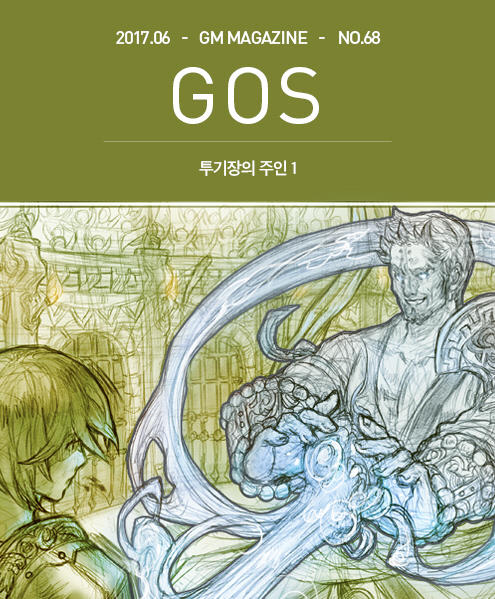

&nbsp;

# 투기장의 주인

### 투기장의 주인

글: 허안  
삽화: 마기

&nbsp;  

&nbsp;

&nbsp;&nbsp;&nbsp;쾅 하는 거친 소리와 함께 한 여자가 프리엄의 방에 들어섰다. 발로 차서 열지 않았다 뿐이지 들어서는 태도와 문을 여는 난폭함은 들어선 여자가 몹시 화가 나있다는 사실을 알려주었다.

&nbsp;

&nbsp;&nbsp;&nbsp;프리엄은 천천히 탁자를 짚고 의자를 뒤로 밀면서 일어나 인사를 했다. “이런 이런 제 방까지 직업 왕림해주시다니 부르시면 제가 달려갔을 텐데요. 어찌되었건 영광입니다. 마스터.”

&nbsp;

&nbsp;&nbsp;&nbsp;들어선 여자, 무르밀로 마스터 펠릭시아는 흥분한 모습 그대로 다가와 양손을 꺾어 강하게 프리엄의 탁자를 짚은 다음 말했다. “누구 마음대로 대진표를 바꾼 겁니까?”

&nbsp;

&nbsp;&nbsp;&nbsp;“그야 제 마음대로죠. 아시다시피 투기장의 연간 월간 주간의 모든 행사와 일정을 비롯해 재정관리, 인력관리 기타 등등의 행정업무를 하는 것이 제 책임이고 권한이지 않습니까?”

&nbsp;

&nbsp;&nbsp;&nbsp;펠릭시아는 상대의 뻔뻔한 그러나 반박할 수 없는 사실에 기초한 답변에 더 화가 났지만, 화는 나는데 딱히 말이 생각나지 않아서 머뭇거렸다. 그러자 프리엄이 말을 이었다. “네, 제가 조금 사무적으로 딱딱하게 말씀 드렸군요. 죄송합니다. 그러나 아마도 마스터께서 하셨어야 할 바른 질문은 이런 것이겠지요. 누구 마음대로 대진표를 바꾼 거냐가 아니라 왜 대진표를 바꾼 것이냐? 대진표를 바꾸고 조정하는 것은 제 책임과 권한이지만, 그것이 합리적으로 정당하게 이루어졌는지는 마스터께서도 충분히 관심을 지닐 권리가 계시니까 말입니다.”

&nbsp;

&nbsp;&nbsp;&nbsp;“그.. 그래. 그렇소. 그런 얘기였지. 맞아. 암만. 흠흠. 그러니까 내 말이 그 말이오. 왜 대진표를 당일에 갑자기 멋대로 바꿨소?”

&nbsp;

&nbsp;&nbsp;&nbsp;“절대로 멋대로 바꾸지 않았습니다. 다 투기장에 오시는 관객의 흥미를 높이고, 그로써 투기장의 이익을 높이고자 하는 투기장 운영을 맡은 책임자의 고민이 담긴 선택입니다. 마스터께서야 관중들 앞에서 싸움만 하시면 돈이 저절로 들어오고 투기장 운영이 그냥 굴러가는 줄 아시지만, 절대로 그렇지 않단 말입니다. 솔직히 제가 투기장을 운영한 뒤로 펠릭시아님에게 들어가는 배당금도 훨씬 늘어났지요. 안 그렇습니까?”

&nbsp;

&nbsp;&nbsp;&nbsp;“그.. 그건 사실이지만, 에이.. 하여간 내 말은 왜 내 제자의….”

&nbsp;

&nbsp;&nbsp;&nbsp;“제자분의 순서를 바꾼 것은 말씀 드린 그대로 흥행을 위해서입니다. 솔직히 말이 제자지 나이차도 별로 안 나는 분들이 마스터님을 중심으로 모여서 무리를 이룬… 아 뭐 단체라고 해두지요. 아무튼 단체를 이룬 것이고, 오늘 순서를 변경한 사람은 그 일원 아닙니까? 그게 무슨 공식적인 단체도 아니고 말입니다. 솔직히 말해서 관객들은 그 사람이 무르밀로 마스터 제자인지 아니면 또 다른 어떤 마스터분의 친구인지 전혀 모른다는 말입니다. 그저 싸움 좀 하는 친구가 요새 좀 승률이 높구나. 그렇게 생각하겠죠. 뭐 시간이 지나면 알고 보니 누구 제자라더라 누구 친구라더라 소문도 퍼지고, 그러면 흥행에도 도움이 되겠지만, 현재까지는 아니란 말입니다. 그러니까 대전 순서라도 바꿔서 흥미진진해야죠. 이기면 뭐합니까? 다음에 누구랑 붙을지 궁금하지 않은 사람은 백날 이겨봐야 도움이 안 됩니다.”

&nbsp;

&nbsp;&nbsp;&nbsp;“그래서 누구랑 붙일 건데?”

&nbsp;

&nbsp;&nbsp;&nbsp;“그건 비밀입니다. 그래야 호기심이 높아지고 흥행이 됩니다. 어제까지 7연승한 아무개가 오늘은 정체불명의 투사와 예측할 수 없는 추첨으로 한판 붙을 거라고 이미 왕도 곳곳에 홍보 중입니다. 모르긴 몰라도 오늘 그 덕분에 사람 더 올 겁니다. 그러면 투기장에 지분을 지니신 펠릭시아 마스터님도 도움이 될 겁니다. 배당금 받으시면 그 주위 제자라는 분들에게 베푸시는 거 제가 언제 뭐라고 했습니까? 이번에도 뜻대로 하세요. 하지만 특별한 이유 없이 제가 공들여 만든 기획과 행사 일정에 참견하시지 말고 말입니다.”

&nbsp;

&nbsp;&nbsp;&nbsp;“지분 이야기가 나와서 말인데 당신이 투기장 지분의 최대 소유자지만, 과반 소유자는 아니야. 그러니까 너무 나대지 말라고..”

&nbsp;

&nbsp;&nbsp;&nbsp;“그럴 리가 있습니까? 저는 힘없는 상인에 불과합니다. 펠릭시아 마스터 같으신 분들이 넘쳐나는 곳이 여기입니다. 제가 불법적인 수작을 부리다 걸리면 왕법에 의해 데포에트 법무대신 앞에 가기도 전에 투기장 마스터 분들 창날 맛을 먼저 볼 곳입니다. 제가 그렇게까지 용감하지 않습니다. 그리고 용기 이야기가 나와서 말입니다만 뭐 정 겁이 나시면 지금이라도 다시 바꿔드릴 수도 있습니다만..”

&nbsp;

&nbsp;&nbsp;&nbsp;“누가 겁을 먹는다는 거야? 절대로 그런 일 없어. 투기장에 서는 자, 상대가 누구든 두려워하지 않아야 한다고. 그래도 다음부터는 내게 먼저 통보라도 해주도록 하라고요.”

&nbsp;

&nbsp;&nbsp;&nbsp;펠릭시아가 끝에는 약간 부드럽게 말을 하면서 방을 나가자 그 등에 대고 프리엄이 말했다. “알겠습니다. 명심하겠습니다. 마스터.”

&nbsp;

&nbsp;

&nbsp;&nbsp;&nbsp;펠릭시아 무르밀로 마스터가 나가고 다시 혼자가 되자, 프리엄은 다시 탁자에 의자를 당겨 앉아 사무를 보기 시작했다. 그리고 얼마 지나지 않을 때 문을 열고 들어온 사람이 없는데도 누군가 그의 앞에 섰고 말을 걸었다. “바쁜가?”

&nbsp;

&nbsp;&nbsp;&nbsp;프리엄은 그 말에 자리에서 일어나 앞에 선 사람에게 예의를 표했다. “오셨습니까? 마스터.” 호칭은 같은 마스터였고, 말투도 똑같이 공손했지만, 프리엄의 어조에는 펠릭시아를 대할 때와는 다른 무엇이 있었다. 그것은 공경심이라기 보다는 진심이라고 할 것이 담겨있다고 보였다. 프리엄의 방에 둘 만이 아는 통로를 통해 들어온 사람 즉, 몽크 마스터 올파스 그림이 말했다. “특별한 사항이 있나?”

&nbsp;

&nbsp;&nbsp;&nbsp;“펠릭시아가 바뀐 대진표에 반발해서 왔다가 그냥 돌아갔습니다. 그러니 예정대로 진행하시면 되겠습니다. 가능하면 한 방에 죽여버리십시오. 7연승이나 했다니 괜찮을 줄 알았는데 그렇게 약할 줄은 몰랐다 뭐 그런 식으로 몰고 가겠습니다.”

&nbsp;

&nbsp;&nbsp;&nbsp;“그렇게 하지. 무르밀로든 뭐든 투기장 관련된 마스터들 추종자의 숫자가 너무 늘어나면 곤란하니까 가끔 적절하게 숫자 조절을 해야지. 그래도 내가 직접 나서야 할 정도니 꽤 하는 친구 같군.”

&nbsp;

&nbsp;&nbsp;&nbsp;“네 그렇습니다. 그렇지 않았으면 연승하지 못하도록 대진표를 조정하고 시합 사이의 간격도 조정해서 불리하게 했는데도 여기까지 오지 못했을 겁니다. 무르밀로 마스터를 따르는 자들이 많은 건 곤란합니다. 그리고 그 녀석 죽으면 펠릭시아가 유족들 돌본다고 돈을 쓸 테니 배당금 받아도 지갑은 텅 빌 겁니다.”

&nbsp;

&nbsp;&nbsp;&nbsp;“좋아. 다른 일은?”

&nbsp;

&nbsp;&nbsp;&nbsp;“하이레이번이 포로를 꽤 모았다고 거래 일자와 방법을 구체적으로 정하자고 사람을 보냈습니다.”

&nbsp;

“누가 왔지?”

&nbsp;

&nbsp;&nbsp;&nbsp;“오세아니드인가 하는 여자 같은 이름을 지닌 주제에 팔에는 뱀 문신 한 녀석 기억하십니까? 그 녀석입니다.”

&nbsp;

&nbsp;&nbsp;&nbsp;“알겠네. 또 다른 일은?”

&nbsp;

&nbsp;&nbsp;&nbsp;“니모켄이 온답니다. 직접 만나시지 않는 편이 좋습니다. 제가 상대하겠습니다.”

&nbsp;

&nbsp;&nbsp;&nbsp;“그래. 레인저 마스터는 가능한 적게 마주치는 편이 좋지. 그쪽에는 계속 빚을 지어두는 편이 좋아.”

&nbsp;

&nbsp;&nbsp;&nbsp;“그러고 보니 곧 올지 모릅니다.”

&nbsp;

&nbsp;&nbsp;&nbsp;“그래 일단 갔다가 다시 와서 다음 일들을 이야기하도록 하지.”

&nbsp;

&nbsp;

&nbsp;&nbsp;&nbsp;올파스 그림이 사라지자 프리엄은 다시 제 자리에 앉아 서류를 보기 시작했다. 얼마나 시간이 흘렀을까 결국 문을 두드리는 소리가 들렸다. “들어오십시오.” 프리엄이 말하자 문이 열리고 레인저 마스터 니모켄이 들어섰다.

&nbsp;

&nbsp;&nbsp;&nbsp;“아이고, 마스터께서 머나먼 클라페다에서 여기까지 어인 일로?”

&nbsp;

&nbsp;&nbsp;&nbsp;니모켄이 다가오며 프리엄의 탁자에 돈주머니를 올려 놓으며 말했다.

&nbsp;

&nbsp;&nbsp;&nbsp;“그 가식적인 모습은 여전하군. 분명히 오늘이 이자 내는 날 아니던가?”

&nbsp;

&nbsp;&nbsp;&nbsp;“아니 뭐 그런 일로, 이 먼 길을.. 제가 언제 이자 제 날짜에 꼬박꼬박 내라고 했습니까? 조금 밀리셔도 됩니다.”

&nbsp;

&nbsp;&nbsp;&nbsp;“그래 놓고. 나중에 이자 안 냈다고 무슨 생트집을 잡으려고 내가 그 속을 모를 것 같은가?”

&nbsp;

&nbsp;&nbsp;&nbsp;“이자는 채무 관계 규정상 형식적으로 기재한 내용이었습니다. 그러니 기간도 분기에 한 번 소액으로 받는 것 아닙니까? 이자 받을 생각이었으면 케도라 상단에 예치했죠. 빌려드린 금액을 거기다 예치하고 이자를 쌓이도록 두었으면, 케도라 상단 VIP 명단에 제가 드루이드 마스터 지나 그린님 다음으로 적혀 있을 겁니다.”

&nbsp;

&nbsp;&nbsp;&nbsp;“그런 돈을 일반적인 이자를 받고 빌렸으면, 드루이드 마스터라도 파산했을 거야. 나도 애초에 그런 무리한 융통을 하지도 않았을 테고…”

&nbsp;

&nbsp;&nbsp;&nbsp;“에이 무슨 말씀을.. 지나 그린님의 재산이 얼마나 대단한지 모르시는군요. 제게 투기장이 10개 있어서 몽땅 판다고 하더라도…”

&nbsp;

&nbsp;&nbsp;&nbsp;“됐어. 그런 말은 더 듣고 싶지 않아. 그래서 오늘은 올파스를 볼 수 있는 거야?”

&nbsp;

&nbsp;&nbsp;&nbsp;“올파스님은 바쁘셔서 그렇지 않아도 제가 오신다는 말을 듣고 열심히 말씀 드렸는데 요즘 수련에 집중하시느라 힘드신가 봅니다. 어쨌거나 수련을 바탕으로 신심을 키우는 성직자시니까요.”

&nbsp;

&nbsp;&nbsp;&nbsp;“그런 성직자가 돈놀이를 하고 있지.”

&nbsp;

&nbsp;&nbsp;&nbsp;“아니죠. 돈놀이는커녕 돈 관리에 서투신 성직자시니까 저 같이 돈에 밝고 믿을만한 사람에게 재산 관리를 대신 시키고 계시는 것이죠.”

&nbsp;

&nbsp;&nbsp;&nbsp;“내가 오늘 당신을 처음 만나는 사람이라면 그 말을 믿지 않을 수 없겠지만, 처음이 아니라 다행이야.”

&nbsp;

&nbsp;&nbsp;&nbsp;“칭찬으로 듣겠습니다.”

&nbsp;

&nbsp;&nbsp;&nbsp;“휴… 사람들은 파드너 마스터가 돈만 아는 성직자라고 하지만 그건 드러난 현상만을 보고 하는 소리지. 사실은 파드너 마스터는 발치도 못 따를 엄청난 성직자는 따로 있는데 말이야.”

&nbsp;

&nbsp;&nbsp;&nbsp;니모켄이 이렇게 말하자 그 때까지는 능글능글한 태도로 니모켄을 상대하던 프리엄이 낯빛을 고치고 그러나 여전히 미소를 머금은 채 말했다. “몽크 마스터님을 조금 아는 사람들은 몽크 마스터님이 고리대금업자와 다를 바 없다고 하지만 그거야 말로 드러난 현상 만을 보고 하는 이야기죠. 우리 마스터께서는 돈에 관심을 지니신 게 아닙니다. 그분의 눈은 더 높은 곳을 보고 있습니다. 그리고 그 목표는 성직자의 이상과 배치되지 않습니다. 범인들이 이해하든 말든 그렇습니다.”

&nbsp;

&nbsp;&nbsp;&nbsp;“충성스러운 부하군. 그런 충성스러운 부하가 투기장의 이득을 빼돌리고 있다는 사실을 올파스가알면 어떻게 될까?”

&nbsp;

&nbsp;&nbsp;&nbsp;프리엄이 미소를 더 짙게 하며 답했다. “투기장의 주인은 공식적으로 접니다. 아, 정확히는 최대 지분 소유자이지요. 어쨌거나 제가 거둔 이득 중 일부를 몽크 마스터께 기부하는 행위는 완전히 합법적인 일입니다. 따지고 보면 아주 신성한 종교적 헌금입니다. 제 배당금을 제가 가지는 것이고, 제가 주고 싶어서 헌금을 내는 것이지 아무도 무엇도 빼돌리는 행위는 전혀 없습니다. 여기는 왕국 수도의 투기장입니다. 수많은 귀족고관과 때로는 국왕께서도 관람하시고 관심을 기울이시는 곳인데 그런 비리가 있을 리가 없지요.”

&nbsp;

&nbsp;&nbsp;&nbsp;니모켄은 잠시 말이 없다가 이렇게 말했다. “만약 내가 더 이상 당신들에게 빚진 것이 없는 날이 오면, 법무대신께 제 발로 찾아가 자수하는 편이 좋을 거야. 안 그러면 내가 자수할 테니까. 물론 자수할 때 밝힐 나의 죄목은 증명하거나 정당화 할 수 없는 사적인 복수에 기반한 살인의 행사가 되겠지.”

&nbsp;

&nbsp;&nbsp;&nbsp;“휴우… 죄송하지만, 제 머리를 언급한 사람은 이제까지 적지 않았고, 그 사람들 중에 마스터분도 적지 않았으나 놀랍게도 아직도 제 머리가 제 몸에 붙어있다는 사실을 알려드리고 싶습니다.” 이렇게 말한 프리엄은 여전히 웃음을 머금은 채 그러나 이전보다 더 강력한 어조로 이렇게 덧붙였다. “또한 레인저 마스터께서는 레인저들의 수장으로서의 명예는 물론이거니와 샤펜스타의 단원이었던 사람으로서 리디아 샤펜의 이름까지 걸고 맹세를 하셨다는 사실을 상기시켜 드리고 싶습니다. 그러니까 어디 가서 우리 사이의 일을 언급하시는 일은 없다고 믿습니다. 최소한 저희에게 지신 빚을 갚을 때까지는 말입니다.”

&nbsp;

&nbsp;&nbsp;&nbsp;“좋아. 알아들었어. 이제부터는 내가 너희들을 피해 다니는 편이 낫겠군. 뭔가 어려우면서 나쁜 일을 시키려고 할 그 속셈이 뻔하니까 말이야. 뭐 이자는 꼬박꼬박 대신 보낼 테니 걱정하지 않아도 좋아.” 그렇게 말하고 니모켄은 대답은 굳이 들을 필요 없다는 태도로 방을 나섰다. 그래도 프리엄은 인사를 했다.

&nbsp;

&nbsp;&nbsp;&nbsp;“클라페다까지 평안한 여행을 기원합니다. 안녕히 가십시오.”

&nbsp;

&nbsp;&nbsp;&nbsp;그렇게 세 번째 방문자를 보내고 프리엄은 다시 일을 하기 위해 탁자로 돌아갔다. 그러나 오늘의 방문자는 아직 더 있었고 그 사람들은 프리엄의 예정에는 없던 사람들이었다.

&nbsp;

&nbsp;

**&lt;다음 편에서 계속됩니다&gt;**

&nbsp;

&nbsp;

### 올파스 그림(Olfas Grimm), 몽크 마스터.

몽크 마스터이자 반목의 중심이다. 자신만의 독선적인 계율을 따르기 때문에 일반적인 도덕적 기준에 위배되는 행동을 한다. 매우 영리하며 그의 성격을 알든 모르든 그에게 피해를 보기 쉽다. 목적을 위해 수단을 가리지 않으며, 그러므로 상대에 따라 보여주는 성격이 달라지기도 한다.

세상은 그를 이기적인 인간이라 하지만, 그는 수행자는 본시 고독하다고 주장한다. 몽크는 기도와 제례를 완전히 배제하는 성직자는 아니나 그보다 신체단련을 통한 수련자이기에 이를 통한 자기확신이 강하다는 점에서 다른 성직자와 큰 차이를 보인다.