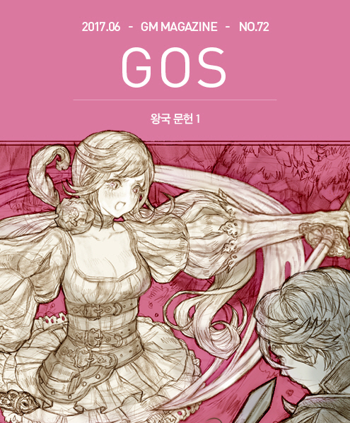

&nbsp;

# 왕국 문헌 1

### * 왕국문헌 보관소 공식기록 제1096-562호 문서 상편: 폴라니 영지의 전투에 관한 건

글: 허안  
삽화: 마기

&nbsp;  

&nbsp;

&nbsp;&nbsp;&nbsp;&nbsp;&nbsp;&nbsp;다음의 기록은 각기 마스터 그에라와 마스터 워시스 크리크가 이끄는 용병단인 칼날서약단과 황금노래단이 폴라니 영지에서 벌인 전투에 관한 내용이다. 불행히도 이 기록은 이후 이 전투의 종전에 라민 장군이 관련됨으로써 군무대신과 의전대신 등 조정의 여러 고관들에 의해 기밀로 분류되었다. 불행 중 다행인 일은 이 전투의 첫 전투와 그 내용은 그 과정을 목격하거나 겪은 사람들에 의해 기록되고 외부에 널리 알려질 수 있었다는 점이다. 왕국 기록관들 역시 뜻을 모아 이 초전은 기밀문서로 지정하지 않도록 상부에 청원하였으며, 그 결과 아래의 기록은 공개가 허용되었기에 이렇게 기록하는 바이다.

&nbsp;

&nbsp;&nbsp;&nbsp;왕국력 1096년(타히엘 국왕 재위 11년) 1월 왕국 수석 기록관 에센 요나스

&nbsp;

&nbsp;

&nbsp;&nbsp;&nbsp;그에라는 펜을 놓고 탁자를 들여다보았다. 그리고 다시 고개를 들어 그와 같이 탁자의 지도를 내려다보고 있던 부하 사관 세 명을 차례로 보았다. 그에라는 생각했다. 불과 얼마 전까지는 두 명의 사관과 한 명의 총사관이 더 있었는데 그 세 사람은 모두 이 자리에 없다.

&nbsp;

&nbsp;&nbsp;&nbsp;병력도 그 때에 비하면 많이 줄어서 150명대가 되었다. 여러 면에서 하이레이번의 해적단과 조우하여 전멸한 일은 시간이 지났음에도 아직도 뼈아픈 일이었다.

&nbsp;

&nbsp;&nbsp;&nbsp;그나마 참호 파기 공사에 고용주측 영지민들을 동원할 수 없었다면, 큰일 날 뻔하였다 라고 생각하고 있는데 사관 중 하나가 말을 걸었다.

&nbsp;

&nbsp;&nbsp;&nbsp;“황금노래단이 도착하기 전에 참호공사를 끝낼 수 있어서 다행입니다.”

&nbsp;

&nbsp;&nbsp;&nbsp;그에라가 그 말에 고개를 끄덕이면서 말했다. “필요 없을 거라 생각한 일이지만, 기본적인 일을 해둔 덕분에 한 가지 다행스러운 일이 되긴 했지. 그 점은 다행이지만, 애초에 상대 영주를 붙잡아 조기에 분쟁을 종식시키는 일은 완전히 틀어진 것 같군. 게다가 그쪽이 고용한 게 하필이면 워시스라니 이 계약건 너무 쉽게 생각하고 덤벼든 거 같아.”

&nbsp;

&nbsp;&nbsp;&nbsp;“차라리 이곳에 오자마자 상대 영주를 사로잡으러 진격할 걸 그랬다는 생각도 듭니다.”

&nbsp;

&nbsp;&nbsp;&nbsp;“그랬으면 전투는 쉽게 끝났겠지만, 영지병들이 적지 않게 다쳤을 거야. 행여 사망자가 나올 수도 있는 일이고, 설령 사망자 없이 진압했다가 하더라도 혹시 영주가 그냥 도망가는데 성공하면 결과적으로는 아무 것도 한 것이 없는 셈이니까.. 하지만 이제는 서로 용병단을 보유한 상태가 되어 도망은 가지 않기로 서약했으니 지금부터 잘해야지.”

&nbsp;

&nbsp;&nbsp;&nbsp;“그렇게 본다면 그나마 본성을 미리 점령하고 있는 점은 다행입니다. 또 이 경우에는 보급이 끊길 염려도 전혀 없고 말입니다.”

&nbsp;

&nbsp;&nbsp;&nbsp;“그건 워시스쪽도 마찬가지야. 영지민들을 해치는 일은 우리나 저쪽이나 계약조건과 의전대신의 훈령 양쪽에서 엄격히 금하고 있으니까. 따라서 우리나 저들이나 모두 상대의 보급을 막을 방법이 없어. 물품을 생산해서 운반하는 일은 영지민들이 맡고 있으니까, 군인은 순수하게 전투로 승부를 볼 수 밖에 없는 어떻게 보면 이상적인 환경이지. 그렇지만 폴라니 영지의 본성을 타고 앉은 것은 절대로 지지 않을 조건은 확보한 것이면서 동시에 할 것은 아무 것도 없는 상황이 된 셈이지.”

&nbsp;

&nbsp;&nbsp;&nbsp;“그나마 본성 성채를 확보하지 못했다면 황금노래단 녀석들은 기동력과 원거리 사격이 우리보다 나으니 더 고생했을 겁니다. 파놓은 참호 덕분에 황금노래단이 기동력을 활용해 의뢰주를 공격하는 길도 일단 막혔고, 이 정도면 일단은 상황은 비등한 형세라고 하겠습니다.”

&nbsp;

&nbsp;&nbsp;&nbsp;“참호가 없는 지역으로 우회 기동할 가능성은 없을까?”

&nbsp;

&nbsp;&nbsp;&nbsp;“이론상은 가능하지만, 영지민들에게 경제적인 피해를 줄 겁니다. 기동 중에 우연히 거기를 지나던 영지민이 한 명이라도 그저 조금이라도 다친다면 이 전투는 거기서 끝입니다. 이 전투는 순수한 용병단들만의 전투가 되어야 합니다. 조금이라도 그 점을 위반할 가능성이 있는 작전은 위험합니다. 워시스 크리크라면 더욱더 영지민들에게 피해가 갈 작전을 세우지 않을 겁니다.”

&nbsp;

&nbsp;

&nbsp;&nbsp;&nbsp;다른 부하가 단장을 비롯한 모두에게 확인하는 어조로 말했다. “결과적으로 우리가 피해를 입힐 수 있는 대상은 용병 상호간과 소속 영주와 그 직속 경비병뿐이고, 그나마도 영주와 경비병들은 부상자는 나와도 사망자는 절대 나와서는 안 된다고 정해져 있으며, 그건 우리나 저들이나 마찬가지다. 애초에 양측 영주들은 자기 경비병들이 모두 두들겨 맞고, 상대방 용병단이 집무실에 들어갈 정도면 항복할 것이다. 문제는 어떻게 상대측 용병단을 넘어서 거기까지 갈 거냐 하는 점만 남는다.”

&nbsp;

&nbsp;&nbsp;&nbsp;그에라가 그러한 부하의 정리에 고개를 끄덕이며 말했다. “좋아. 모두 알고 있는 상황은 그 정도로 정리하고, 새로운 소식은 없나?”

&nbsp;

&nbsp;&nbsp;&nbsp;“여러 번 반복해서 추산한 결과에 따르면, 워시스의 총병력은 120명대입니다. 즉 우리가 30명 정도 많습니다.”

&nbsp;

&nbsp;&nbsp;&nbsp;“급하게 오느라 대포라든가 다른 특별한 무기는 챙겨 오지 못했다고 보여집니다. 평소 워시스의 성향을 생각하면 이상한 일이지만 늦게 도착했다면 전투는 시작도 못 했을 테니 장비를 최대한 줄이고 급히 이동해 온 일은 이해하지 못할 일이 아닙니다. 뭐 아무튼 우리에겐 다행한 일입니다. 컴패니언, 석궁, 총기류의 장비는 원래 황금노래단을 상대하면 기본으로 겪을 일이라 그건 잘 아실 테니 구태여 현재 무장 상태를 언급하지 않겠습니다. 다만 컴패니언을 탑승하여 이동하느라 꽤 지쳐있을 테니 당장 우리를 공격하는 일은 무리가 아닐까 싶습니다.”

&nbsp;

&nbsp;&nbsp;&nbsp;사관 중 하나가 질문했다. “여정으로 지쳐있고, 정리가 아직 안 되어있을 때 한 번 건드려 보는 것도 나쁘지 않을 듯 싶은…”

&nbsp;

&nbsp;&nbsp;&nbsp;그에라가 부하의 의견을 제지했다. “다른 용병단이라면 몰라도 상대는 워시스다. 자기 부대가 지쳐있다는 점을 알 테니 더 경계할 녀석이야. 그리고 병력을 나눠서 소규모 습격으로 간을 보려다가 워시스의 무용에 휘말리기라도 하면 사망자만 나올 것이다. 그렇다고 본격적으로 전병력을 움직일 수도 없다. 그러니까 소규모 습격은 한 두 사람의 실력자가 활약해도 기습의 효과 따위는 무효화할 수 있는데 누구나 알다시피 워시스가 그런 사람이지. 그리고 기습이 성공하지 못하면 기동력에서 슈바르츠라이터들에게 뒤지는 기습조는 후퇴도 어려울지 몰라.”

&nbsp;

&nbsp;&nbsp;&nbsp;다른 부하 사관이 말했다. “그래도 아무튼 계약기간도 있으니 이대로 죽은 영주의 본성을 차지한 채 현상유지 작전을 쓸 수는 없습니다.”

&nbsp;

&nbsp;&nbsp;&nbsp;또 다른 사관이 그 말을 받았다. “뭐 그렇기는 하지만, 워시스 마스터측도 자기 고용주나 우리 고용주의 양측의 영주 처소를 제외한 양측 고용주 영지에서 싸우기는 곤란하겠지. 거기에 세 영지 어디의 영지민에게도 피해를 줘선 안 되니 아무래도 싸움은 우리가 차지한 이 본성과 그 주변으로 한정될 수밖에 없고, 그건 성을 차지한 우리가 유리하다는 뜻이지.”

&nbsp;

&nbsp;&nbsp;&nbsp;세 번째 사관도 나름대로 견해를 말했다. “결국 어느 한 용병단이 더 이상 피해나 손해를 감당하지 못하고 포기한 후 물러나거나, 기발한 작전으로 경계를 따돌리고 상대방 고용주를 생포하면 끝나는 일인데 후자는 분쟁에 직접 관련된 세 영지 외에는 출입을 금지당해서 우회수단이 거의 없으니 어지간한 작전으로는 다 틀린 일이라 봐야겠지.”

&nbsp;

&nbsp;&nbsp;&nbsp;그 때 경보를 알리는 타종 소리가 울렸다. 그에라는 갑작스런 경보에 놀라기는커녕 재미있다는 표정을 지으며 말했다. “뭐야 짐도 풀기 전에 기습을 한 번 해보겠다는 건가? 뭐 나름대로 워시스 다운 선택인 건가..”

&nbsp;

&nbsp;&nbsp;&nbsp;세 명의 사관이 일제히 자리에서 일어섰다. 그에라는 그들을 인솔해서 조금도 서둘지 않고 걸음을 옮기기 시작했다.

 
&nbsp;

&nbsp;

&nbsp;&nbsp;&nbsp;폴 프엥크 부단장이 이끄는 36명의 용병단원이 칼날서약 단원들이 웅크리고 있는 참호를 향해 달렸다. 참호 속 적군에게 아무런 피해를 입히지 못하리란 점은 잘 알지만, 적이 머리를 들어 자신들을 관측하지 못하도록 사격을 그치지 않았다. 황금노래단에 비하면 원거리 공격력이 취약한 칼날서약단 처지에서 참호를 구축해 둔 것은 당연한 일이었다.

&nbsp;

&nbsp;&nbsp;&nbsp;그리고 컴패니언이 달려오는 소리가 작지 않아서 참호에 숨은 칼날서약단원들은 상대가 금방 도착하리란 사실을 잘 알고 있었고, 그 순간이 오면 지니고 있는 큰 칼로 매운 맛을 보여주겠다는 각오를 다지며, 황금노래단 용병들이 접근하며 내는 소리에 집중하였다.

&nbsp;

&nbsp;&nbsp;&nbsp;참호라지만 전체가 연결되도록 땅을 판 것은 아니었다. 영지민들을 다수 동원했다고 해서 그렇게까지 대공사를 할 수 있는 상황은 아니었고, 시간도 허락하지 않았다. 그러나 가로로 길게 판 참호들은 적정거리를 두고 긴 웅덩이처럼 배치되었고, 슈바르츠라이터들은 연결되지 않은 사이사이를 달려서 통과할 수는 있지만, 좌우에서 튀어나와 공격하는 칼날서약단에 방해를 받지 않을 수는 없는 노릇이기에 칼날서약단원들은 상대가 이 참호선을 돌파하는 일은 어렵다고 판단하고 있었다. 어차피 전원 통과를 막는 것이 목표가 아니라 고용주측 영주를 호위하고 있는 영지병을 압도할 수 있는 수의 황금노래단원이 통과하지 못하도록 하는 것이 목적이었다.

&nbsp;

&nbsp;&nbsp;&nbsp;몇몇 칼날서약단원들이 적이 접근해오는 소리를 가늠하여 바로 참호 앞에 이르렀다고 생각하자 칼을 휘두르면 일어섰다. “멍청이들 앉아!” 막 성채에서 나오던 그에라와 사관들이 그 모습을 보고 들릴지 안 들릴지 생각하지 않고 바로 내지른 말이었다. 그러나 몸을 일으킨 칼날서약단원들은 그 소리를 듣지도 못했고 반응할 틈도 없었다. 37명의 황금노래단이 사전에 작정한대로 카라콜을 사용하며 뒤로 빠져나갔다. 몇몇 칼날서약단원이 그 총격에 피해를 입었으나 노련한 단원들은 정말로 적이 참호에 돌입할 때까지 기다리고 있었다. 그 와중에 조금 전에 일어서서 피해를 자초한 신참들에게 윽박을 지르는 단원도 있었다. 하지만 아무리 훈련을 받고 사전에 교육을 받아도 처음 전장에 서면 실수하기 마련이니 크게 꾸짖는 분위기는 아니었다. 그 첫 실수에 죽는다면 그럴 필요가 없었고, 살아남았다면 말로만 듣던 교육을 몸으로 체험했으니 나아질 터였다. 만약 그러고도 깨닫지 못한다면 가르쳐서 될 일이 아니고 죽어야 끝날 일이었다.

&nbsp;

&nbsp;&nbsp;&nbsp;아무튼 황금노래단도 이런 가벼운 총질만 하고 물러갈 생각이면 아예 오질 않았을 테니 결국은 참호에 뛰어들 수밖에 없을 것이다.

&nbsp;

&nbsp;&nbsp;&nbsp;그리고 이곳은 어차피 고용주의 영지로 넘어가는 가장 좋은 통로이자 계약 조건과 여러 정황을 고려해 유일한 통로이니 이곳을 돌파하는 시도를 대충하고 물러가기 어려운 두 번째 이유다.

&nbsp;

&nbsp;&nbsp;&nbsp;한 가지 걱정이라면 지금 돌격중인 황금노래단 일부나 혹은 전부가 참호를 무시하고 계속 칼날서약단 고용주측의 처소로 달려가는 계획을 지녔을 경우다. 그러나 전부가 무시하고 달려가는 계획은 그에라 처지에서는 그래 주면 좋다고 생각할만한 일이었다. 컴패니언의 기동력을 이용한다고 하여도 고용주의 직속 영지병이 그들의 영주 앞을 막아서는 상황은 어쩔 수 없다. 용병단의 실력이 더 뛰어나니 시간만 주면 다 제압할 수 있겠지만, 그 전에 뒤를 쫓아온 칼날서약단을 맞아 양면으로 포위되는 상황이 될 것이고, 그렇게 되면 결과는 전멸밖에 없다. 그렇다면 일부는 참호 안으로 뛰어들어 참호에 있던 칼날서약단원들이 따라오는 것을 방비해야 한다. 그들이 아니더라도 성채에 있는 본대가 그에라의 지휘 아래 따라올 것이 틀림없다. 뭐 그래도 아무튼 이왕 돌격한 이상 전부는 아니더라도 참호를 무시하고 지나갈 수는 없다.

&nbsp;

&nbsp;&nbsp;&nbsp;아니나 다를까 프엥크 부단장의 병력이 집중포화를 퍼부으며 참호 안으로 들어왔다. 지원군도 파견하지 않은 채 지켜보던 그에라가 그 모습을 보면서 말했다.

&nbsp;

&nbsp;&nbsp;&nbsp;“일단 그냥 돌파할 생각은 아니었다는 건가? 그래 그게 힘들다는 정도는 크리크도 알겠지. 하지만 참호를 점령해도 그 참호를 내려보고 있는 성채는 우리가 지니고 있으니 참호 확보는 의미가 없을 텐데…”

&nbsp;

&nbsp;&nbsp;&nbsp;상관인 단장이 그런 말을 하는 가운데 참호에 있던 칼날서약단원들은 사이클론을 돌면서 적을 공격했다. 이후 각자의 기술인 와일드샷과 레델이 각기 상대에게 발휘되며 두 용병단 사이에 교환되었고, 그렇게 참호 안은 총성과 고함 그리고 피를 부르는 칼날이 오고 가는 장소가 되었다.

&nbsp;

&nbsp;&nbsp;&nbsp;사관 하나가 그에라에게 말했다.

&nbsp;

&nbsp;&nbsp;&nbsp;“지원을 지금 투입할까요?”

&nbsp;

&nbsp;&nbsp;&nbsp;“좁은 참호 속 난전에 병력을 많이 구겨 넣어 봐야 효과가 없다. 그러니 지금은 아니다. 잠깐만 더 기다려 투입하되 기력을 소모한 아군과 교체되도록 훈련한대로 실행하라.”

&nbsp;

&nbsp;

&nbsp;&nbsp;&nbsp;그에라의 명령을 사관이 실행하고 있을 때 크리크의 황금노래용병단도 상대의 병력이 교체되는 그 실낱같은 틈을 놓치지 않았다. 그들도 분명히 이런 교체로 지치지 않은 신선한 병력이 들어올 것을 예상하고 있었고, 그 경우 그대로 있으면 전멸밖에 없다는 점을 잘 알았다. 그래서 이 교체의 미묘한 순간을 노려 참호 밖으로 탈출할 수 있는 자들만을 가려 뽑아 왔다.

&nbsp;

&nbsp;&nbsp;&nbsp;죽거나 다친 단원을 제외하고 열 명 정도의 황금노래단원이 참호를 벗어났다. 죽거나 다쳐서 못나온 단원도 있었지만, 처음부터 이 누가 참호에 남고 누가 나올지 결정하고 온 까닭도 있었다. 그리고 그 사이에 주인이 다루지 않아도 천천히 움직여 참호 주위를 돌아온 컴패니언들이 그들을 기다리고 있었다. 참호를 벗어난 부단장과 황금노래용병단원들이 컴패니언에 탐승하면서 후퇴사격으로 이제 후방이 된 참호방향을 견제했다.

&nbsp;

&nbsp;&nbsp;&nbsp;그들을 추격하려고 참호에서 뛰쳐나오던 칼날서약단원 몇이 그 서슬에 물러서거나 혹은 그 공격을 맞았다. 

&nbsp;

&nbsp;&nbsp;&nbsp;일단 거리가 벌어지자 상대측 영주와 달리고 있는 황금노래단원 사이에는 영주의 경비대만이 유일한 병력이었다. 그렇다면 그에라가 영주의 호위로 얼마나 많은 칼날서약단원들을 붙여놓았는가 라는 문제만 남는다.

&nbsp;

&nbsp;&nbsp;&nbsp;단련되고 노련한 용병단원이 아니라면 시도할 수도 없는 작전이었다. 참호전 같은 아수라장에서 근접전 전문도 아닌 황금노래용병단이 백병전에 가까운 전투 상황에서 정해놓은 순간을 노려 전장을 이탈하는 일은 이론상으로나 가능한 일이다. 병력을 이렇게 쓰면 참호전에 휘말려 애초에 의도 따위는 날라가고 누가 죽고 누가 살아 남느냐 하는 문제로 귀결되기 쉽다. 그럼에도 이렇게 한 것은 참호 속의 난전을 유도하지 않고 바로 병력을 나누어 일부는 참호로 뛰어들고 일부는 그대로 달렸다면, 지금과는 달리 상대의 추격을 피할 수 없고, 또한 빨랐을 것이기 때문이었다. 실제로 황금노래단의 의도대로 참호를 벗어나 추적에 나선 칼날서약단은 정말 소수였고, 그나마 후퇴사격에 추적을 포기하고 칼날을 돌려 참호에 남은 황금노래단을 노리기 시작했다.

&nbsp;

&nbsp;&nbsp;&nbsp;이를 지켜보던 본진의 그에라는 한 박자 늦었지만 병력을 출동시켰다. 참호 쪽은 방금 교체 병력이 들어갔으니 시간이 지나면 확실한 우위를 점할 수 있을 것이다. 교대하여 나온 병력은 부상병과 사망자가 있지만 쉬다가 다시 교대할 수 있었다. 그렇다면 그쪽은 문제가 없었다.

&nbsp;

&nbsp;&nbsp;&nbsp;한 가지 걱정되는 것은 크리크의 황금노래단이 추가 병력을 보내 참호의 자기 아군을 지원하는 일인데 그에라의 병력이 많고, 여기는 그에라가 장악한 지역이라 크리크측이 출발한 것을 보고 반응해도 전혀 늦지 않았다. 따라서 완전히 병력을 빼서 성채와 참호를 무방비로 놓지만 않으면 걱정할 것 없이 남은 병력을 동원해 참호지역을 돌파한 열 댓의 황금노래단을 추격할 수 있었다.

&nbsp;

&nbsp;&nbsp;&nbsp;그에라는 잠시 고민하다가 최소한의 인원을 남기고 전원 출동을 명했다. 참호에 남은 황금노래단과 저쪽 부단장 프엥크가 이끈 열 댓을 모두 죽이거나 포로로 잡는다면 승부의 추는 기울게 되고, 그러면 그 이후에는 소모전이나 장기전으로 가도 필승을 보장할 수 있다고 생각했기 때문이
한편 황금노래단 부단장 프엥크와 부하들은 칼날서약단의 방어선인 참호를 돌파하자 죽어라 그에라의 고용주 처소를 향해 달렸다. 하지만 너무 속도를 내다가 보행 중이거나 작업 중인 영지민을 들이받아서는 안 되기 때문에 기수로서의 실력을 최대로 발휘해야만 했
물론 기수로서 그런 뛰어난 실력을 지닌 자만을 엄선했기 때문에 그들은 일반 영지민들을 피하면서도 그리 속도를 크게 잃지 않고 달려나갈 수 있었다.

&nbsp;

&nbsp;&nbsp;&nbsp;그리고 그 뒤를 그에라가 직접 이끄는 본대가 추격에 나섰다. 프엥크와 황금노래단 부하들이 아무리 빨라도 결국은 영주의 직속 경비병들과 마주친 후 그들이 제압당하기 전에는 무조건 도달할 수 있다고 예상되었기에 그에라는 적을 확실하게 잡기 위해서 본대가 진군할수록 산개하도록 명령을 내렸다. 넓게 펼쳐진 좌우익이 그에라의 본대가 적을 상대하는 동안 프엥크의 타격대가 다른 곳으로 빠져나가지 못하게 하거나 달아나는데 방해가 될 지점을 선점하도록 하는 조치를 담은 명령이었다.

**&lt;다음 편에서 계속됩니다&gt;**

&nbsp;

&nbsp;

### 그에라(Guerra), 도펠죌트너 마스터.
도펠죌트너 마스터이자 칼날서약 용병단의 단장. 전투 감각에서 영리함과 총명함을 발휘하며, 용병으로서의 많은 명성과 금전적인 이득을 원한다.

계약을 중요시하며, 지금까지 가장 큰 고객은 왕국군과 몇몇 지방 영주들이다. 부하 용병을 아끼는 타입이라기보다는 ‘나 같은 리더를 만나 전투에서 승리하고, 돈도 버니 너희에게도 좋은 거다’라는 태도를 지니고 있다.

물론 그렇기에 유능한 부하에게는 관심을 많이 쏟지만, 비록 그가 의식하든 못하든 이것은 애정보다는 투자에 가깝다.