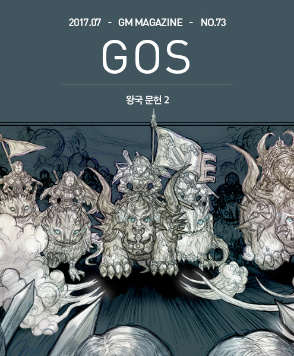

&nbsp;

# 하이레이번의 비공식 항해일지2; 칼날 서약단과의 조우

### 하이레이번의 비공식 항해일지2

글: 허안  
삽화: 마기

&nbsp;  

&nbsp;

그에라의 본대 추격대가 그런 명령에 따라 본격적인 움직임을 펼칠 때, 워시스 크리크는 준비하고 있던 2차 부대를 출진시켰다.

&nbsp;

&nbsp;&nbsp;&nbsp;성채에 남아 경비하던 그에라의 부하 용병들은 그 출진을 보았고, 즉시 참호에서 싸우고 있는 동료들에게 그 사실을 알렸다. 그러나 그에라에게 본대를 불러들이는 신호를 보내지는 않았는데 그 이유는 2차 공격대의 규모가 대단하지 않았기 때문이었다. 어느 정도 숫자까지는 성채라는 장점을 타고 앉은 수비측이 몇 배의 병력이 와도 문제가 없었고, 참호 쪽 역시 전황도 유리하고 거의 2개 조로 나뉘어 적을 번갈아 공격하는 상황이라 그쪽으로 간다 하여도 큰 문제가 아니라고 판단했기 때문이었다. 그런데 두 번째로 공격에 나선 황금노래단의 목표는 악전고투 속에 말라 죽어가고 있는 참호의 황금노래단원이 아니었다.

&nbsp;

&nbsp;

&nbsp;&nbsp;&nbsp;그들은 성채를 노리고 곧장 달려왔다. 그리고 쇠뇌와 총의 사정거리에 들자마자 마구 집중사격을 퍼붓기 시작했다. 슈바르츠라이터의 집중포화의 명성을 들어보지 않은 것은 아니지만, 이건 너무 하다 싶을 정도였다. 칼날서약단도 농성전을 대비해 투사무기 등을 준비하지 않은 것은 아니지만, 황금노래단은 성채를 노리고 공격하고 있지 않았다. 그들은 컴패니언에 탄 채 빠른 이동과 집중포화 회피기동, 그 밖의 기술들을 번갈아 사용하면서 총탄과 화살을 쏟아붓는 것에만 신경을 쓰는 것 같았다. 결국, 성채를 수비하던 칼날서약단은 상대를 공격하려는 생각을 접고, 성벽 뒤로 숨는 전술을 택했다. 황금노래단은 성벽에 일정 거리 이상 근접하지 않으니 굳이 공격할 필요가 없었고, 컴패니언에 탑승한 채 끊임없이 움직이니 칼날서약단이 공격해봐야 효율도 낮았기 때문이었다.

&nbsp;

&nbsp;&nbsp;&nbsp;공격의 효율이 낮은 것은 황금노래단도 마찬가지였다. 칼날서약단 수비병들이 성을 방패 삼아 몸을 숨기고 있으니 아무리 여름날 쏟아지는 우박처럼 사격을 가해도 손가락 하나 다치는 사람이 없었다. 그럼에도 황금노래단의 2차 공격대는 성채를 향해 계속 쉬지 않고 사격을 퍼부었다.

&nbsp;

&nbsp;

&nbsp;&nbsp;&nbsp;성채 수비를 맡아 남은 그에라의 세 명의 사관 중 하나가 생각하기에 이 상황은 1차적으로는 자신들에게 하나도 불리할 것이 없었다. 황금노래단은 공연히 어마어마한 물자를 쓸데없는 총질과 활질에 낭비하고 있었고, 자신들은 고개를 내밀지 않고 머리만 숙이고 있으면 그 낭비는 그대로 적들에게 부담으로 돌아갈 것이 틀림없었다. 저 정도의 병력이라면 전 단원이 고개를 숙이고 있어서, 상황을 몰라서 바로 코앞에 적이 들이닥쳐서야 그 사실을 알아도 퇴치하는데 문제가 없다고 봐야 했다.

&nbsp;

&nbsp;&nbsp;&nbsp;하지만 그런 생각이 들자 오히려 등골이 서늘해졌다. 전장에서 닳고 닳은 용병단장인 워시스 크리크가 이렇게 척 봐도 답이 나오는 손해를 자초하는 것은 다른 까닭이 있다는 생각이 들었기 때문이다. 그래서 위험을 무릅쓰고 고개를 내밀어 상황을 보려 했는데 그러자 더 격렬한 사격이 쏟아졌다. 하지만 아무것도 보지 못했음에도 그는 상대의 목적을 알 수 있었다.

&nbsp;

&nbsp;&nbsp;&nbsp;‘처음부터 성채를 노리거나 성을 수비하는 병력을 노리는 것이 아니었다. 그냥 무조건 수비병 부근을 쏴서 고개를 들지 못하게 하고, 그렇게 해서 높은 곳에 있는 성채 수비병들이 관측하지 못하게 하려는 것이 목적이었다. 왜 그런 거지?’

&nbsp;

&nbsp;&nbsp;&nbsp;그 마음속 질문에 대한 답은 금방 떠올랐다. ‘황금노래단 전체가 출동할 생각인데 충분히 전진할 때까지는 우리가 모르기 바라기 때문이다. 그에라 단장님의 본대가 돌아올 적기를 놓치게 하려는 것이다’

&nbsp;

&nbsp;

&nbsp;&nbsp;&nbsp;이 시점에서는 참호에 있던 칼날서약단 역시 황금노래단의 3차 병력이 출발한 것을 알아차렸다. 그러나 그들은 성채에 있는 동료들 같은 지리적 이점이 없었다. 그래서 세로로 길게 뱀 모양 진형을 이루어 늘어선 황금노래단 병력이 많은지 적은지 알 수 없었다. 이런 진형을 취하고 달려오니 비슷한 고도의 지형에 서서는 정면에 보이는 적병의 후미에 얼마나 많은 적이 뒤따르고 있는지 알 수 있는 방법은 컴패니언 무리가 일으키는 먼지구름 정도였다.

&nbsp;

&nbsp;&nbsp;&nbsp;따라서 워시스 크리크의 신호에 따라 황금노래단이 횡으로 길게 진형을 펼쳤을 때야 황금노래단이 전원 출동했음을 알 수 있었으나 이미 때는 늦어있었다.

&nbsp;

&nbsp;

&nbsp;&nbsp;&nbsp;그들이 성채에 사격을 하고 있는 황금노래단 2차 공격대를 습격했다면 결과가 달랐을 가능성도 없지 않았지만, 그들은 그들 나름대로는 참호 안의 적을 곧 전멸시킬 수 있다고 보았기 때문에 이쪽을 마무리하고 움직일 생각이었다.

&nbsp;

&nbsp;&nbsp;&nbsp;칼날서약단의 참호전투가 생각보다 시간이 더 들고 있는 이유는 컴패니언 탓이었다. 황금노래단은 단원마다 컴패니언을 타고 왔고, 그들도 전투에 참여하였다. 개체로는 칼날서약단원 한 사람 한 사람에 못 미쳤지만, 황금노래단은 그들이 원래 각자의 컴패니언을 얼마나 아끼는지 모른다는 평판은 어디다 집어 던졌는지 컴패니언을 주저 없이 희생하면서 방패막이로 사용하였다.

&nbsp;

&nbsp;&nbsp;&nbsp;그래 봐야 시간 연장책에 불과했지만, 그럼에도 이 시점에서 황금노래단원은 상당수가 살아남았다. 물론 컴패니언은 한 마리도 살아남지 못했다. 컴패니언 하나를 이 수준까지 훈련시키고 키우는 비용을 생각하면 황금노래단에 엄청난 손실을 끼친 것은 분명하고, 그 손실이 단순히 시간 연장책에 지나지 않는다면 도저히 전투의 손익 계산이 맞지 않는 일이지만, 바로 그 정확한 시점에 이제는 황금노래단의 컴패니언이 아니라 황금노래단원의 인명이 희생되지 않을 수 없게 되는 바로 그 시점에 황금노래단의 남은 본대 전원이 참호에 쇄도하였다. 돌격사격으로 문을 연 황금노래단의 공격이 시작되었다.

&nbsp;

&nbsp;

&nbsp;&nbsp;&nbsp;그에라는 좁은 참호에 지원병을 더 넣는 일이 효율적이지 않다고 하였지만, 황금노래단은 근접전이 아니라 사격전이 전문이었다. 층층이 진형과 원형 포진을 한 황금노래단원들이 각자 자기가 선 원형진에서 전우들과 줄을 맞춘 뒤, 참호 안의 아군과 참호를 둘러싼 앞열의 아군을 피해서 적에게 총과 화살을 선물했다. 앞열과 후방열의 황금노래단이 컴패니언의 자세를 낮추기도 하고 내리기도 하고, 몸을 비스듬히 기울여 다리 힘만으로 컴패니언에 매달리기도 하고, 온갖 방법과 온갖 각도를 사용해 아군을 피해 참호와 그 부근의 칼날서약단원에게 부지런히 사격을 퍼부었다.

&nbsp;

&nbsp;&nbsp;&nbsp;이 순간 워시스 크리크는 소수가 다수의 병력을 이기는 일은 없다. 그렇게 보이는 모든 사례는 실제로는 전장의 일부 지역에서 소수가 적의 병력을 분산시켜 그 지역 한정으로 압도적인 다수의 우세를 만들었기에 가능한 일이라는 글칸 도니휴의 전쟁론을 떠올리고 있었다.

&nbsp;

&nbsp;&nbsp;&nbsp;아무튼 황금노래단 본대의 대부분이 이곳에 있었고 그들의 집중사격을 받은 참호와 그 부근의 칼날서약단원들은 빠른 시간 안에 전멸하였다. 그리고 컴패니언은 모두 잃었지만, 투입한 인원에 비하면 사상자는 많지 않은 동료 단원들을 구해내었다.

&nbsp;

&nbsp;&nbsp;&nbsp;다른 단원들이 끌고 온 예비 컴패니언을 그들에게 주었다. 투입한 단원의 두 배 정도 되는 칼날서약단원을 사살했다. 사살한 인원의 절반에 해당하는 컴패니언과 약간의 아군 사상자가 생겼지만, 서전의 전과로는 충분하다.

&nbsp;

&nbsp;&nbsp;&nbsp;30 명 정도 적다고 생각하던 양측의 병력 차이도 이쪽이 미세하지만 오히려 우세로 바뀐 셈이다.

&nbsp;

&nbsp;

&nbsp;&nbsp;&nbsp;이제 남은 것은 프엥크 부단장이 기대대로 그 뛰어난 실력으로 이끌고 있는 병력을 데리고 탈출하는 일이다. 가능한 피해를 입지 않고, 그 과정에서 적에게 타격을 주면 좋지만, 주된 목적은 탈출이었다. 본대를 유인해내는 일에는 성공했고, 탈출만 한다면 오늘의 전과는 충분하다.

&nbsp;

&nbsp;&nbsp;&nbsp;그래서 가장 믿을 수 있는 부단장을 내보냈는데 실패한다면 큰일이다. 만약 부단장 프엥크가 그에라의 손을 벗어나지 못한다면, 워시스가 택할 수 있는 길은 두 가지였다.

&nbsp;

&nbsp;&nbsp;&nbsp;이대로 진격하여 부단장도 도울 겸 그에라의 본대와 회전을 벌이는 방법과 옆으로 조금만 이동하면 바로 공격할 수 있는 소수의 수비병만 남은 성채를 공격하는 방법이었다.

&nbsp;

&nbsp;&nbsp;&nbsp;성채를 지키고 있는 칼날서약단원은 참호의 동료들을 지원하지 못하고 보고만 있을 수밖에 없었다. 그들에게 최선은 자신들의 힘으로 성채를 지키는 일이었다. 성채를 공격하여 본대의 출발을 눈치채지 못하게 하는 임무를 맡았던 2차 공격 단원들도 성채를 벗어나 참호의 본대에 합류하였다.

&nbsp;

&nbsp;

&nbsp;&nbsp;&nbsp;프엥크를 추격하던 그에라의 본대 역시 후방에서 일어난 일을 알아차렸다. 전장에서 지휘관의 능력은 옳은 판단을 빠른 시간 안에 내리는 것이다. 둘 다 중요하지만 이상하게 들릴지 몰라도 둘 중 하나를 골라야 한다면 옳은 판단 보다 빠른 판단이 도움이 되는 경우가 많다.

&nbsp;

&nbsp;&nbsp;&nbsp;이대로 돌아가 전면적인 대결을 한다면 승부는 반반의 확률이다. 성채는 소수의 인원이 지키고 있지만, 함락될 리는 없다. 다른 사람도 아닌 상대의 부단장 프엥크가 포함된 별동대를 잡거나 전멸시키는 것이 이 상황에서의 최선이라고 빠르게 판단한 그에라는 본대 병력을 돌리지 않고, 나누어서 일부를 참호나 성채 방향으로 돌려보내지도 않고 그대로 추격을 지속시켰다.

&nbsp;

&nbsp;

&nbsp;&nbsp;&nbsp;워시스 크리크가 그에라에게 넘긴 판단의 공은 이제 그에라의 그러한 결정으로 다시 황금노래용병단 부단장 프엥크에게 넘어왔다.

&nbsp;

&nbsp;&nbsp;&nbsp;본래 계획에 따르면 이 시점에서 프엥크과 부하들은 탈출해야 했다. 전원이 한 방향으로 움직일지 몇 조로 나눌지 완전히 각개로 흩어져 돌파할지 정도만 상황에 따라 프엥크가 결정해야 했다.

&nbsp;

&nbsp;&nbsp;&nbsp;다음 순간 참호를 확보하고 부대를 정돈하면서 전방의 상황을 주시하던 워시스 크리크의 입에서 욕이 터져 나왔다.

&nbsp;

&nbsp;&nbsp;&nbsp;그러나 이미 벌어진 일은 무를 수가 없다. 더구나 전장에서 돌발 변수는 아무 때나 예고 없이 터져 나오기 마련이다. 이럴 때는 그저 빠른 대처만이 유일한 길이다. 다행히 부하들은 단장의 욕을 들은 순간 사태를 직감하고 컴패니언에 탑승하고 있었다. 아직 탑승하지 않은 부하들이 있었지만 워시스는 그것을 무시하고 전원에게 진격 명령을 내렸다.

&nbsp;

&nbsp;&nbsp;&nbsp;워시스가 달리면서 이를 갈면서 말을 내뱉는 복합적인 행동을 하였다.

&nbsp;

&nbsp;&nbsp;&nbsp;“프엥크 이 자식 살아오지 못하면 용서 않겠다. 살아 돌아와도 그냥 두나 봐라.”

&nbsp;

&nbsp;

&nbsp;&nbsp;&nbsp;그에라 역시 프엥크가 무엇을 선택했는지 알 수 있었다.

&nbsp;

&nbsp;&nbsp;&nbsp;“뭐야 소문과 달리 도박을 좋아하는 부단장이지 않은가 말이다. 단신으로라도 영주 경비병을 뚫고 먼 거리에서 영주 다리에다 총질 한 방만 할 수 있다면, 도착 첫날 황금노래단이 칼날서약단을 하루 만에 이겼다는 평판을 들을 수 있다는 건가?”

&nbsp;

&nbsp;&nbsp;&nbsp;애초에 그것은 무리라고, 프엥크가 이끄는 황금노래단의 1차 공격조가 영지병을 뚫느라 시간을 보내는 사이에 칼날서약단원들이 배후에 도착할 것이기 때문에 안 된다고 양측의 단장과 간부들이 모두 예상한 일이었다.

&nbsp;

&nbsp;

&nbsp;&nbsp;&nbsp;그러나 프엥크는 그에라의 본대 추격대와의 거리가 예상보다 조금 더 멀다고 보고, 부하들이 경비병을 붙잡고 시간을 끌어주면 자기 혼자서는 영주 집무실까지 내달릴 수 있다고, 그렇게 체스처럼 수장만 잡으면, 영주의 얼굴에 총구만 들이대면, 정 안 되면 영주가 보이는 곳까지만 가서 조준사격으로 다리에다 총알 하나만 박아주면, 그러면 이길 수 있다는 충분히 가능성이 있는 일이라는 그런 판단을 하고 말았다.

&nbsp;

&nbsp;&nbsp;&nbsp;미리 파악해둔 정보와 이번 전투에서 드러난 병력을 생각하면 그에라가 별도로 병력을 빼내 영주 경비병들과 함께 배치하지 않았다고 봐야 했다. 영지민을 참호 공사에 동원했지만, 바로 그렇기 때문에 다른 곳에 추가로 더 참호나 함정을 팠을 가능성은 없다고 보았다. 그런 프엥크의 판단과 희망은 틀리지 않았다.

&nbsp;

&nbsp;&nbsp;&nbsp;그러나 그에라도 전문가인 용병단보다 훨씬 전투력이 떨어지는 지방 영지병들만 믿고 손을 놓고 있지는 않았다는 점이 문제였다. 프엥크는 영지병들이 나름대로 숨어있다가 여기저기서 튀어 나온다든가 정문으로 이어지는 곳에 방책을 설치해 직선으로 달리지 못하게 준비해두어 자신들의 원거리 사격에도 대비해둔 정도는 각오하고 있었다. 그러나 영지병들이 느닷없이 스필어택을 사용하자 당혹감을 감출 수 없었다.

&nbsp;

&nbsp;&nbsp;&nbsp;‘이건 랜서들의 기술이잖아! 말도 안 돼. 상당히 숙련된 랜서들이나 펼칠 수 있는 것을..’

&nbsp;

&nbsp;&nbsp;&nbsp;라는 외침은 마음속에서만 울렸다. 프엥크는 간신히 스필어택을 피할 수 있었지만 다수의 부하들은 차례로 낙마하였다. 전문적인 랜서도 아니고 배운지도 얼마 안 되고 가르친 사람도 잘 알고 가르치진 않았으며 배우는 사람도 대단한 재능을 지니지 않았지만, 숫자가 많다는 점이 어설프게 구사하는 기술의 미약한 효과를 상쇄하고도 남았다. 영지병의 수가 많았기 때문에, 몇 명 중의 한 명의 기술만 제대로 먹혀도 낙마는 피할 수 없었다.

&nbsp;

&nbsp;&nbsp;&nbsp;컴패니언도 없이 질주만으로 이제 프엥크 일행을 거의 다 따라잡은 그에라가 그 모습을 보며 한 마디 했다.

&nbsp;

&nbsp;&nbsp;&nbsp;“도피 탈출 전략으로 갔어도 어차피 전멸했겠지만, 욕심부리다가 일을 더 쉽게 만들어주는군.”

&nbsp;

&nbsp;

&nbsp;&nbsp;&nbsp;부하들이 낙마하자 프엥크는 이미 일이 틀렸다는 것을 알았다. 주변과 배후의 영지병까지 끼고서는 무차별 사격을 할 수가 없다. 자칫 사망자가 나오면 안 되기 때문이다. 그리고 그런 상황이라면 칼날서약단과 죽을 때까지 싸우는 일은 그냥 죽을 때까지 싸운다는 것 말고는 아무 보람도 없는 상황이 될 것이 분명했다.

&nbsp;

&nbsp;&nbsp;&nbsp;프엥크는 빠른 결단을 내렸다.

&nbsp;

&nbsp;&nbsp;&nbsp;“무슨 일이 있어도 최단거리로 최대한 신속하게 영지를 이탈한다!”

&nbsp;

&nbsp;&nbsp;&nbsp;낙마하여 영지병들과 싸우고 있던 부하들은 그 말을 알아들었지만, 금방 따를 수는 없었다.

&nbsp;

&nbsp;&nbsp;&nbsp;누군가가 이의를 제기했다.

&nbsp;

&nbsp;&nbsp;&nbsp;“부단장님 그렇게 하면…”

&nbsp;

&nbsp;&nbsp;&nbsp;프엥크가 소리를 질러서 그 말을 막았다.

&nbsp;

&nbsp;&nbsp;&nbsp;“마스터 그에라의 본대가 곧 온다. 그나마도 지금이 아니면 기회가 없다. 달려라.”

&nbsp;

&nbsp;&nbsp;&nbsp;몇몇은 운 좋게 컴패니언에 다시 올라타고 몇몇은 그냥 두 발로 달렸다. 영지병들은 황금노래단원이 달아나기로 작정하자 그것을 막을 수 없었다. 수가 더 많지 않았으면 이미 밀렸을 상황이라 적이 빠져주니 그냥 한숨 돌리고 쉬는 편을 택하고 싶었기 때문이다.

&nbsp;

&nbsp;&nbsp;&nbsp;프엥크와 부하들이 도망치자 그에라는 그 의도를 알아차렸다. 그에라는 빙긋 웃으며 말했다.

&nbsp;

&nbsp;&nbsp;&nbsp;“뭐야, 전장이탈인가? 나름대로 나쁘지 않은 선택이라고 해야 하나.”

&nbsp;

&nbsp;&nbsp;&nbsp;그에라는 일부 부하들만 그대로 달려가게 하고 나머지는 정지시켰다. 물론 계속 달려가는 부하들의 숫자와 그 지휘자 사관의 능력이면 다른 변수는 일어나지 않으리라고 보았기 때문이다. 그리고 그 기대는 예상대로 충족되었다.

&nbsp;

&nbsp;

&nbsp;&nbsp;&nbsp;부단장 프엥크와 그 부하들은 영지 경계를 넘어 도망쳤다. 영주들과 용병단 간의 협정에 따라 이것은 전장이탈이었고, 따라서 프엥크와 그 부하들은 종전까지는 다시는 분쟁 관련 영지 세 곳 가운데 어느 곳에도 들어올 수 없었다. 전력상으로만 따지면 죽은 것이나 다름없는 일이었다.

&nbsp;

&nbsp;&nbsp;&nbsp;실제로도 프엥크와 그 부하들이 모두 탈출에 성공하지는 못해서 프엥크를 따라 영지 경계를 벗어날 수 있었던 부하는 여섯 명에 불과했다. 따라서 이 날의 전과는 사상자 수의 비교에 있어서는 황금노래단의 우위였지만, 작전과 전투의 핵심 전력인 부단장을 종전까지 활용할 수 없게 되었다는 점에서는 황금노래단으로서는 뼈 아픈 손해가 아닐 수 없었다.

&nbsp;
 
&nbsp;

&nbsp;

&nbsp;&nbsp;&nbsp;추가 기록: 현 국왕이신 타히엘 폐하의 승인을 얻어 이 문서에 아래의 기록을 덧붙인다.

&nbsp;

&nbsp;&nbsp;&nbsp;첫 전투가 그렇게 진행된 하루 뒤 돈을 받고 편지를 가져온 사람으로부터 프엥크의 편지를 받은 마스터 워시스 크리크는 새로운 지령을 쓴 후 그 명령서를 프엥크에게 전달하도록 부탁했다. 어차피 부단장은 전투에 더 이상 참여할 수 없으니 추가 병력을 모집하라는 내용이었다. 빠른 시일에 모집할 수 있다면 추가 병력은 새로 이 전투에 참전할 수 있었기 때문이다. 그렇지 않더라도 전투 후의 모병은 꼭 필요한 일이기도 했다.

&nbsp;

&nbsp;&nbsp;&nbsp;프엥크가 어떤 경로로 어떻게 왕국 수도 투기장의 프리엄과 접촉하게 되었고, 이후 수상한 계약을 속아서 맺게 되었는지는 또 다른 이야기이나, 바로 그러한 과정 가운데 야기되어 이후 드러나게 된 일련의 투기장 관련 사건이 이 전투와 관련 있음을 밝혀두기 위해 이 기록 문서에도 덧붙이는 바이다. 아무튼 서전부터 딱히 누가 우세하다고 할 수 없었던 전투는 그 후 몇 차례의 전투가 계속 이어지면서도 그러한 피장파장의 상태를 벗어나지 못하였고, 이후 이 전투에 라민 장군이 개입하여 종전을 이끌어냈으나, 이미 적은 바와 같이 이 과정이 외부에 공개할 수 없는 법적인 문제를 일으킬 것을 염려하여 이후의 모든 전투와 기타 사항이 모두 기밀문서로 분류되었다.

&nbsp;

&nbsp;&nbsp;&nbsp;그러므로 이를 열람할 권한을 지닌 관리는 해당 기밀문서는 물론 <투기장 폐쇄애 관한 칙령 제62조> 문서와 관련된 수사기록 역시 필히 열람하기를 권하기 위해 이 같은 첨언을 부기하여 두는 바이다.

&nbsp;

&nbsp;&nbsp;&nbsp;타히엘 재위 11년 3월 왕국 수석 기록관 에센 요나스