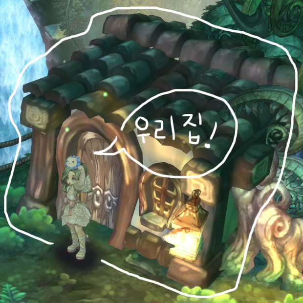
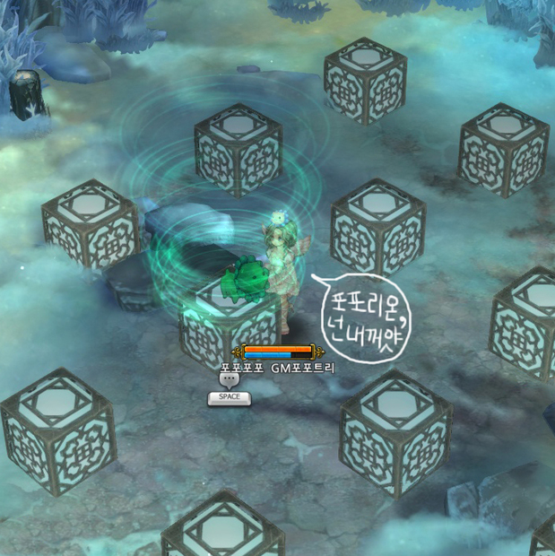
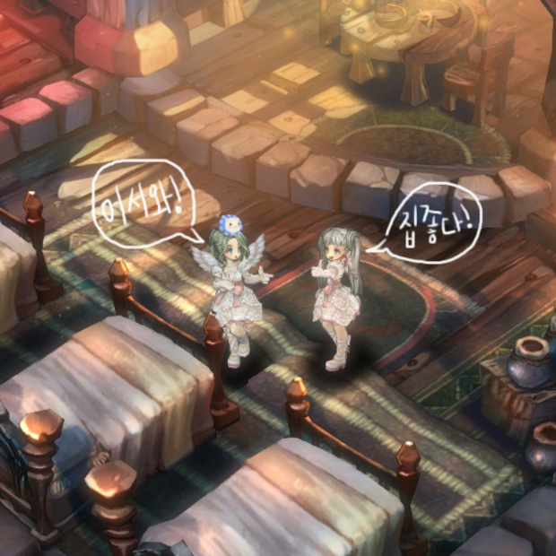
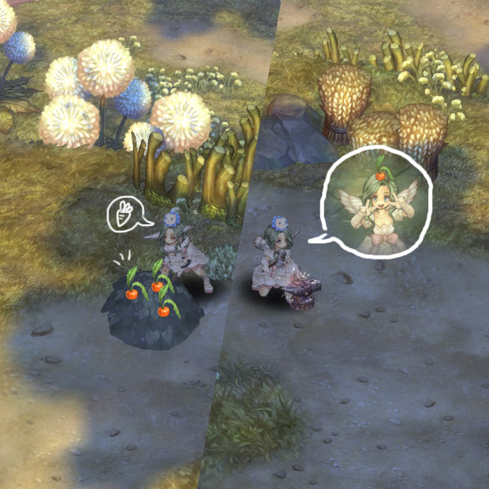
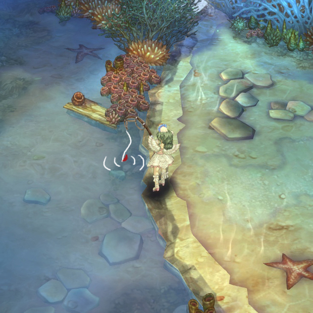
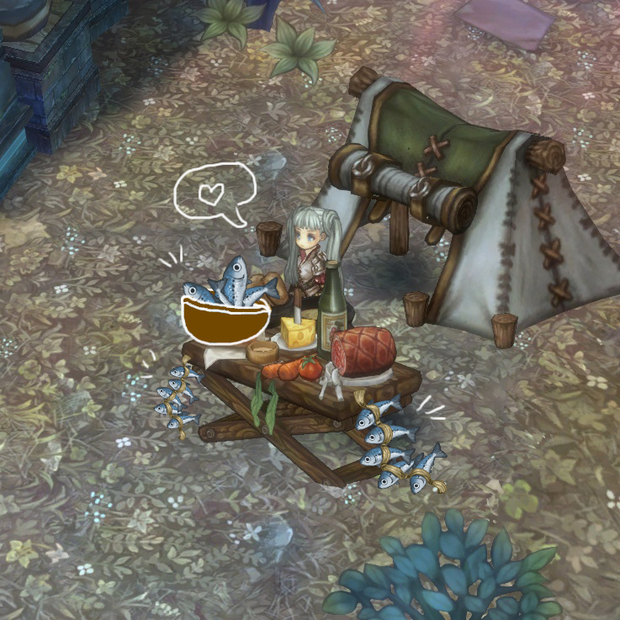
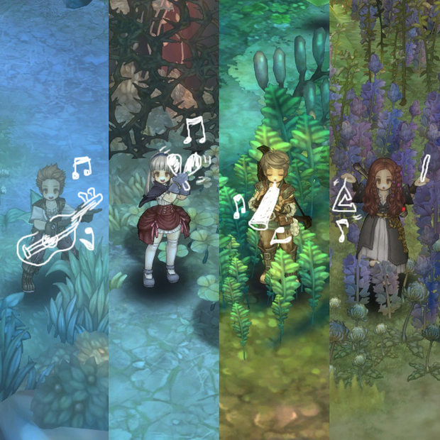
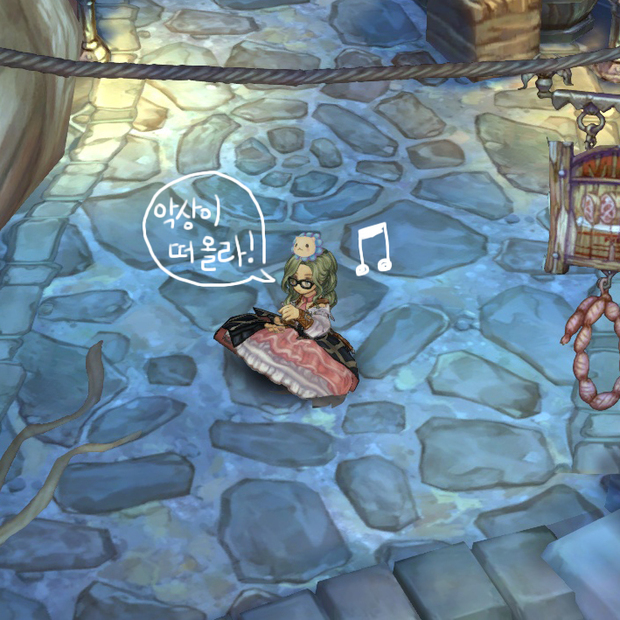
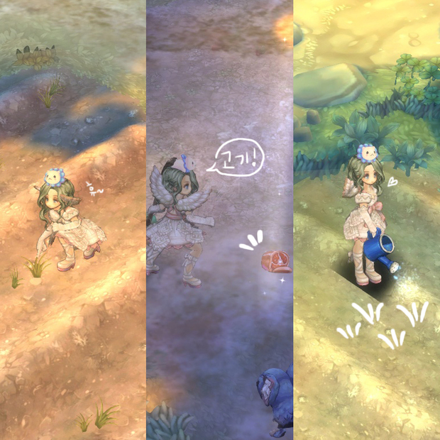
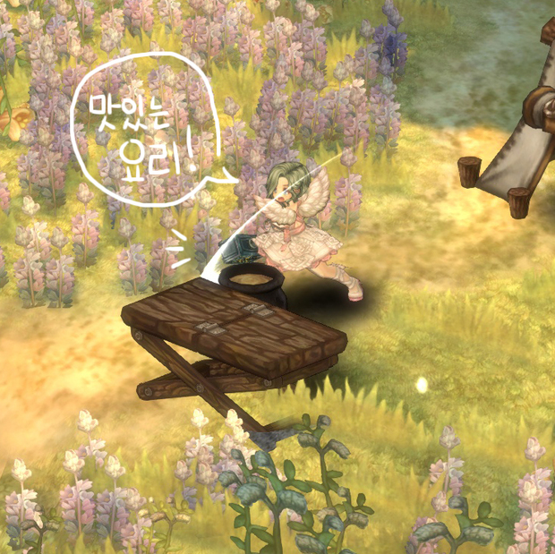

&nbsp;

# 트오세에 생활 컨텐츠가 생긴다면!?

안녕하세요,  
여러분께 처음 인사드리는 GM포포트리입니다. (수줍)

 
포포트리는 영어로 **'Pawpaw Tree'**라고 쓰는데요, (포포리온 아닙니다.)  
포포트리 잎과 줄기에는 **'항암 효과(!)'**가 있다고 합니다.

저 역시 포포트리처럼  
앞으로 구원자 분들께 항암제 같은 서비스를 제공해드리기 위해 노력하겠습니다. (_ _)

&nbsp;

저는 GM이 되기 전에도 트리 오브 세이비어를 열심히 플레이 했던 트덕이었는데요,  
주로 뇌오세를 열심히 하면서 다양한 트리를 시도해보는 컨텐츠를 즐겨왔습니다.

여느 때와 같이 트리 오브 세이비어에서 새로운 클래스 트리를 육성하던 중,  
문득 트리 오브 세이비어가 예전보다 많이 삭막해진 것 같다는 느낌이 들었습니다.

아무래도 **'사냥'**을 제외하고 즐길 수 있는  
**'생활형 컨텐츠'**가 부족한 것도 원인 중 하나가 아닐까 생각하였는데요,

그래서, 검증된(?) 트덕인 GM포포트리가  
**'트리 오브 세이비어의 생활형 컨텐츠!'** 를 상상해보았습니다.

*※ 아래 컨텐츠들은 GM포포트리의 상상 속에서만 존재하는 컨텐츠인 점, 참고해주세요!*

&nbsp;

### 1. 나만의 집 꾸미기

일명 ‘하우징’이라고 하는 시스템이 트오세에 있다면 어떨까 생각해보았습니다!

레벨을 올리기 위해 맵을 탐험하다 보면 맵 중간에 사람이 살지 않는 빈 집 같은 오브젝트 들을 자주 볼 수 있는데요,  
해당 오브젝트들 중 하나를 선택해 나만의 집으로 꾸미는 기능이 있으면 어떨까요?

**[이제 이 집은 제 것입니다. 제 마음대로 할 수 있는겁니다.]**

하우징에 필요한 재료나 가구, 장식물은 트오세에 존재하는 다양한 기믹을 통해 얻고 자랑도 할 수 있고,

**[기믹을 풀고 장식품을 얻는 상상]**

친구를 초대하거나 친구의 집에 놀러 갈 수 있으면 정말 좋을 것 같네요!

**[친구를 집에 초대해서 포즈를 취하고 찰칵!]**

&nbsp;

### 2. 채집

RPG의 꽃(?)이자 최종 컨텐츠인 채집이 트리 오브 세이비어에 적용된다면 어떨까요?

트리 오브 세이비어는 개성 넘치는 다양한 헤어 코스튬이 마련되어 있는데요,  
이 헤어 코스튬들을 직접 채집한 재료를 가공하여 만들 수도 있을 것 같습니다!

**[당근을 채집해서 부러진 당근을 만드는 것은 어떨까요?]**

또, 채집 하면 빠질 수 없는 컨텐츠가 낚시일 것 같은데요, 트오세에 존재하는 다양한 폭포, 강, 바다에서 낚시를 하는 상상, 한 번쯤은 해보셨을 것 같습니다.

**[이기티 연안에서 한가롭게 낚시를 즐기는 GM포포트리]**

낚시로 낚은 물고기를 스콰이어가 조리하여 음식으로 만들 수도 있을 것 같네요!

**[오늘 저녁은 정어리란다!]**

&nbsp;

### 3. 악기 연주

트리 오브 세이비어는 훌륭한 BGM으로도 정말 유명한 게임이죠!  
감성 터지는 트오세의 BGM을 게임 내에서 직접 연주해볼 수 있다면 어떨까요?

클래스 별로 연주할 수 있는 악기가 달라도 색다른 경험이 될 것 같네요!

**[우리 게임 음악대장은 누구일까요?]**

그리고 히든 클래스로 작곡가가 추가된다면? 클라페다에서 오케스트라 공연을 볼 수 있을 것 같네요+_+.

**[GM포포트리는 훌륭한 작곡가가 되고 싶어요!]**

&nbsp; 

### 4. 요리

마지막으로, 지금까지는 스콰이어의 전유물이었던 요리가 추가되면 어떨까 생각해보았습니다.

앞서 채집 부분에서 맵에 존재하는 다양한 재료들을 수급하거나,  
길드 농장에서 딜겔레를 포함한 각종 야채나 과일들을 재배할 수 있을 것 같습니다.

**[재료는 각 필드에서 얻을 수 있겠네요!]**

요리하는 방법은 강화처럼 조리도구를 타격하면 어떨까요?

**[맛있는 요리의 기본은 팔뚝 힘!]**

또한, 이벤트로 지급되었던 떡국이나 포춘쿠키처럼 조리된 음식을 먹으면 이로운 효과가 부여되는 것도 좋을 것 같습니다!

&nbsp; 

지금까지 GM포포트리가 생각해본 트오세의 생활 컨텐츠를 소개해드렸습니다.

위 컨텐츠들은 모두 100% 제 상상 속에만 구현되어 있는데요, 언젠가는 게임에서 만나 볼 수 있으면 좋겠네요~ 

구원자 여러분께서 생각하신 트오세의 생활 컨텐츠는 어떤 모습인가요?