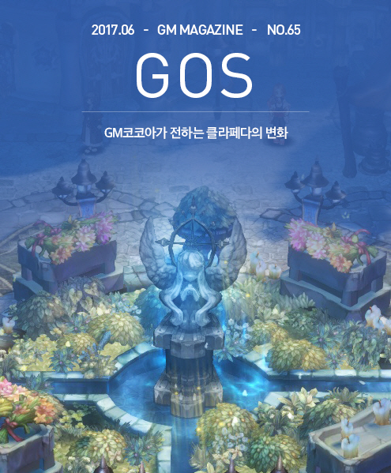
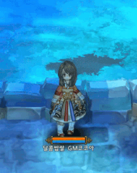
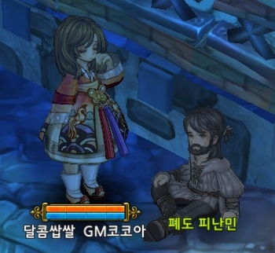
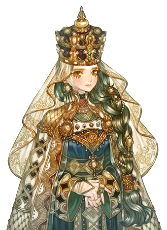
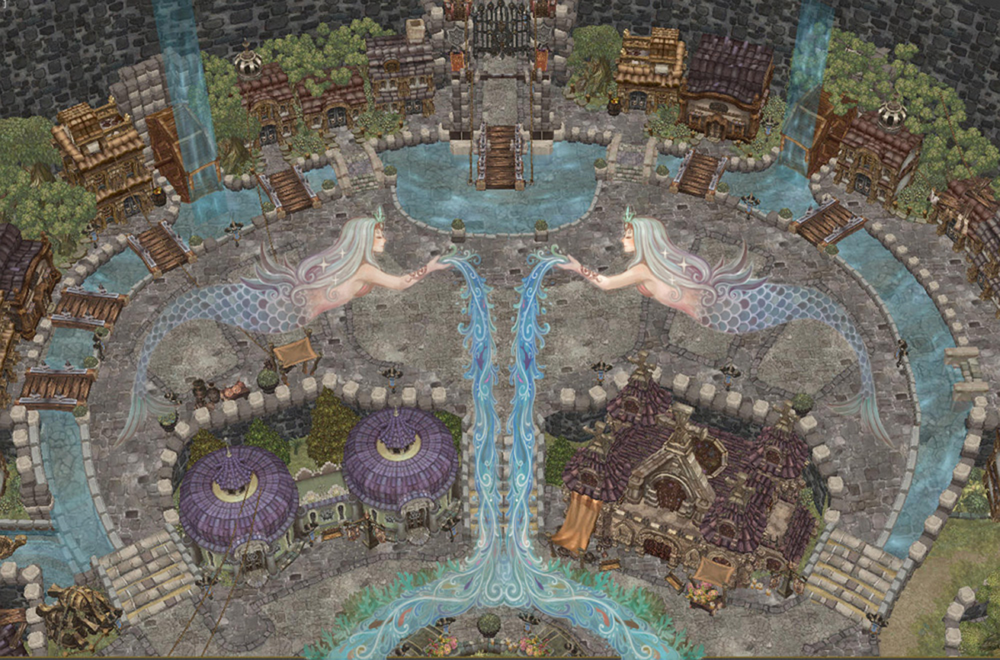
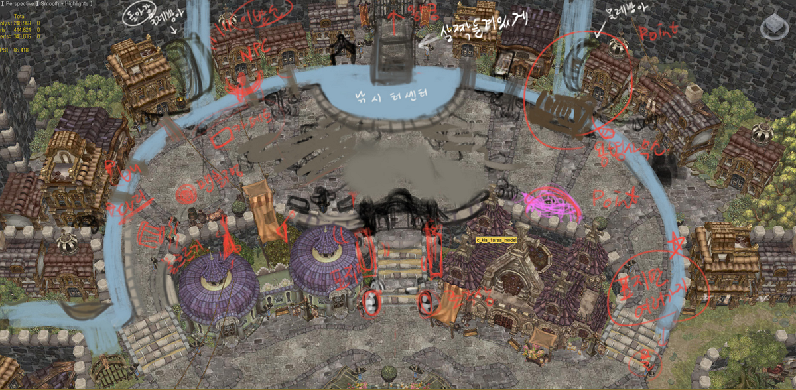
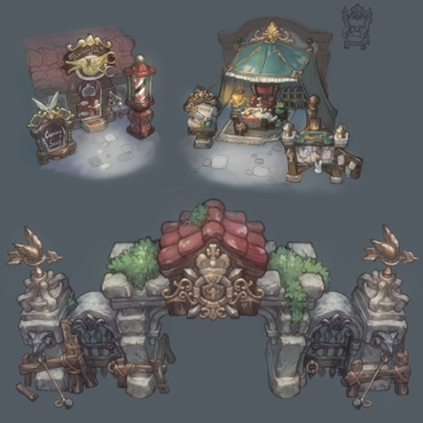
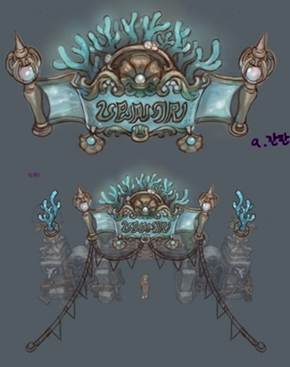

&nbsp;

# GM코코아가 전하는 클라페다의 변화

안녕하세요, **GM 코코아**입니다.

저는 평소 '무릇 현대인이라면 강대한 마력으로 세계에 그 영명을 떨치겠다처럼 쪼잔한 꿈이나 꾸느니,  
어떻게 하면 목 좋은 곳에 작은 상가라도 하나 마련할까 같은 원대하고도 거창한 이상을 품는 편이 낫다'는  
지론을 가지고 있었는데요, 

 

트리 오브 세이비어의 주민이나, 저나 사정은 크게 다르지 않은 것 같아  
진한 동지애를 느끼며 지내고 있던 어느날이었습니다.

시작 마을 단일화와 용병 의뢰소 이전으로, 명실상부 트오세의 중심 마을로 자리매김한 클라페다가  
최근 대규모 공사에 들어갔다는 소식이 들려왔습니다!

물론 옷 사입을 돈으로 코스튬을 입히고, 월세 낼 돈을 쪼개 토큰을 삼으로써  
소중한 직장 동료들의 월급에 이바지하고는 있던 저였지만  
그럼에도 트오세의 주민들이 조금 부러운 것이 사실이었습니다.

그래서!  
찾아갔습니다.
이번 클라페다 확장 공사를 기획하고 개발하신 개발팀장님과,  
마을을 디자인하시고 건설을 진두 지휘하신 아트 디렉터 마기님과의 인터뷰,

**지금,  
시작합니다.**

&nbsp;

**GM 코코아 :**  
개발팀장님 안녕하세요, 매일 마주치다 이렇게 오붓하게 마주하니 어색하고 참 좋네요.  
최근 클라페다에 사람이 많아져서, 개인적으로는 복작복작한 느낌도 들고 사람 간의 온기도 느껴져서 흡족했는데요.  
굳이 확장을 기획하시게 된 이유가 무엇인가요?

**개발팀장 :**  
유저분께서 가장 잘 아시다시피, 기존에는 중심이 되는 마을이 북쪽 100레벨 지역에 위치한 페디미안이었습니다.  
페디미안도 목가적인 풍경과 오붓함이 있어 좋지만, 많은 비율의 유저들이 고레벨 지역에 상주하고 있는 점이  
신규 유저로 하여금 MMORPG를 플레이를 하고 있다는 느낌을 주기에는 약점으로 작용했습니다.  
어떤 MMORPG에 처음 들어갔는데,  
넓은 마을에 사람이 몇 없다면 이 게임을 내가 해도 되는지? 에 대한 의구심이 생기게 됩니다.  
그 점과 함께, 지난달에 업데이트한 전투 계산식 개편(울림 프로젝트)과  
신규/복귀자 이벤트로 플레이어가 많아지는 점을 고려하여 활기찬 중심 마을을 구성하기 위해  
기존 클라페다를 더 넓히는 작업을 하게 되었습니다.

**GM 코코아 :**  
신규 유저는 언제나 환영이죠! 넓어진 만큼 채워지기를 바랍니다.  
다음으로는 마기님께 여쭙겠습니다.  
다름이 아니오라 팬입니다. 사인해주세요.

**MAGGI :**  
--하하하-  ㅂ-)>;;
 
**GM 코코아 :**  
마기님께 드리는 첫 질문입니다. 5월 19일 트위터에서 새식구를 들였다고 밝히시면서, '이제 딸내미가 둘'이라고 하셨는데요,  
그렇다면 4월 24일 인벤과 하셨던 인터뷰에서 '트오세가 내 첫째 딸내미'라고 하셨던 것은 어떻게 되는 건가요?  
...같은 질문을 드리면 난감하고 괴롭고 무서우실 테니까, 다른 질문을 드리겠습니다!  
마기님께서 생각하시는 클라페다는 어떤 이미지인가요?
 
**MAGGI :**  
질문이 난감하면서도 재밌네요!! 딸내미 셋으로 정정하겠습니다+_+  
클라페다는 저에게 아주 큰 의미가 있는 마을입니다.  
우선 트오세를 만들면서 캐릭터 디자인만 하던 제가 처음으로 배경 작업을 시작했고, 그 첫 단추가 클라페다였죠.  
처음엔 이름도 달랐고 다양한 컨셉시안들을 낸 끝에 지금의 클라페다가 탄생하게 되었는데요,  
클라페다는 유저들이 처음으로 접하는 마을인 만큼 트오세만의 아기자기하면서도 클래식한 느낌을 집약시킨 곳이죠.  
세 마을 중 가장 트오세다운 느낌을 잘 담아내고 있는 마을이라 생각합니다.

**GM 코코아 :**  
마기님께서는 이번 클라페다 확장 공사의 디자인과, 실질적인 건설을 진두 지휘하셨는데요.  
처음 '클라페다 확장 공사를 해야 한다'는 소식을 들으셨을때, 가장 먼저 떠오르셨던 생각은 무엇인가요?

**MAGGI :**  
처음 얘기가 나온것은 회의에서 유저들끼리 놀 수 있는 넓은 광장의 부재에 대한 것이었죠.  
그걸 어떻게 해소하면 좋을까하는 생각을 하다가 거의 공터로 방치되어 있는 클라페다 3층?을 확장해서  
주요 NPC를 이전하고 소통할 수 있는 '광장'으로 꾸며보자는 생각을 굳혔습니다.  
그리고 기왕 확장할거면 땅만 넓힐게 아니라 구조적인 변화까지 있는게 좋겠다는 생각에,  
물길을 트고 물래방아를 넣어서 더 활기차고 생동감 넘치는 마을 분위기를 연출하고 싶었습니다.

**GM 코코아 :**  
그 과정에서 '이것만은 꼭' 지켜내고 싶으셨던 포인트를 꼽으시자면?

**MAGGI :**  
유저들이 자연스럽게 모여있을만한 요소들을 집약시키는 것이었죠.  
단순히 넓은 공간을 만드는 것만으로는 '놀이터'가 될 수 없다고 생각했기 떄문에,  
주요 NPC(용병의뢰소)의 이전 및 앞으로 오픈하게 될 헤어샵,  
그리고 광장중앙에서 양 옆으로 뻗어나가는 물길을 낚시터로 활용해서  
실제로 유용하고 살아 숨쉬는 공간을 만들고 싶었던게 포인트라면 포인트입니다.

**GM 코코아 :**  
클라페다가 살아 숨쉰다니 떠오른 질문이 있는데요,  
개발팀장님, 혹시 이 분을 기억하시나요?

(오르샤의 영주, 이네사 해먼데일)

**개발팀장 :**  
…

**GM 코코아 :**  
이 분께서 어젯밤 저의 꿈에 현몽하사, 이 질문을 꼭 드리라 하셨기에 여쭙습니다.  
오르샤가 시작 마을에서 빠지게 된 이유가 무엇인가요?

**개발팀장 :**  
이 부분은 지난 개발 히스토리를 저희 스스로 부정하게 되는 부분이라 죄송하게 생각합니다.  
신규 유저 입장에서 봤을 때, 처음 캐릭터를 생성하고 마을을 선택하는 과정에 있어,  
오르샤에서 시작하게 되는 경우 시나리오의 개연성이나, 앞으로 내가 할 플레이의 미래를 알기 어려웠습니다.  
어떤 다른 게임처럼 완전히 진영(렐름)이 구분되어서 서로 적대하는 내용이 아닌 만큼,  
불필요한 선택의 어려움을 제공하고 있다고 판단했습니다.
 
실제 플레이에 있어서도 한쪽 루트를 플레이하다가 자유롭게 다른쪽 마을의 퀘스트도 진행할 수 있는데,  
좋게 말하자면 자유도지만 유저에게는 혼란과 어려움이 더 먼저 다가오는 경우가 많았다고 생각합니다.  
그리고 1~100레벨까지의 저레벨 구간만 분리되어 있기 때문에  
개발팀의 리소스 활용 측면에서도, 유저가 시나리오를 즐기는데 있어서도 효과적이지 못했습니다.

이런 이유와 먼저 답변드린 클라페다 확장과 주요 콘텐츠 이전이 맞물려 오르샤는 초반 선택에서 빠지게 되었습니다.

**GM 코코아 :**  
그럼 오르샤의 미래는 어떻게 될까요?

**개발팀장 :**  
개발 사정상 당분간 오르샤는 이대로 유지되지만,  
향후 더 많은 유저들이 더 가치있는 시점에서 즐길 수 있는 콘텐츠로 활용할 수 있도록 준비할 예정입니다.

**GM 코코아 :**  
그렇군요. 오르샤 시민이기 이전에, 왕국의 국민으로서 납득하도록 하겠습니다.  
마기님, 우연찮게 클라페다의 확장된 구역을 하늘에서 내려다본 장면을 보게 되었는데요,  
놀랍게도 바닥화가 있었습니다.  
그간 여러 RPG게임을 해 왔지만, 바닥화는 상당히 신선했는데요.  
이에 대해 한 말씀 부탁드립니다.

(클라페다 바닥화의 개요도)

**MAGGI :**  
이건 제 생각이 아니라, 저희 컨셉 디자이너의 아이디어이고 직접 작업한 작업물입니다.  
쿼터뷰 게임의 특성상 바닥의 중요도가 큽니다.  
이번 클라페다 증축공사의 집들이 격으로 6월의 여신 유라테의 축제를 넣어보자고 제가 일을 키웠더니,  
이를 기념하는 바닥화를 클라페다 전체에 그려내면 좋을 것 같다고 말하고 슥슥 그려서 줬는데 보니까 너무 좋더군요.  
이 벽화는 6월 내내 바닥에서 감상하실 수 있습니다.  
앞으로도 다양한 아이디어의 바닥화들을 디자인해줄거라 생각해요. 기대가 큽니다+_+

**GM 코코아 :**  
평소에는 마기님의 손 끝이, 트오세라는 세상을 피워낸다고 생각했는데  
이제 보니 팀원과 함께 빚어내기도 하는군요.  
개발팀장님, 그럼 클라페다는 최종적으로 어떻게 변화될 예정인가요?

**개발팀장 :**  
용병 의뢰소가 이전해 있는 북부 지역으로의 통로가 생기고 면적이 넓어졌는데요,  
이 구역에 유저들이 마을 콘텐츠를 즐길 수 있는 건물과 지형, 소품들이 생길 예정입니다.  
클라페다는 앞으로도 트리 오브 세이비어의 중심 마을로서의 기능과 카리스마를 가진 무대가 될 것입니다.
 
**GM 코코아 :**  
마을에서 점프 말고도 할 수 있는게 생긴다니, 진지하게 클라페다로의 전입 신고를 고려해봐야 하겠네요.  
마기님, 혹시 클라페다 확장 공사의 진행 과정, 살짝 공개하여 주실 수 있을까요?

**MAGGI :**  
일단 기존 클라페다의 공사전 스샷에,  
제가 원하는 방향을 러프하게 리터칭한 후 배경 모델링팀과 조율하면서 구조 변형을 했구요.

변형된 구조 위에 추가될 소품들 및 주요 시설들 등을 배경 원화 디자이너와 상의해서 원화 작업을 진행합니다.

(클라페다 증축용 주요 건물들에 대한 원화 작업물들) 

클라페다 확장 기념 유라테 축제 이벤트 소품들도 작업했습니다.

(클라페다 확장기념 유라테 축제용 원화 중 일부. 유라테 여신관련 간판)
 

이렇게 원화 작업이 완료되면 이를 배경 모델링팀으로 넘겨서 작업 및 배치합니다.  
이번 6월 축제는 물의 여신 유라테가 테마인터라, 축제 기한 한정으로 수중 도시의 느낌을 주고 싶었습니다.  
배경 모델링팀과 조율하면서 그 느낌을 최대한 끌어내는걸로 이번 축제 준비를 마쳤네요.

**GM 코코아 :**  
부디 계획하신 바, 트오세에 이루시기를 여신님께 간절히 기도드립니다.  
지금까지 인터뷰에 응해주셔서 감사드립니다.

**개발팀장 / MAGGI**  
감사합니다.
