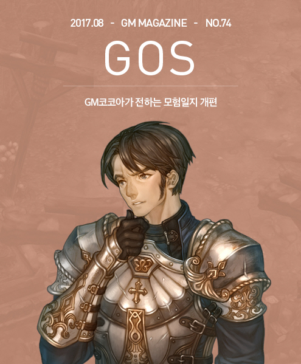
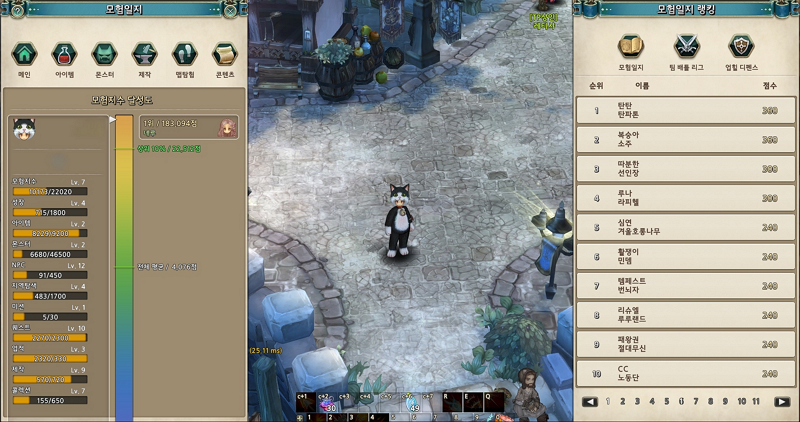
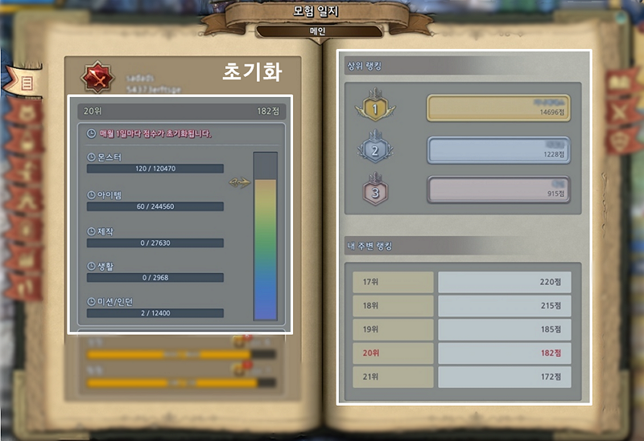
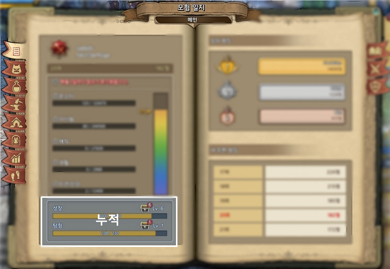
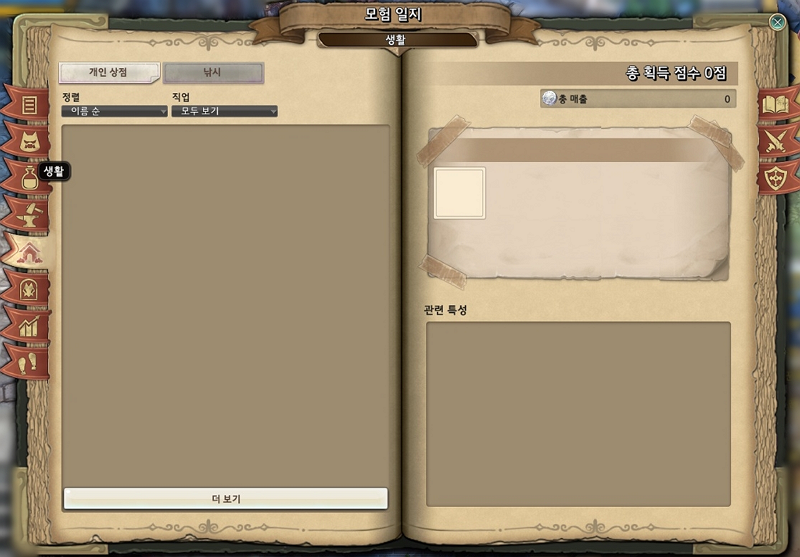
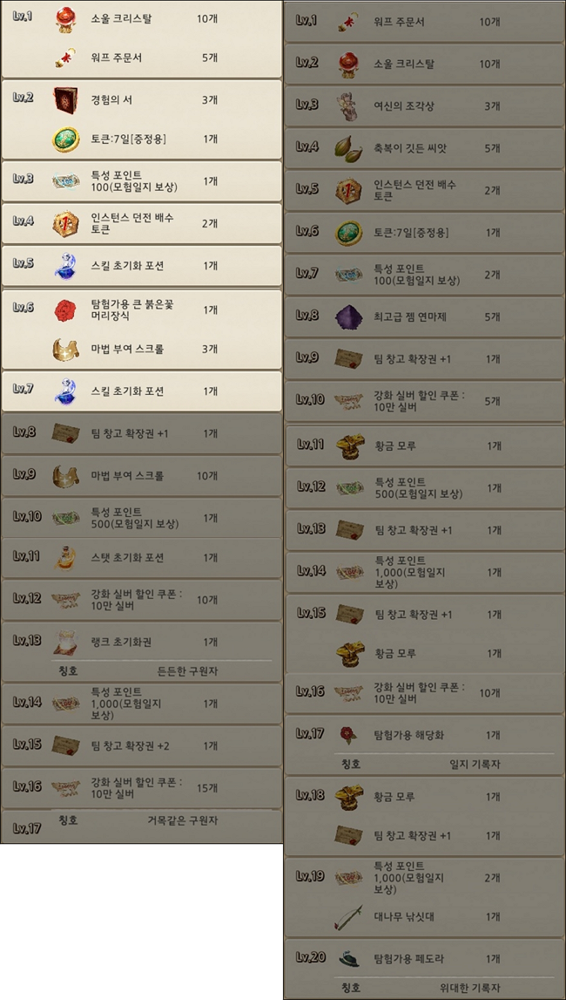

&nbsp;

# GM코코아가 전하는 모험일지 개편

**GM 코코아:**  
모험일지 기획자님, 반갑습니다!  
인터뷰를 마치고 나면, ‘차라리 TOS 개발팀을 할 걸’이라는 후회를 하실지도 모르는데요,  
각오는 되셨나요^^?

**모험일지 기획자:**  
인터뷰란 것을 태어나고 나서 처음 해보는 거라 더 긴장이 많이 되네요. oㅁo;;

**GM 코코아:**  
걱정하지 마세요. 해치지 않는답니다. ^^*

그럼 첫 질문입니다.  
모험일지 개편에 대한 공지는 아주 오래전부터 최상단에 있어 왔는데요,  
이러다 개편 안내 공지가 공지 페이지의 배경의 일부가 되지 않을까 하는 우려도 있었던 것이 사실입니다.
하지만 그만큼 기대하기도 했었죠.  
이번 모험일지 개편이 이루어지게 된 이유는 무엇인가요?

**모험일지 기획자:**  
개편 이전 모험일지는 불필요한 정보를 표시한다거나, 잘 표시가 안되는 경우가 종종 있었습니다.  
그리고 각 콘텐츠에서 획득한 점수로 받을 수 있는 보상의 종류 또한 구원자분들에게 모험의 욕구를 돋우진 못하다는 생각이 들었습니다. 그래서 불필요하거나 표시가 잘 안되는 정보들은 제거하거나 고치고 다양한 보상을 배치해 모험의 욕구를 돋울 수 있게끔 모험일지를 개편하게 됐습니다.

**▲ 현재 모험일지의 모습**

**GM 코코아:**  
모험의 욕구를 돋운다라… 기획자로서 욕심이 가셨을 만한 이유였네요.  
그럼 실제 개편을 기획하시는 과정에서, 가장 고민하셨던 부분은 무엇이었나요?

**모험일지 기획자:**  
보상 부분이었습니다.  
어떻게 하면 구원자분들이 활발하게 TOS 세계에 모험을 떠날 수 있는 계기를 만들어드릴 수 있게 할 수 있을지, 어떤 보상을 지급해야 기꺼이 모험일지를 기록, 달성해가며 즐거움을 찾을 수 있을지를 놓고 여러가지를 생각해야 했기 때문입니다.

**GM 코코아:**  
일단 제가 보기에는, 유저로서 보면 매력적이고, GM으로서 보면 안정적이라는 평가를 내리게 되는데요.  
하지만 제가 여기서 합격! 이라고 얘기해도, 최종적인 결과는 구원자 여러분께 달려 있으니 당분간 잠을 이루기는 힘드시겠어요.

&nbsp;

다음 질문입니다.  
모험일지에서, 매월 점수가 초기화된다는 문구를 보았습니다.  
초기화되는 영역이 무엇이며, 초기화와 비초기화의 기준은 무엇인지, 그리고 왜 그렇게 나누셨는지 궁금합니다.

**모험일지 기획자:**  
초기화 영역은 몬스터 처치, 아이템 획득, 아이템 제작, 개인상점, 낚시, 던전이며, 초기화와 비초기화의 기준은 초기화 했을 때 현재 내가 가지고 있는 캐릭터로 내 모험기록을 다시 복구할 수 있느냐 없느냐를 기준으로 잡았습니다. 만일 퀘스트 기록이 지워진다면 이것을 다시 채우기 위해 캐릭터를 새로 만든다는 것은 유저분들에게 별로 유쾌하지 않는 경험을 주기 때문이죠.

예전과 달리 초기화 되는 부분은 랭킹을 통한 리프레시와 가치있는 보상을 받을 수 있도록 하기 위함입니다. 모든 것이 누적 랭킹으로 보상이 주어진다면 서비스가 지속되면서 대부분의 구원자분들은 랭킹에 들기 어렵습니다. 매달 초기화되는 항목들을 점검하면서 이번 달에는 나도 몇 위 안에는 들어볼 수 있겠다, 혹은 다음 달에는 랭킹에 도전해봐야지라는 마음이 들 수 있는 부분을 채택했습니다.

**▲ 새로운 모험일지의 모습**

**▲ 매월 점수가 초기화되는 영역 (몬스터 처치, 아이템 획득, 아이템 제작, 개인상점, 낚시, 미션/인던)**

**▲ 초기화 없이 누적되는 영역 (성장, 탐험)**

**GM 코코아:**  
제 자랑거리 중 하나가 트리 오브 세이비어의 (거의) 모든 퀘스트를 해 보았다는 것인데,  
그것이 사라진다면 정말 슬펐을 것 같아요. 어쩌면 죽창을 들고 찾아뵈었을지도 모르겠습니다^^!  
랭킹 도전은 꼭 해보고 싶네요.

&nbsp;

한편 개발 서버에서 확인해 본 바로는, 각 영역별로 점수를 모아서 순위를 매기는 것 같았습니다.  
아무래도 모험일지를 펴자마자 상위 랭커의 명단이 나오게 되기도 하는 만큼, 신경쓰이지 않을 수가 없을 것 같은데요. 아시다시피, 이전에는 모험일지 랭커가 되려면 결국 돈을 치덕치덕 발라야 했습니다. 아이템을 사고, 강화를 적당히 두드린 다음 파는 것을 반복하는 것 만으로도 엄청난 점수가 올랐으니까요. 그런데 이번에도 몬스터, 그리고 아이템이 매우 큰 비중을 차지하고 있었는데요. 이러한 배점의 배경이 궁금합니다.

**모험일지 기획자:**  
유저분들이 트리 오브 세이비어를 즐기면서 많이, 쉽게 접근할 수 있으며 성취도 또한 가장 높은 영역이라 판단이 되어 높은 비중을 뒀습니다.

**GM 코코아:**  
이전과 같은 방식으로 빠르고 쉽게 점수를 획득할 수 있다는 것인데요… 그렇다면 기획자로서, 빠르게 상위권에 도달하기 위해서는 어떤 방법이 좋을 것 같다고 생각하시나요?

**모험일지 기획자:**  
현재는 몬스터와 아이템 획득, 제작이 많은 점수 비중을 차지하고 있습니다. 그래서 다양한 몬스터를 잡으시고 다양한 아이템을 만드시는 게 가장 빠릅니다. 앞으로 콘텐츠가 업데이트가 되고 유저분들의 동향을 살피면서 점수 비중을 맞춰 나갈 것입니다.

**GM 코코아:**  
보상이 걸려있고 그것이 경쟁에 의해 얻어지게 되는 한, 결국은 최적화된 루트를 밟게 될 것인데, 그것에 대해 어떻게 생각하시나요?  
모험일지 개편의 본래 취지와 맞다고 보시나요?

**모험일지 기획자:**  
모험일지는 TOS의 생황을 기록하는 것이 본래의 취지입니다.

그리고 모든 일에는 최적화된 방법을 찾고 그것을 밟아 나가는 건 당연하다고 생각을 합니다만, 만일 경쟁 항목이 지나친 꼼수를 통해 달성이 가능하다던가 다른 유저에게 피해를 줄 수 있는 부분들이 발견된다면 지속적으로 수정해 갈 예정입니다.

**GM 코코아:**  
이전의 최적화된 점수 획득 방식인 ‘마켓에서 구매, 소량 강화 이후 재판매’는 딱히 타 유저에게 피해를 주지는 않지만, 본래의 취지에는 맞지 않는 것 같습니다. 직접 몬스터를 사냥하여 획득한 아이템과 마켓을 통해 획득한 아이템 간에는 점수의 차이가 있나요?

**모험일지 기획자:**  
마켓에서 구매, 재매입도 획득으로 인정하고 모험일지에 표시하려고 했지만 어뷰징 요소가 있을 것으로 판단되어 제외했습니다. 그래서 마켓을 통해서 획득한 아이템은 모험일지에 등록되지 않게끔 되어있습니다.

**GM 코코아:**  
획득이 중요한 것이었군요! 아무래도 저 역시 한국인의 피가 흐르고 있기 때문인지, 어떻게 하면 순위권에 들 수 있을까부터 여쭤보게 되었네요.

그러느라 깜빡할 뻔 했습니다. ‘생활'이란 곳에서는 무엇을 다루나요?

**모험일지 기획자:**  
몬스터, 아이템 획득, 아이템 제작은 전투쪽에 초점을, 생활은 비 전투쪽에 초점을 맞췄습니다. 그래서 유저분들이 비 전투시 즐길 수 있는 콘텐츠를 다루고 있습니다.

**GM 코코아:**  
‘생활' 영역을 보니 개인상점 탭과 낚시 탭이 있더라구요. 그런데 개인상점과 낚시 옆의 빈 공간이, 딱 버튼 하나가 더 들어가기에 안성맞춤으로 보였습니다.  
혹시...?

**▲ 향후 추가될 생활 콘텐츠가 기록될 영역**

&nbsp;

**모험일지 기획자:**  
앞으로 나올 신규 생활 콘텐츠에 대한 일지가 들어갈 수 있게 자리를 마련해 둔 것입니다. 향후 생활 콘텐츠가 나와 모험일지 기록에 적합하다면 지속적으로 추가될 예정입니다.

**GM 코코아:**
성장은 마치... 어릴 적, 그러니까 얼마 전^^에 '주머니괴물' 뱃지를 모으던 느낌이 나네요.  
본인은 저런 곳에 빈 칸이 있는 것을 참지 못하는 성격인지라, 가볍게 사흘 밤낮으로 뇌오세를 굴려 보았습니다.

그랬더니 빈 칸을 메우기 위해서는 필연적으로 '옷장 트리'를 키워야 한다는 결론에 도달했는데요, 이 역시 의도된 바인지 궁금합니다.

**모험일지 기획자:**
다양한 클래스를 키워보는 것은 TOS의 주요 재미 중 하나입니다. 이를 반영한 부분이라고 생각하시면 될 것 같습니다.

**GM 코코아:**  
GM으로서, ‘캐릭터는 곧 자신의 분신’이라는 말을 하곤 합니다. 오직 직업 콜렉션만을 위해 캐릭터를 생성하고, 키우게 된다면 콜렉션을 달성하고 난 뒤에는 버려지게 될 것 같은 예감이 드는데요. 이 점에 대해서는 어떠한 의도가 있었는지 여쭙습니다.

**모험일지 기획자:**  
TOS의 클래스들은 각자 나름의 가치를 가지고 있고, 정도는 다르지만 팬들도 존재합니다. 단지 모험일지 보상을 위해 클래스를 모을 수도 있지만 한 분이라도 더 많은 구원자들께서 한 종류라도 더 다양한 클래스들을 경험해 보시기를 바라는 점을 적용했습니다. 이는 TOS 세계에서 이만큼의 행동을 했다는 발자취가 되기도 할 것입니다.

**GM 코코아:**  
탐험탭은 나의 트리 오브 세이비어 기록실과 같은 느낌이었습니다.  
동시에 윽, 이걸 빼먹었군 어서 가서 해야겠어라는 동기를 부여하는 역할도 할 것 같아요.

그런데 한 가지, '업적' 부분은 예외였습니다.  
여기서는 내가 무엇을 ‘더’ 할 수 있는지 알 수 없는데, 그렇게 설계된 의도가 궁금합니다.

**모험일지 기획자:**  
업적 부분은 캐릭터 정보창에서 [내가 무엇을 ‘더’ 할 수 있는지] 확인이 가능합니다. 그래서 이부분은 모험일지 업적영역에 들어가게된다면 정보를 중복으로 보여주게 된다고 판단이 되어 모험일지에서는 제외했습니다.

**GM 코코아:**
비초기화 영역은 초기화되지 않으니까, 당연히 계정 당 한번만 받을 수 있겠죠?  
단도직입적으로 묻겠습니다. 성장 영역에서 13레벨을 달성하기 위해서는 어느 정도 플레이해야 하나요?

**모험일지 기획자:**
성장 영역에서 13레벨 정도면 점수로 따져봤을 때 5600점입니다.

팀 레벨당 100점, 클래스 1개 보유 시 50점이며,  
이를 고려했을 때 만렙 캐릭터 5개와 캐릭터 당 중복 없이 8개의 클래스를 가진 캐릭터를 4개를 보유하면 도달 가능합니다.

**▲ 성장 영역(왼쪽)과 탐험 영역(오른쪽)의 보상 리스트**

&nbsp;

**GM 코코아:**
그렇다면 일단 저는 차고 넘치도록 안정권이라고 볼 수 있겠군요.  
감사합니...가 아니라, 이번 개편으로 모험일지가 완성되는 것인지, 아니면 아직 더 계획하고 있는 것이 있으신지 궁금합니다.

**모험일지 기획자:**
생활 영역에서 추가적인 생활 콘텐츠가 나올 것이냐는 질문과도 같이 TOS는 서비스 중인 게임이고 콘텐츠는 앞으로 더 나올 겁니다. 그렇기에 모험일지도 앞으로 나올 콘텐츠에 발 맞출 것이고 유저분들의 지속적인 피드백을 받으며 나은 방향으로 업데이트 할 예정입니다.

**GM 코코아:**
끝으로, 기획자분께 모험일지란?

**모험일지 기획자:**
제게 모험일지에 대해 묻기보단 유저분들께 모험일지에 대해 여쭙고 싶어요. 지금까지의 유저분들에게 모험일지란 무엇이었고 앞으로의 모험일지는 어떻게 됐으면 좋겠는지를요. 모험일지에 대한 피드백을 많이 주세요. 앞으로도 유저 여러분의 이야기를 듣고 의견을 반영하는 TOS가 되겠습니다.