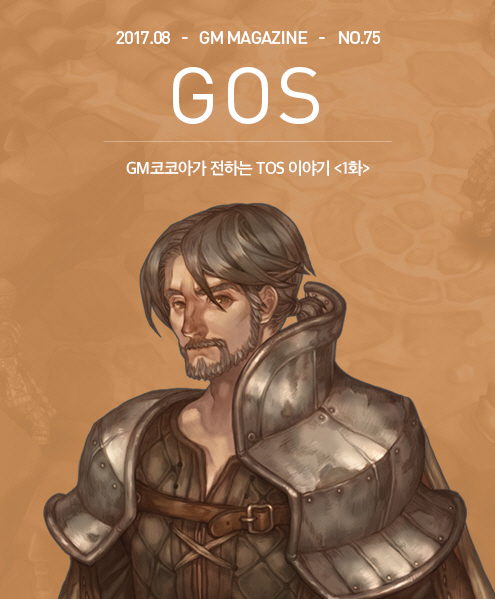

&nbsp;

# GM코코아가 전하는 TOS 이야기: 1화

안녕하세요, **GM코코아**입니다.

### ※주의!  
지금부터 제가 들려드릴 내용은 트리 오브 세이비어의 이야기에 대한 직/간접적인 **스포일러**를 포함하고 있습니다.  
이를 원하지 않으시는 분들은 침착하게 뒤로가기를 눌러주세요.

&nbsp;

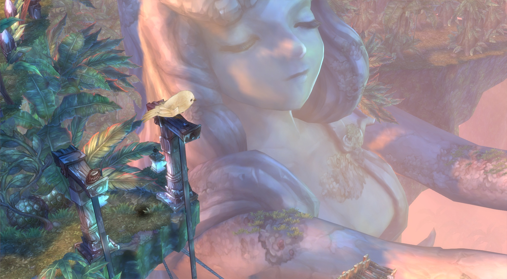 

여신께서는 언제나 사람과 함께하셨다고 합니다.  
대지의 여신인 제미나께서는 온 땅에 축복을,  
불의 여신인 가비야께서는 불의 사용법을,  
여행자들은 바카리네 여신의 별을 보고 자신의 위치를 알았으며  
아우슈리네 여신께서는 영혼들을 편히 쉬게 해주셨죠.  
그러나 언젠가부터 여신들께서는 하나 둘씩 기도에 답하시지 않게 되었습니다.
사람들은 대수롭지 않게 여겼죠.

&nbsp;

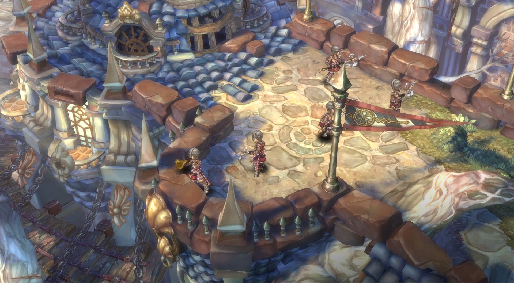

어느 날. 트리 오브 세이비어 세계 속의 사람들에게는 그야말로 어느 날이겠지요.  
하지만 그 날은 여느 어느 날이 아닌, 아무리 잊고 싶어도, 기어코 영원히 기억되고야 말 그 날이 되었습니다.  
바로 **신수의 날**입니다.
 
&nbsp;

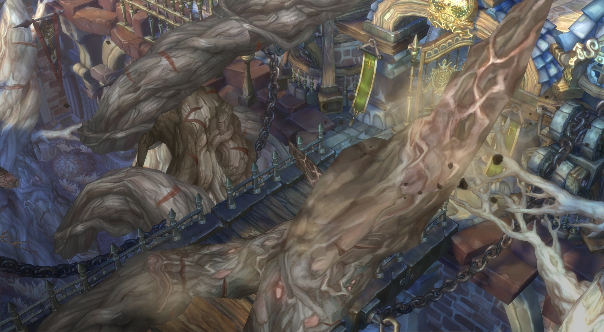

거대한 신수가 왕국을 덮쳤습니다.  
아까 나팔을 불던 병사는 무사했을까요? 이 재앙을, 도망친다고 벗어날 수 있었을까요.

&nbsp;

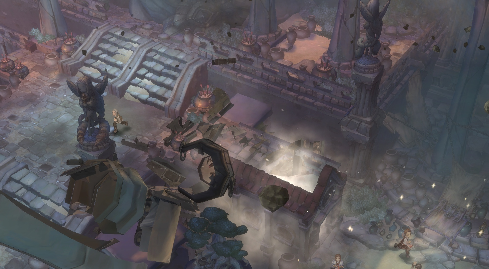

꿈은 꿈으로 남아 있을 때에만 아름다운 것이겠지요. 눈 앞에 닥친 악몽은 깨어날 수 없는 현실이었습니다.

&nbsp;

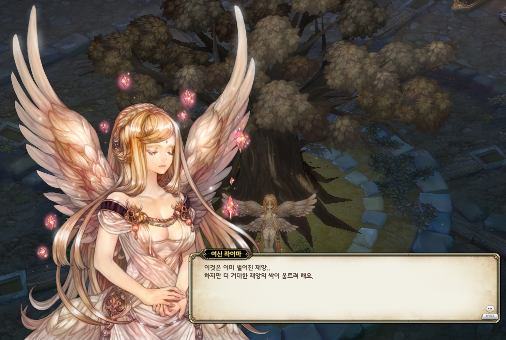

4년 뒤에도 신수의 날로부터 이어진 절망은 계속되고 있었습니다.
그러던 중, 왕국 곳곳에서 여신의 꿈을 꾸었다는 사람들이 나타납니다.

&nbsp;

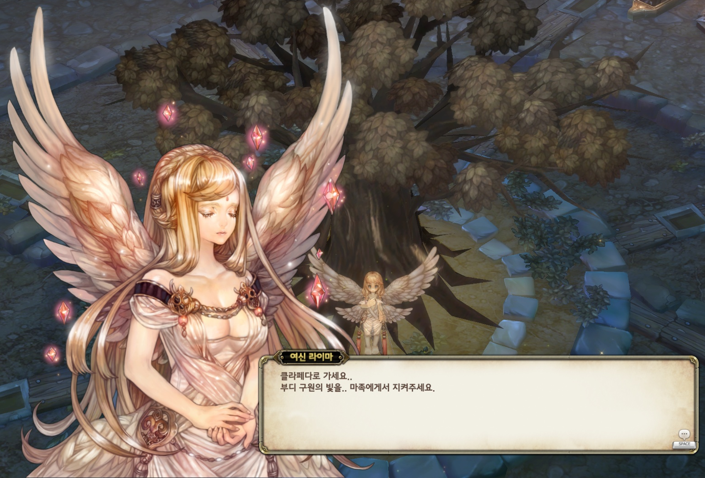

그 꿈에서, 여신께서는 ‘마족이 구원의 빛을 노리고 있으니, 이를 마족으로부터 지켜달라’고 하셨습니다.  
그리고…

&nbsp;

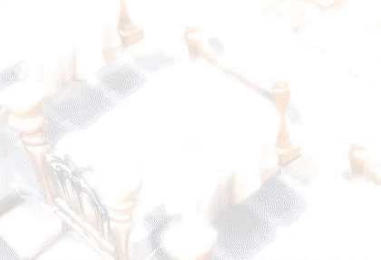

저도 그 꿈을 꾸었습니다.

GM코코아가 들려주는 TOS 이야기, 지금부터 시작합니다.

&nbsp;

본격적인 모험을 떠나기에 앞서, 구원자 여러분과 몇 가지 약속을 하고 가려 합니다.

**GM코코아가 드리는 네 가지 약속!**

1. 큐폴 서버에서 플레이한다.
2. 단, [큐폴 서버 구원자 패키지]는 사용하지 않는다.
3. 육성은 오직 퀘스트로만 진행한다.
4. 클래스 전직 시, 구원자 여러분께서 선택해준 클래스로 전직한다.

&nbsp;

… 라고 말씀드리고 출발하기가 무섭게, 경비병들이 길을 가로막네요.  
이것들이 내가 누군줄 알고… 마! 너희 대장 나오라고해!

&nbsp;

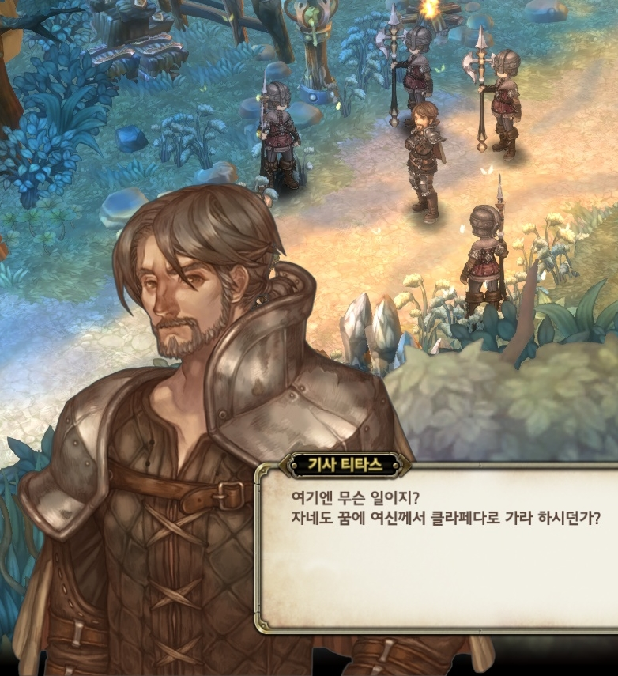

나오란다고 진짜 나오시는 기사님. 대장님답게 말씀도 편하게 하십니다.  
여신님께서도 존댓말 해주셨는데…  
암튼, 자네‘도’ 라고 하시는걸 보니 저 이전에도 여신님의 꿈을 꾼 사람들이 있었나 보군요.  
그 사람들의 지난 행적이 저 말투에 영향을 주었음이 분명합니다.

&nbsp;

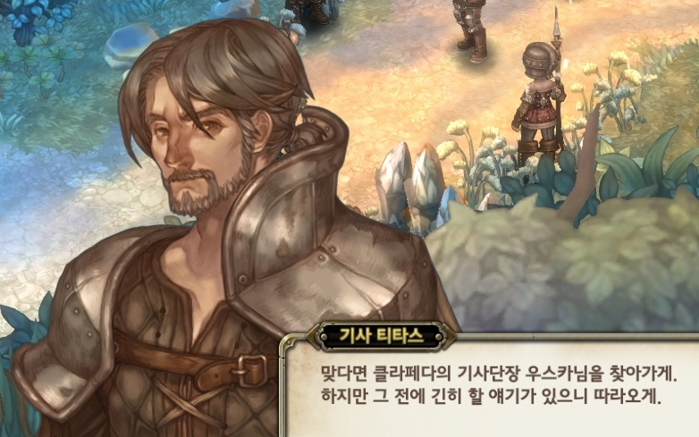

어머… 긴히 할 얘기…*-_-*

&nbsp;

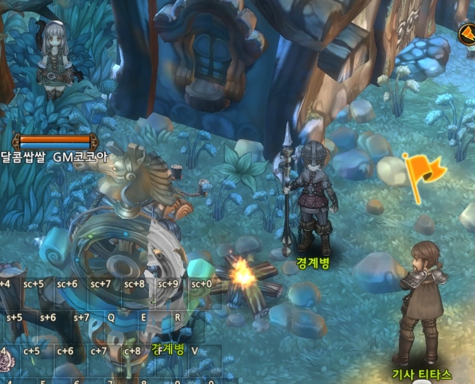

‘긴히 할 얘기’를 나누기 적절한 곳으로 갔지만, 기사님께서는 따라오지 않으셨습니다.  
사실 별다른 얘기는 아니었고, 클라페다로 바로 보내줄까? 아니면 내 부탁 좀 들어줘라는 것이었는데요.  
저는 경험치 카드 한 장 한 장이 매우 소중한 형편인만큼, 클라페다 서쪽 숲을 심부름을 하며 돌아다녔습니다.

&nbsp;

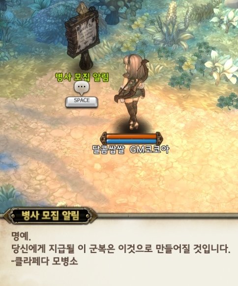

돌아다니다 보면, 이런 멋진 말이 써진 푯말도 보게 되구요.

&nbsp;

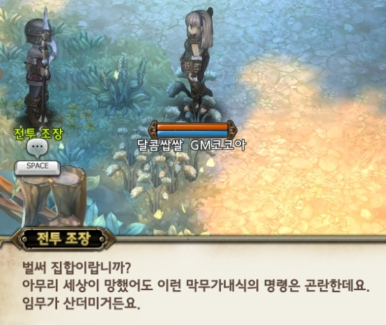

어딜 가나 군인은 다 비슷하구나… 라는 생각이 들기도 하죠.  
조장님, 기사 티타스 앞에서도 같은 말씀 하실 수 있으실지 두고 봅니다?

&nbsp;

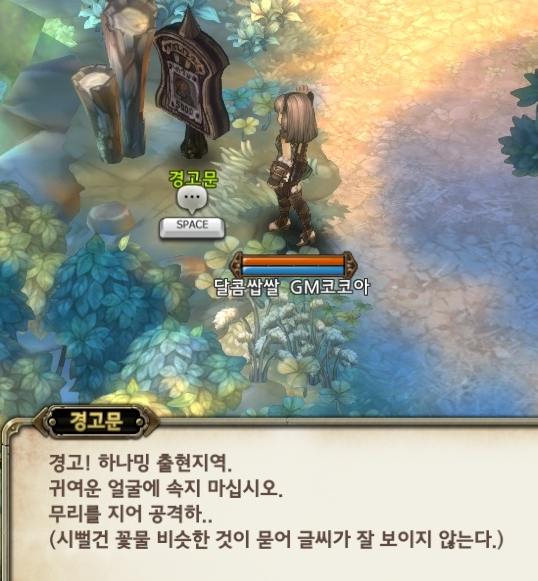

꽃물은 꽃물이지, 꽃물 비슷한 것은 대체 무엇일까요?  
무서운 상상을 하게 됩니다…

&nbsp;

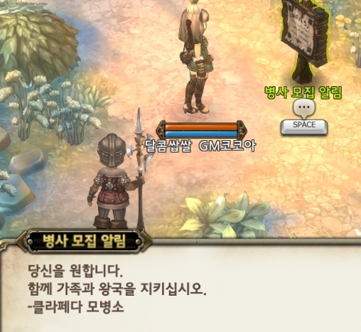

그렇게 간단한 몇 가지 심부름(몬스터 사냥)과 부탁(아주 강한 몬스터 사냥)을 들어주다 보면,  
클라페다 입구까지 도착하게 되는데요.  
입구의 병사 모집 알림에서…

&nbsp;

…가 생각나면 기분 탓입니다.

&nbsp;

클라페다에 입성!  
예상했던 것보다 클라페다는 멀쩡해 보였습니다. 꿈에서 보았던 마을은 다른 곳이었나보군요.  
아마 광산 도시라서, 나무보다 돌이 많으니 상대적으로 피해가 적었던 것이 아닐까 싶습니다.

&nbsp;

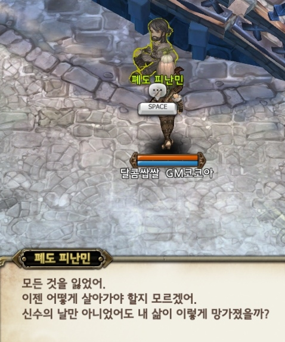

기사단장 우스카를 찾아가던 길에 만난 폐도 피난민입니다.  
신수는 왕국의 수도에 있었다지요. 그곳에서 살아나온 것만 해도 기적일텐데, 살아남는 것만이 전부는 아닌가 봅니다.

&nbsp;

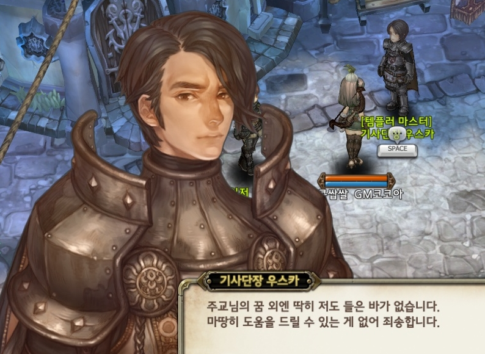

기사단장 우스카님은 아주 말끔하군요.  
최전선에서 구르고복무하고 있는 기사 티타스에게서 느껴졌던 삶의 고됨이 느껴지지 않습니다.  
아니면 기사단장다운 품위를 잃지 않고 있는 것인지도 모르지요.  
우스카는 주교님도 계시의 꿈을 꾸었다며, 수정광산으로 가 보라고 합니다.

&nbsp;

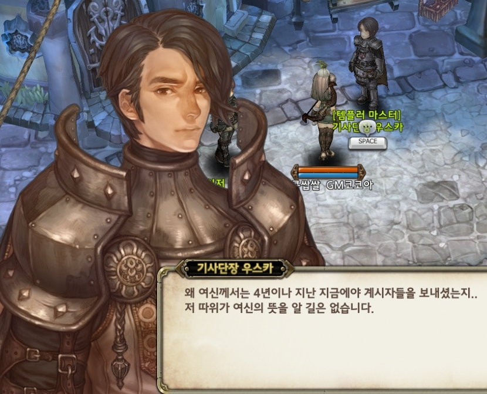

그 와중에 여신님에 대한 디스마저 품위있으신 기사단장님.  
수정광산은 샤울레이 동쪽 숲의 기사 아라스가 담당이라고 하니, 일단 그를 찾아가 봅니다.

&nbsp;

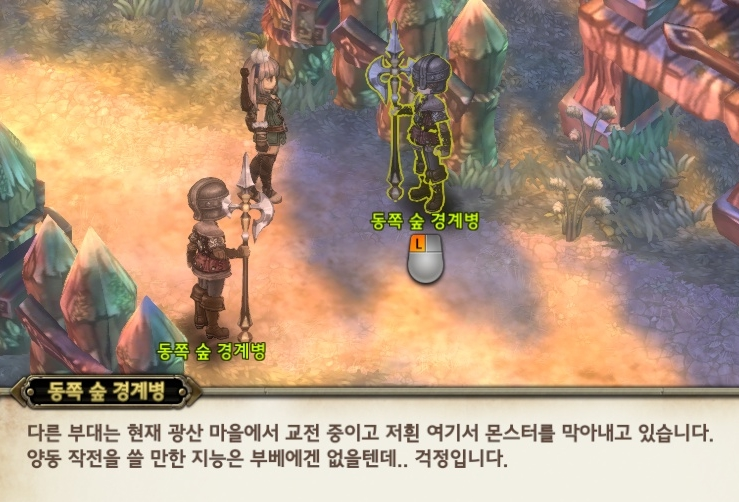

동쪽 숲에서 만난 경계병이 의미심장한 말을 합니다. 부베에게 특별 과외 선생님이라도 생긴 걸까요?

&nbsp;

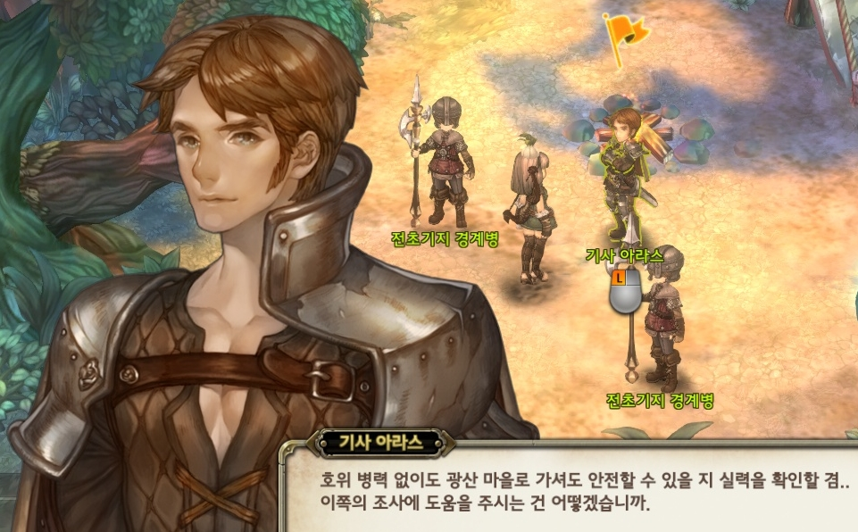

동쪽 숲을 담당하고 있는 기사 아라스는 다른 의미에서 의미심장한 말을 합니다.  
구원의 빛이 얼마나 중요한데… 당신 옆에서 놀고 있는 병사 몇 명만 차출해주면 안되겠냐고 설득하려 했지만,  
어쩔 수 없죠. 도움을 주기로 합니다.

&nbsp;

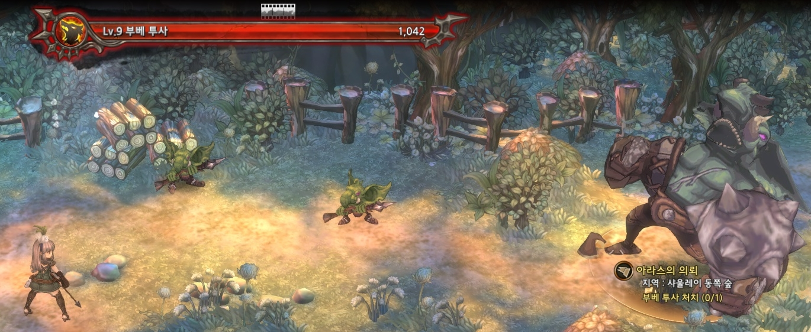

“크아아아” 엄청 짱 쎈 부베 투사가 울부짖었습니다.  
부베 투사는 지축을 뒤흔드는 강력함을 가졌음에도 불구하고, 꽤 상대할 만 했어요.

&nbsp;

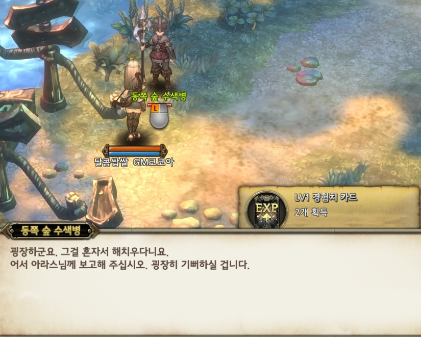

…는 실제로 엄청 강력한 몬스터였나 봅니다.  
하지만 제게는 LV1 경험치 카드 2장짜리 강력함이었을 뿐이죠. (훗)  
설득의 ㅅ도 꺼내지 못할 만큼의 포커페이스를 가진 아라스가 굉장히 기뻐할 거라니, 설레는 마음으로 돌아갑니다.

&nbsp;

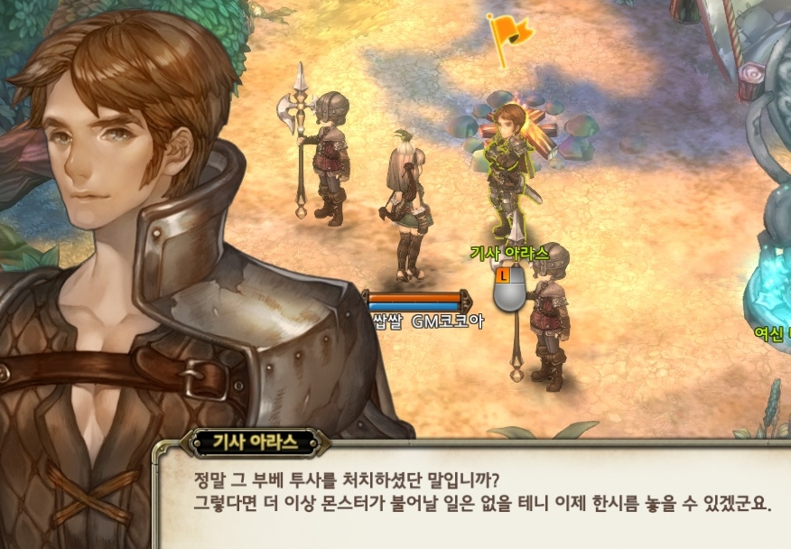

아니 이건… 굉장히 기뻐한다기보다는 반신반의+조금 다행이군 정도 아닙니까.  
그래도 사실 속으로는 많이 걱정하고 있었나 봅니다.

&nbsp;

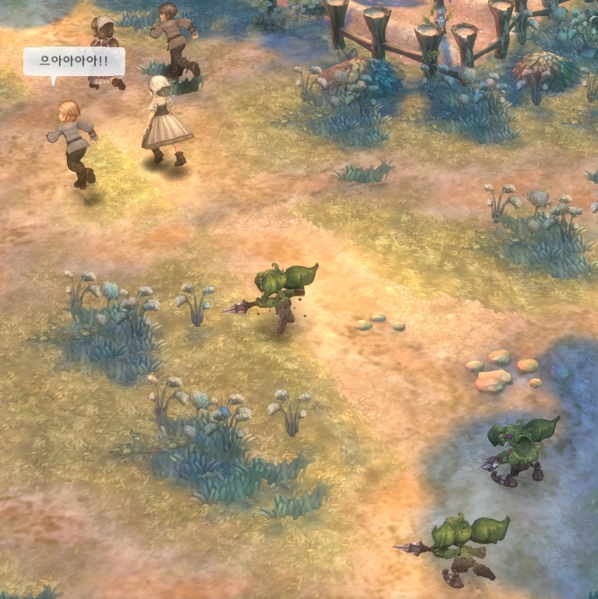

그러던 중에, 마을 사람들이 갑작스레 나타난 부베들에게 공격받는 일이 일어납니다.

&nbsp;

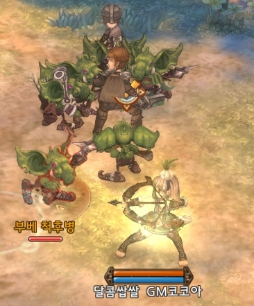

아라스와 함께 몰려든 부베들을 처치하고 나니…

&nbsp;

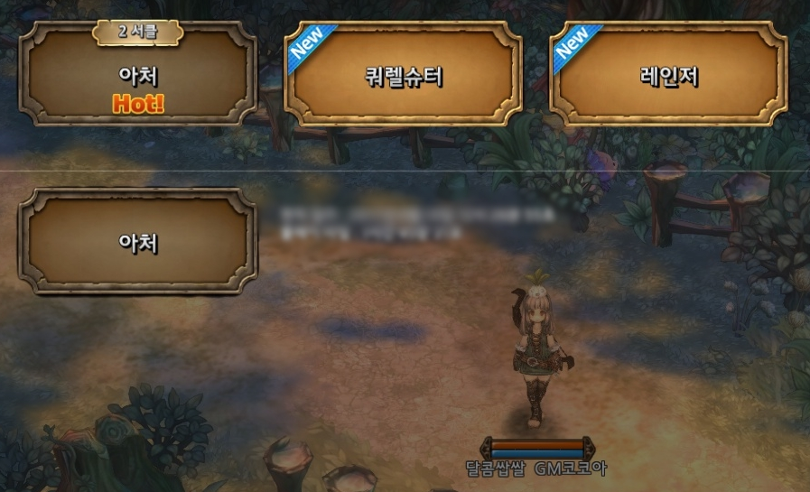

짜잔! 2랭크로 전직할 레벨이 되었습니다!  
아무래도 큐폴 서버이다 보니, 경험치 카드는 아직 전혀 사용하지 않았는데도 벌써 2랭크가 되었네요.

&nbsp;

전직할 때마다 유저 여러분께 선택을 맡기겠다는 약속을 드렸던 만큼, 첫 화는 여기에서 마치도록 하겠습니다.

댓글로, **GM코코아**가 전직할 클래스를 **[1. 아처 2. 쿼렐슈터 3. 레인저]** 중에서 선택하여 적어주세요.

그럼 2화에서 찾아뵙도록 하겠습니다.

감사합니다!