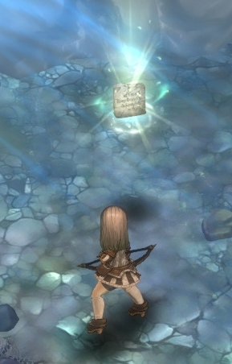

&nbsp;

# GM코코아가 전하는 TOS 이야기: 2화

안녕하세요, **GM코코아**입니다.

### ※주의!

지금부터 제가 들려드릴 내용은 트리 오브 세이비어의 이야기에 대한 직/간접적인 스포일러를 포함하고 있습니다.

이를 원하지 않으시는 분들은 침착하게 뒤로 가기를 눌러주세요.

&nbsp;

 

짜잔~ 지난 화에 여러분께서 선택하여 주신 [쿼렐슈터]로 전직했습니다.
전직할 때 쿼렐슈터 마스터가 하는 대사는 저게 전부가 아닌데… 스크린 샷에 먼지가 들어갔나봐요. ^^;

&nbsp;

 

샤울레이 광산 마을에 도착하면, 마을 경비병과 부베가 교전을 벌이고 있습니다.  
보통 이런 경우, 삼엄한 경계가 펼쳐지기 마련이라 저 같은 외지인이 함부로 돌아다니기는 어려운데요.  
교전 중이어서 정신이 없는 것인지, 아니면 군기가 빠진 것인지 모르겠지만  
저는 촌장님께 뚜벅뚜벅 다가가 말씀을 나눌 수 있었습니다.  
제가 나쁜 마음이라도 먹고 있었다면 정말 큰일 날 뻔 했어요.

&nbsp;

 

네, 안녕하세요 촌장님. 저도 만나서 반갑습니다. 저는 GM코코아라고 해요.  
제가 사는 세계에서는 초면에 인사를 나누는 예절이 있는데, 여기는 조금 다른가 봐요..?

&nbsp;

 

저 말씀을 하시기 직전에 촌장님께서 하신 말씀은 ‘여신께서 도운 게로군’ 이었습니다.  
제가 여기 온 것도 여신님의 뜻일 텐데…? 조금 앞뒤가 맞지 않는 촌장님이세요.

&nbsp;

 

그렇습니다!  
사실 촌장님께서는 마을 사람들을 구하기 위해 광산에 가셨다가,  
그만 유독 증기를 너무 많이 마셔버리셨던 것입니다.

&nbsp;

 

...라고 생각하기로 했어요.  
촌장님은 바이도타스라는 청년을 찾으라고 하셨습니다. 물론 그 분도 부베에게 끌려갔지만요.

&nbsp;

 

부베 전초기지에 도착해서 부베들을 제압하면, 묶여 있는 바이도타스를 만날 수 있습니다.

&nbsp;

 

그런데 이 분, 범상한 마을 사람이 아니군요.

 

무려 6랭크 클래스인 알케미스트 마스터셨던 것입니다.  
부베들이 매우 강력했거나, 아니면 마스터님이 대단히 방심하셨나봐요.

&nbsp;

 

대단히 방심했다가 당한 것 치고는 굉장히 침착하십니다.  
그래도 감사 인사를 하는 것을 보니, 다행히 광산에는 다녀오지 않으셨나봐요.  
광산으로 가는 길은 부베가 몰려오던 길이기도 해서, 수레로 막아두었는데요.  
이제 이걸 치워야 합니다.

&nbsp;

 

질풍노도의 시기라면 누구나 한번쯤은, 방을 치우라는 잔소리에 이런 식으로 치우고 싶을 때가 있었을 거에요.  
오늘은 잠들기 전에 반드시 화장실을 다녀오도록 해야겠어요.

&nbsp;

 

광산 입구에 있는 안전 수칙입니다.  
비록 저는 혼자 들어가게 되겠지만, 그래도 저와 함께 해주시는 여러분이 계시니 든든합니다.

 

&nbsp;

 

자… 잘 모릅니다.

&nbsp;

 

바이도타스가 GM이 된다면,  
아마 문의에 ‘자세한 내용은 지난 모월 모일의 공지에 있으니 한 번 읽어 보시고요.’ 라고 답변할 것 같습니다.

&nbsp;

 

따로 할 일의 정체는 무엇일까요.  
한 번 얄미워 보이기 시작하니 매사가 마음에 안들기 시작하는군요.  
그래도 공과 사는 구분해야 하는 법,  
끌려간 마을 사람들이 질식할 수 있으니 먼저 공기 정화 장치부터 수리하도록 합니다.  
촌장님 같은 분으로 가득한 마을을 만들 수는 없으니까요.

&nbsp;

 

그래서 고치고…

&nbsp;

 

강한 보스 몬스터와

&nbsp;

 

어딘가 굉장히 아파보이는 보스 몬스터를 처치하면서

&nbsp;

 

또 고치고

&nbsp;

 

계속 고칩니다.

&nbsp;

 

그렇게 광산을 가로질러 달려가다 보면

&nbsp;

 

바이도타스가 얘기했던 광부 휴게소가 나타납니다.  
어디 한번 둘러볼까요?

&nbsp;

 

책장에는 커닝햄의 전설이 꽂혀 있습니다.  
신수의 날 이후로, 커닝햄과 같은 위대한 영웅들이 얼마나 나타나고 스러져 갔을까요.  
커닝햄이 왜 위대한 영웅이냐구요?  
책장은 수정 광산 2층 포탈과 가까운 곳에 있으니, 직접 읽어보시는 것을 추천드립니다.  
어...이거 아까 바이도타스가 했던 말 같은데…(긁적긁적)...  
함께 꽂혀있는 다른 책들도 재미있습니다!

&nbsp;

 

광부 휴게소에 이런게 있어도 되는 걸까요?  
부베가 나타난 이후로 들여온 것일지도 모릅니다.

&nbsp;

 

그냥 먹을 수 없다면, 방금 전 ‘냄새만 잔뜩 나던 그거’랑 같이 먹으면 좋겠어요.

&nbsp;

 

2층에서의 볼 일이 끝났으니, 이제 3층으로 갑니다. 폴짝!

&nbsp;

 

바이도타스가 ‘따로 했던 일’은 무엇이었을까요?  
새삼스레 저 옷의 목 부분이 잡아당기기 좋게 생긴 것처럼 보입니다.

&nbsp;

 

그래도 거짓말은 하지 않았군요.  
잡혀갔던 마을 주민들을 찾았습니다.  
유독 이 상황을 즐기고 계신 것처럼 보이는 분이 한 분 계시지만,  
그렇다고 저 분만 빼고 풀어드릴 수는 없었어요.

&nbsp;

 

이전에는 옷의 목 부분에 집중하느라 잠시 깜빡했는데,  
바이도타스가 폐쇄된 구역 근처에서 구원의 빛과 관련된 마력이 느껴졌다고 했습니다.  
묘한 돌을 모아야 진입할 수 있나 봅니다.

&nbsp;

 

충분히 묘하게 생겼군요.  
굳이 부베에게서 빼앗을 필요가 없겠습니다.

&nbsp;

 

...는 잘못했어요ㅠㅠ  
저 붉은 색이 네더보바인을 분노하게 한 걸까요? 하지만 소는 색맹인걸요. 보스 몬스터님 저 마음에 안들죠?

&nbsp;

 

지나가는 부베들을 붙잡고 ‘샅샅이 찾아서 1개라도 나온다면 군밤 100대’ 하는 식으로 구하면  
더 빠르게 구할 수 있습니다.  
그것으로 결계석을 문지르면, 스르...ㄱ...

&nbsp;

 

광부가 말한 ‘스르륵’과는 꽤나 거리가 있습니다만, 아무튼 폐쇄된 구역으로 진입합니다.

&nbsp;

 

수정기둥과_한_컷.jpg  
이제 이걸 확인하기만 하면 되는데...

&nbsp;

 

커닝햄의 전설에도 등장했던 미르티스가 방해하러 나타납니다.  
아니면 제가 찾으러 올 줄 알고 기다렸던 것일지도 모르겠습니다.  
적절한 움직임으로 적절하게 적의 공격을 회피하며, 적절하게 잡아내시면 되겠습니다.

&nbsp;

 

이 돌판이 뭐라고 이 고생을… 이제 이걸 우리동네기사대장 우스카에게 가져갑니다.

&nbsp;

 

제 말이 그 말입니다.  
우스카는 자신도 잘 모르겠으니, 보코르 마스터에게 해석을 부탁하라고 합니다.

&nbsp;

 

보코르 마스터에게 가던 길에 만난 미망인과 대화를 나누면, 사라진 여신님들에 대한 이야기를 합니다.  
여신님들께서 사라지신 이유는 모르지만, 순서가 있었다고 해요.  
그리고…

&nbsp;

 

라이마 여신님이 가장 이상하다고 합니다.  
이로써 ‘당장 내일이 세상이 망하는 것 < 라이마 여신님’ 이라는 부등식이 성립하는군요.  
보코르 마스터에게 찾아갑니다.

&nbsp;

 

해석을 부탁드렸더니 석판으로 홀로그램을 재생하여 주시는데...

&nbsp;

 

운명과 예지의 여신께서는 마족들에 의해 일어날 첫 번째 재앙을 미리 아셨습니다.  
그럼에도 불구하고 당신의 미약함으로 인해 막으실 수 없었다고 해요.  
그래서 라이마 여신께서 찾으신 답이 바로 ‘구원자’라는 존재입니다.  
**이 세상 단 하나뿐인 구원자**를 숨기기 위해, 여러 ‘계시자’를 만드셨고  
당신은 스스로를 여러 개의 계시로 나누어 감추어 두셨습니다. 천 년 동안이요.  
라이마 여신이 완전한 모습을 되찾고 마족의 흉계를 멈추려면 **모든 계시를 전부 찾아야 합니다.**  
이 신성한 사명은 아주 힘들거에요.  
어쩌면 고난과 시련으로 가득찬 영겁의 세월을 보내게 될지도 모릅니다.

&nbsp;

 

p.s.  
광산 마을로 돌아가면 무언가 이상합니다.

&nbsp;

 

아까 광산에서 구할 때에는 분명히 네 명이었습니다.

&nbsp;

 

설마…

(3화에서 이어집니다.)