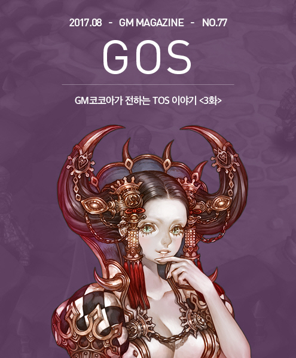 

&nbsp;

# GM코코아가 전하는 TOS 이야기: 3화

안녕하세요, **GM코코아**입니다.

### ※주의!

지금부터 제가 들려드릴 내용은 트리 오브 세이비어의 이야기에 대한 직/간접적인 **스포일러**를 포함하고 있습니다.  
이를 원하지 않으시는 분들은 침착하게 뒤로 가기를 눌러주세요.

&nbsp;

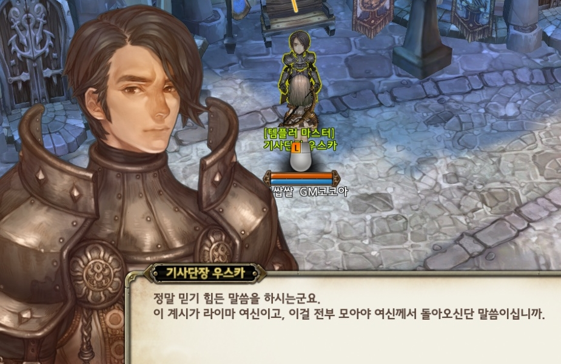 

지난 계시에서, 라이마 여신께서는 가장 드높은 화원의 초대 팔라딘에게 다음 계시를 맡겨 두었다고 하셨습니다.  
우스카의 말에 따르면, 오랜 맹약을 위해 팔라딘 마스터가 겔리 고원 지역으로 왔다고 합니다.

&nbsp;

 

가는 길에 만난 파수꾼들을 도와줍니다.  
몰리는 판토와의 관계를 회복하고 싶어하네요.

&nbsp;

 

새끼 판토를 미인계로 유혹해서...

&nbsp;

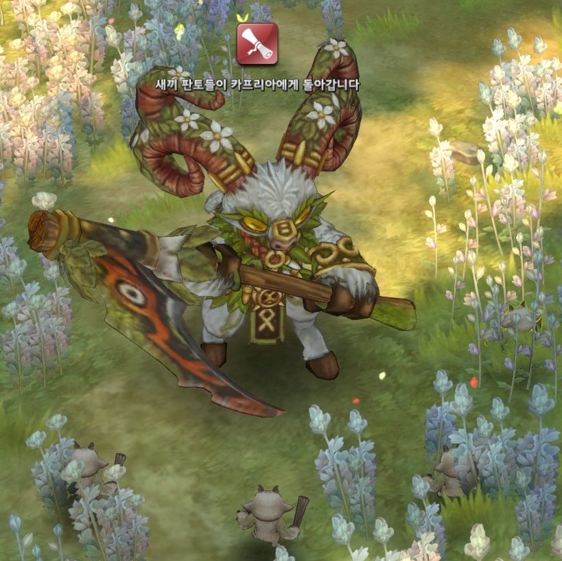 

판토들의 우두머리 카프리아에게 데려가봅니다.  
카프리아는 인간과의 추억을 떠올려 줄까요?

&nbsp;

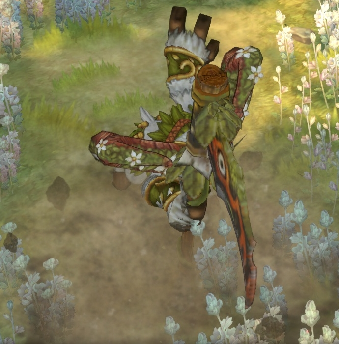 

격하게 환영해주네요! 뚝배기가 열 개라도 모자랄 환영입니다.  
저도 비슷한 방식으로 답례하여 주었습니다. ^^

&nbsp;

 

겔리 고원에 이르면 팔라딘 마스터가 나타납니다.  
저 엄청난 등장을 고작 나타난다고 밖에 표현하지 못하다니 안타까운 일이에요.

&nbsp;

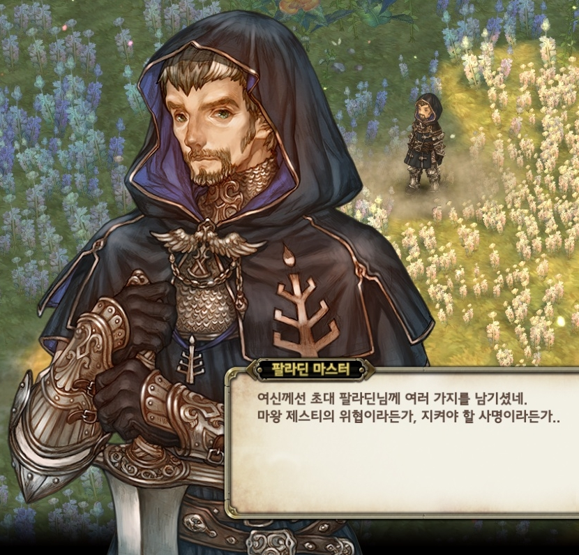 

그 중에는 구원자가 올 것이라는 말씀도 있었다고 해요.

&nbsp;

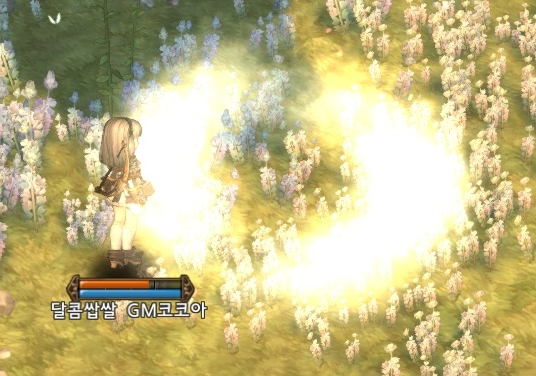 

먼저 가 있을테니 내 동료들을 도와주고 와요! 그럼 뿅!

&nbsp;

 

지난 화에서 먼저 가 놓고는 대체 무엇을 했는지 알 수 없었던 모 클래스 마스터와는 달리,  
팔라딘 마스터는 마왕 제스티가 노리는 계시를 지키기 위한 작업을 하고 있었던 모양입니다.

&nbsp;

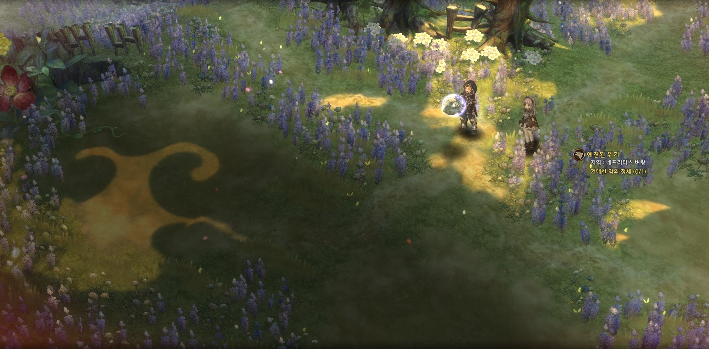 

팔라딘 마스터가 성구를 들고 의식을 시작하자, 하늘이 어두워지고…

&nbsp;

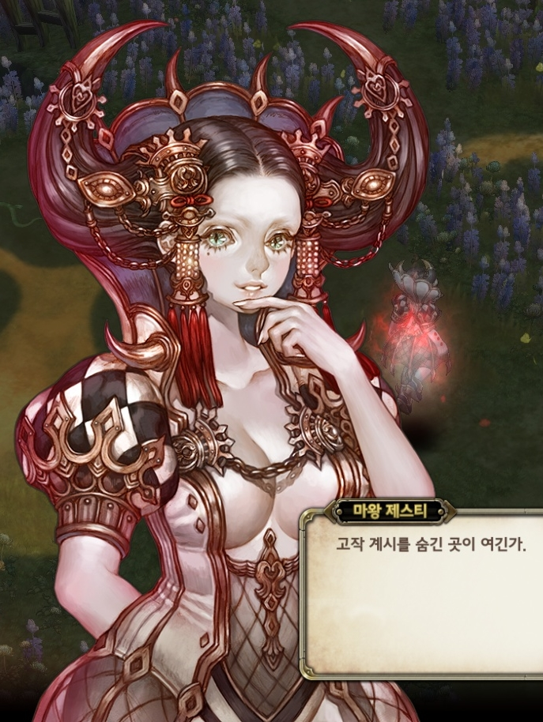 

마왕 제스티가 나타납니다.  
나이는 어려보이지만, 마왕이니만큼 보이는게 다가 아닐거에요.  
준비된 의식의 힘으로 마왕을 잡아보도록 합니다!  
먼저 가서 준비한 의식의 힘을 보여줘요 팔라딘 마스터!

&nbsp;

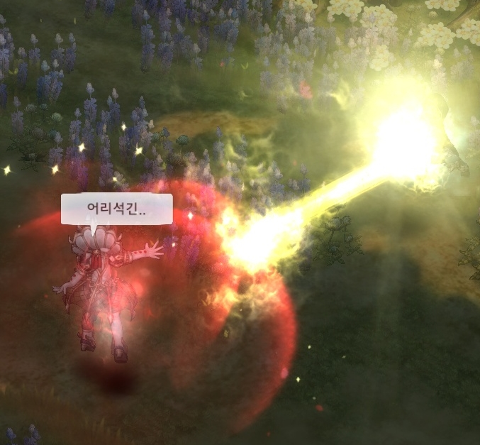 

결단코 저에게 하는 말은 아닐겁니다.

&nbsp;

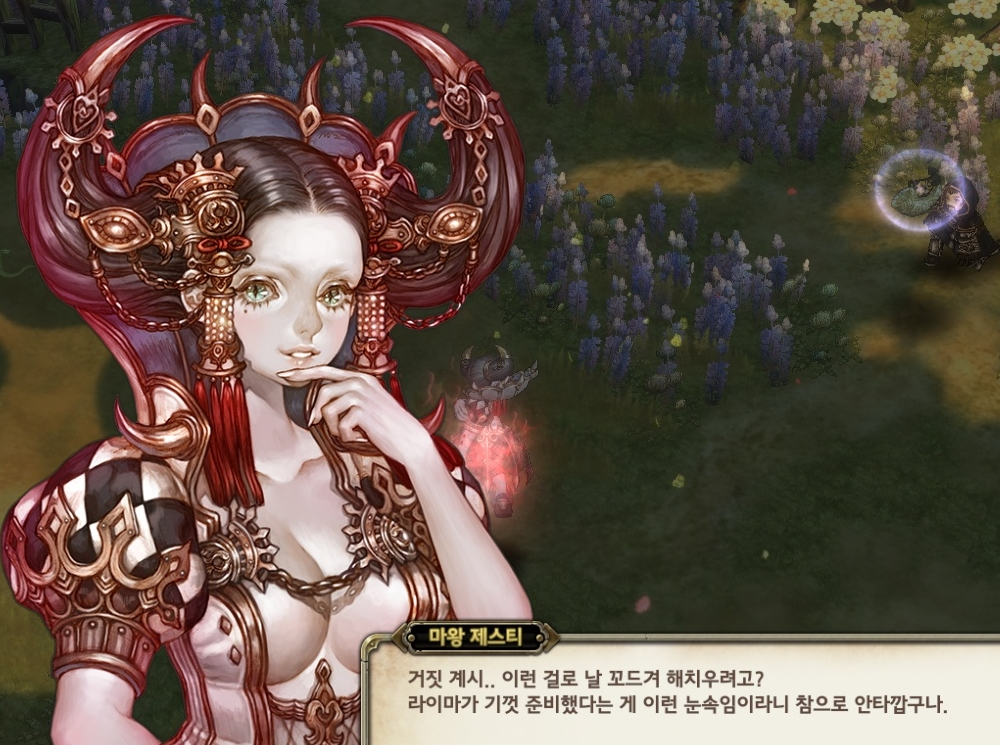 

여신님을 이름으로 막 부르는 제스티.  
예의범절에 엄격한 저는 용납하기 힘드네요. 꼭 버르장머리를 고쳐놓고야 말겠습니다.  
제스티는 진짜 계시를 찾으러 테넷 성당으로 떠나가버리는데…

&nbsp;

 

등장씬에서 모든 기력을 소진해버린 것은 아닌지 의심스럽습니다만-_-  
초대 팔라딘으로부터 지금까지 수백년간 여신의 뜻을 받든 분이기도 하고,  
상대는 다름아닌 ‘마왕’이라는 점을 감안하기로 합니다.

&nbsp;

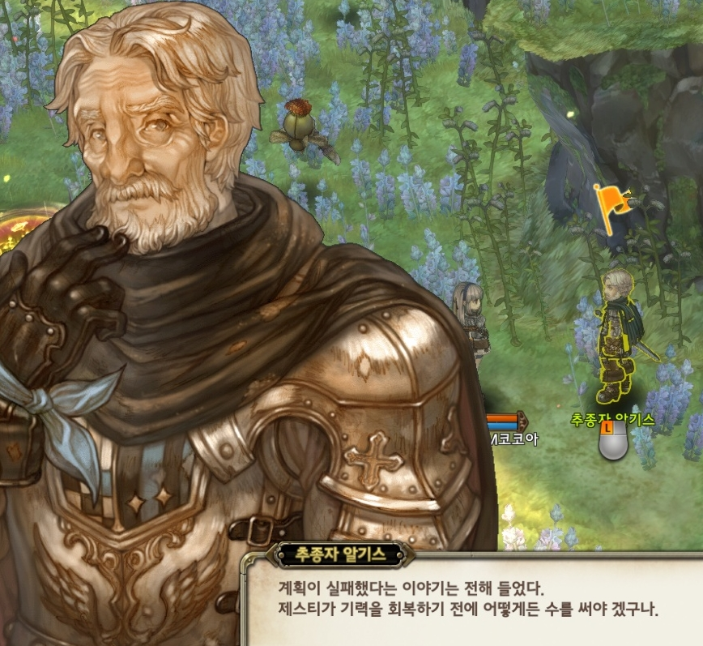 

테넷 화원에 도착해서, 테넷 성당 입구에 가면 알기스가 기다리고 있습니다.  
본인이 실행한 계획을 마치 제가 실패한 것처럼 자상하게 얘기하니 쑥쓰럽군요.

&nbsp;

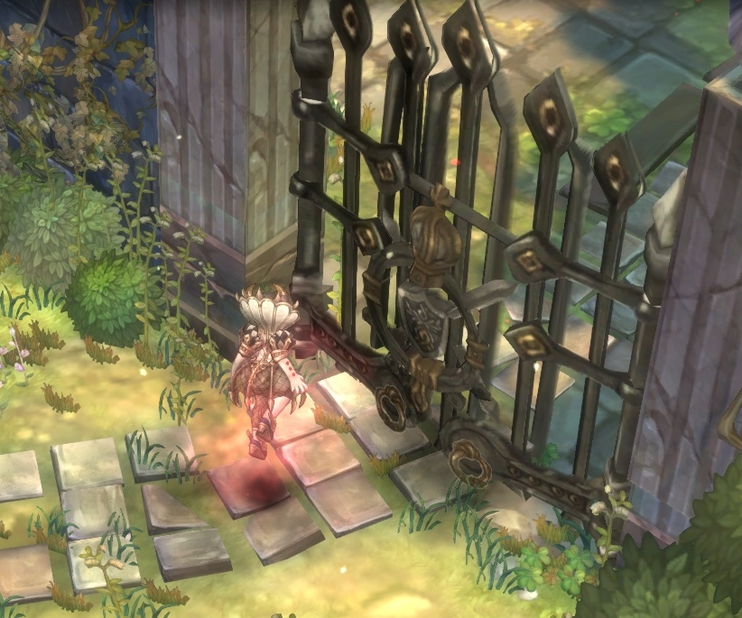 

그런데 이 때, 마왕 제스티가 성당 입구에 나타납니다. 철문 따위는 가볍게 날려버리는데요.  
기력을 회복하지 않은 상태에서도 지나다닐 수 없는 오브젝트를 삭제하는 비범함이라니,  
업수이 여길 상대가 아닌 것은 확실합니다.

&nbsp;

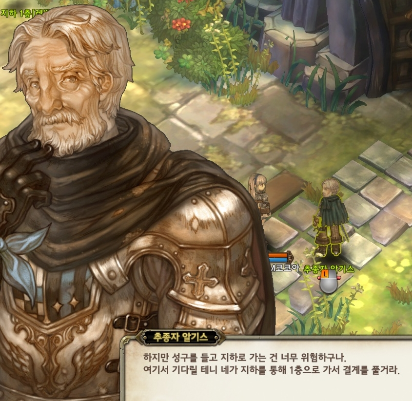 

제가 성구를 들고 기다려도 되는데…
하드 유저의 기다릴 줄 아는 능력을 우습게 보지 말아요 알기스.

&nbsp;

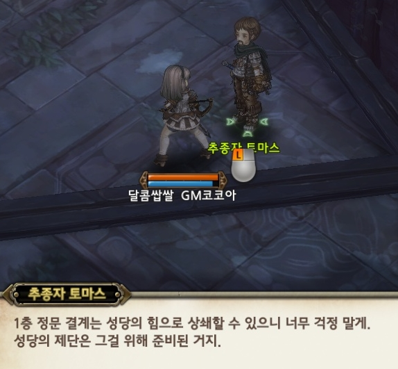 

하지만 경험치 카드는 소중하므로 따르도록 합니다. 제스티가 계시를 찾아내는 것은 시간 문제일 뿐입니다.
성당 지하에서 만난 토마스는 성당에 대해서 잘 알고 있는 것 같아요.

&nbsp;

 

심지어 위험한 일도 자진해서 떠맡습니다.

&nbsp;

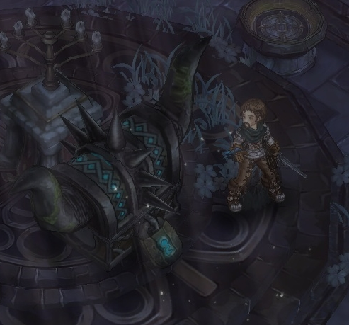 

톡! 작전 시작입니다!

&nbsp;

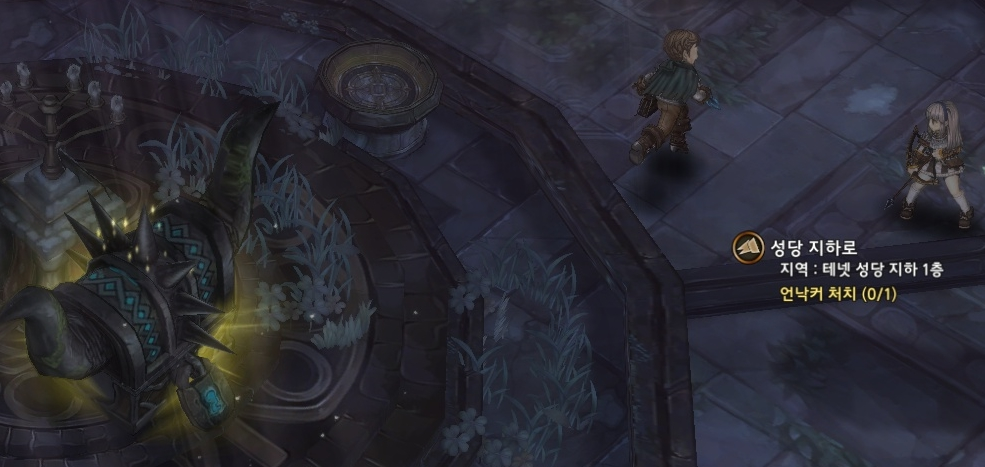 

잠들어있던 언낙커가 깨어납니다. 녀석을 유인해요 토마스!

&nbsp;

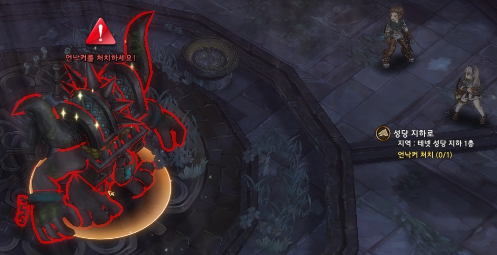 

…???

&nbsp;

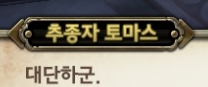 

제가 할 말을…

&nbsp;

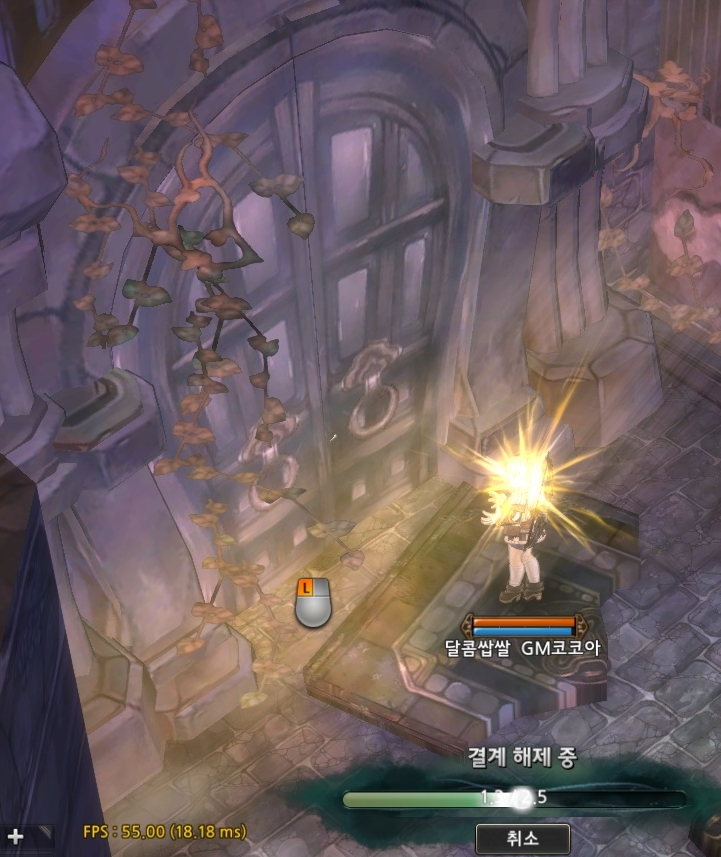 

지하를 지나, 1층으로 돌아 나와 정문의 결계를 해제합니다.  
한 문장으로만 써 놓으니 쉬워 보이지만,  
잘 보존되어 있는 큐폴 서버의 바글바글한 몬스터 무리를 켈드롭으로 상대하는 것은 꽤나 피곤한 일이었습니다.

&nbsp;

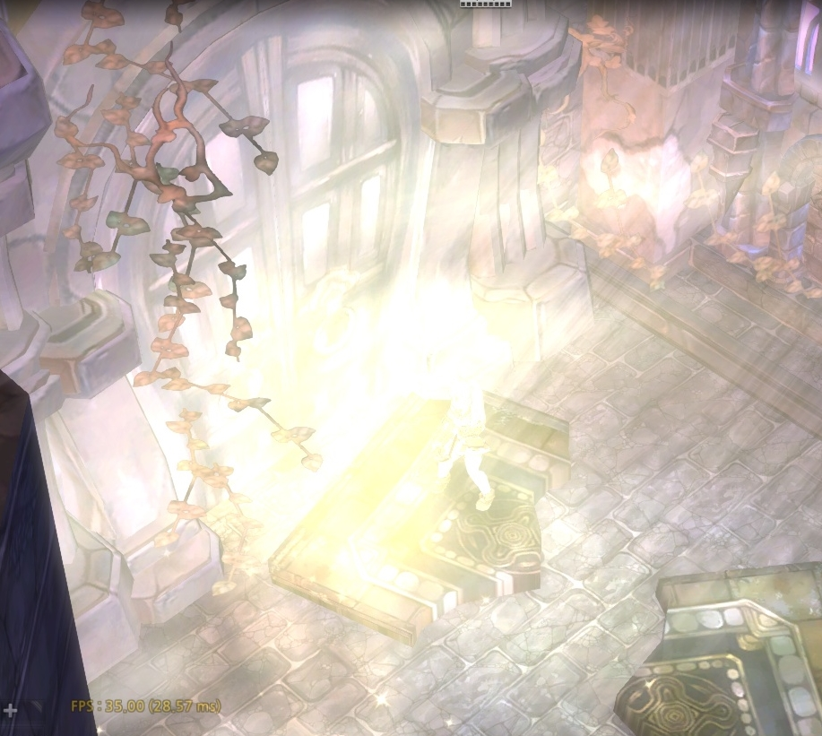 

결계를 해제하면, 환한 빛과 함께…

&nbsp;

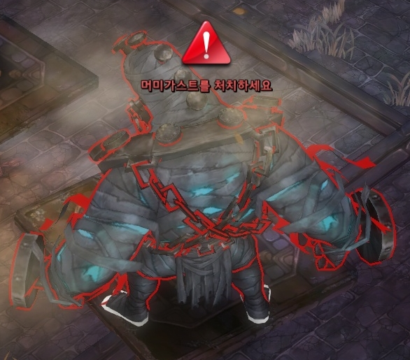 

숙면을 위해 눈까지 꽁꽁 싸맨 녀석이 뛰쳐나올 정도로 밝았던 것입니다. ㅠㅠ  
머미가스트가 드롭하는 장비는 조금 특별한 점이 있어요.

&nbsp;

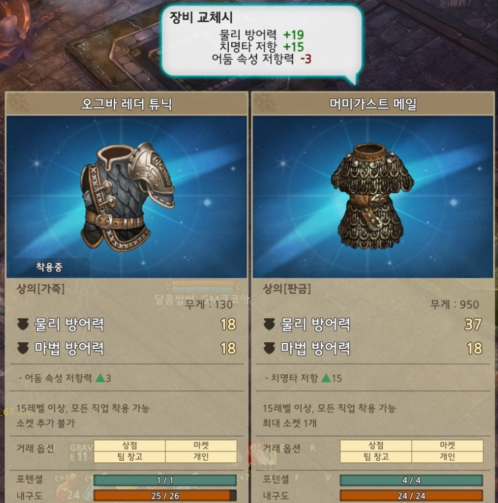 

탈트와 함께, ‘갑자기 이동 속도가 느려지는 버그’로 접수되는 문의를 이끄는 쌍두마차입니다.  
무게의 차이가 보이시나요?  
빠르게 처분하지 않으면, 어느새 걷고 있는 자신을 발견할 수 있습니다.

&nbsp;

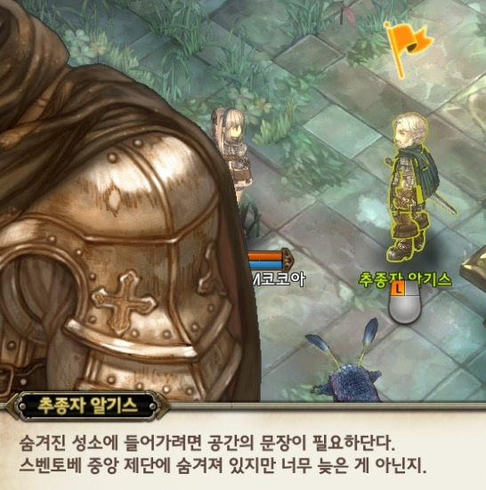 

계시는 숨겨진 성소에 있는 것 같아요.

&nbsp;

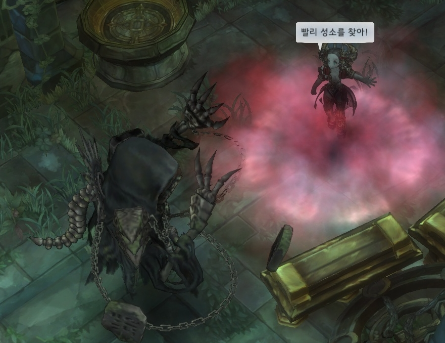 

그 정도는 제스티도 알고 있는 것 같습니다.  
그런데 어째서 네크로벤터에게서 알 수 없는 동질감이 느껴지는 걸까요...

&nbsp;

 

인간을 무시하고 깔보는 마족이지만, 조직 문화는 크게 다르지 않은 것 같습니다.

&nbsp;

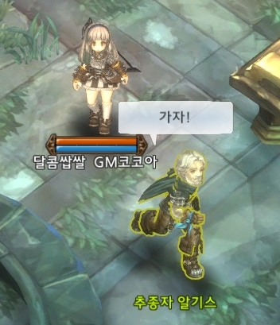 

이러고 있을 때가 아니에요. 저희도 서둘러야 합니다.  
일단 종탑을 되찾아, 제스티가 무엇을 하는지 확인해야겠어요. 지피지기라고 하잖아요?  
그런데 이상한 느낌이 드네...

&nbsp;

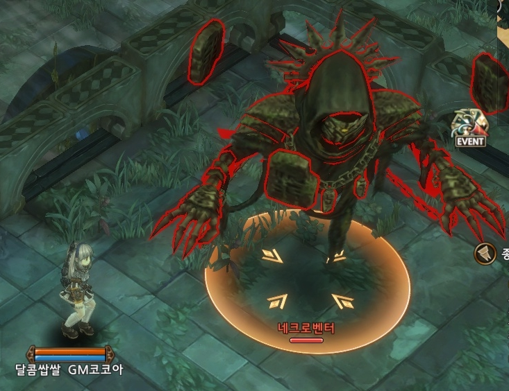 

크로벤터!  
성소를 찾으랬더니 왜 여기에 있니...  
시키는 일은 안하고 엉뚱한 곳에 짱박혀 있으면 끝이 좋지 않은 법입니다.

&nbsp;

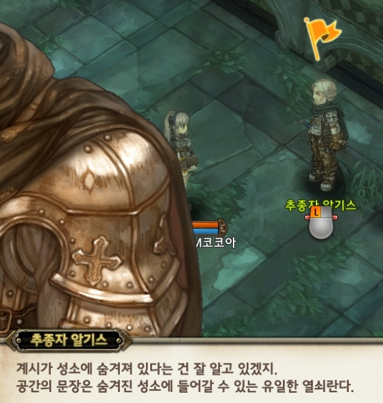 

그리고 이 말을 증명하듯,

&nbsp;

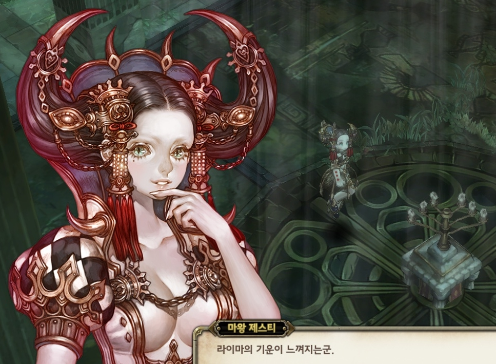 

제스티가 선수를 칩니다.

&nbsp;

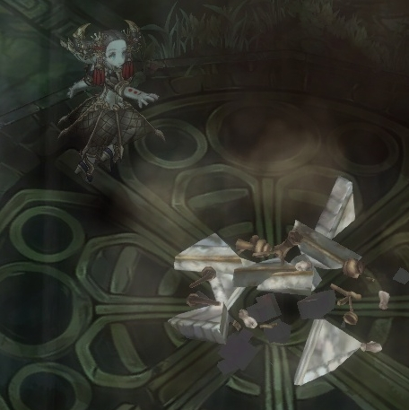 

라이마 여신님의 기운을 제스티가 어떻게 여기는지 단적으로 보여주는 장면이네요.  
이제 공간의 문장은 제스티의 손아귀에 있습니다.
어떡하죠 알기스?

&nbsp;

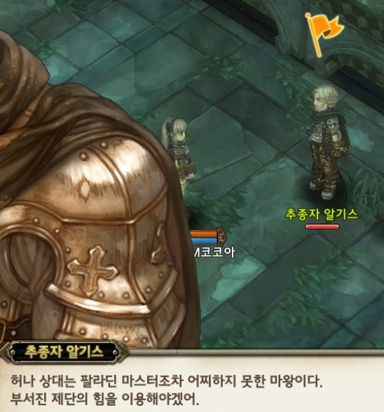 

다행히 공간의 문장은 계시자 이외에는 사용할 수 없다고 합니다.  
제단이 파괴되었어도 조각들에는 힘이 남아 있구요.  
조각들을 모아, 기둥에 끼워넣어야 하는데

&nbsp;

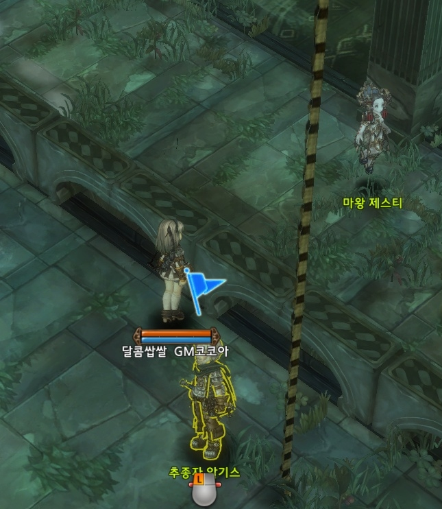 

나홀로 경계 근무를 서는 제스티…
제스티와 마주치면 수하같은거 없이 곧장 커다란 대미지를 입기 때문에,  
알기스가 지켜보고 있다가 제스티가 접근하면 종을 쳐주기로 합니다.

&nbsp;

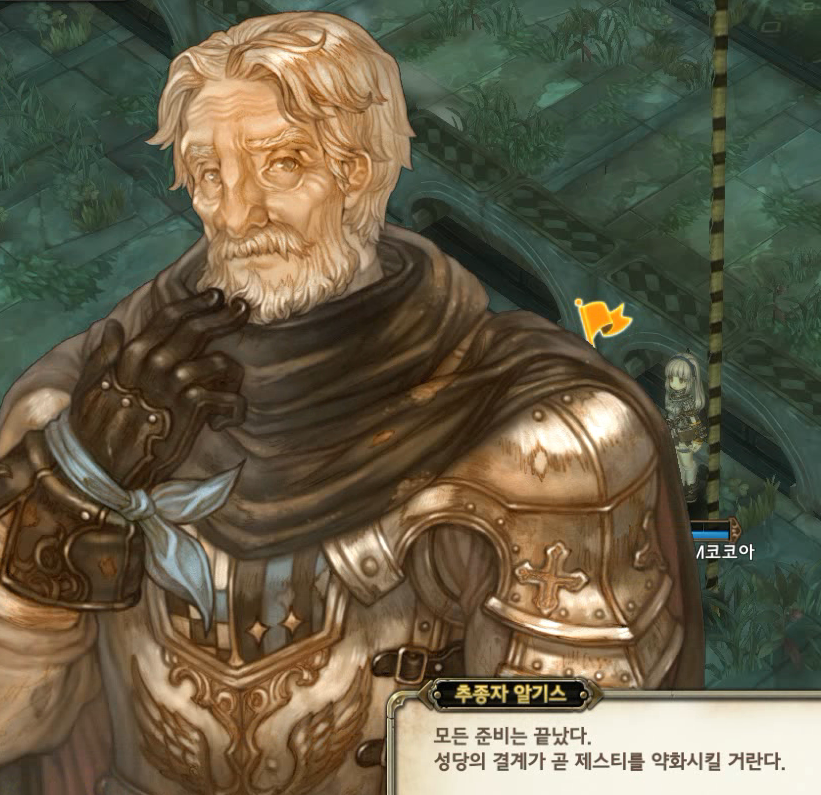 

사실 기둥을 복원해서 뭐하지? 싶었는데, 기둥이 곧 결계였어요.  
기력을 모두 회복하지 못한 데다가 결계로 약해진 제스티라면, 저도 상대해볼 수 있을 것 같습니다.

&nbsp;

 

결계가 발동됩니다!

&nbsp;

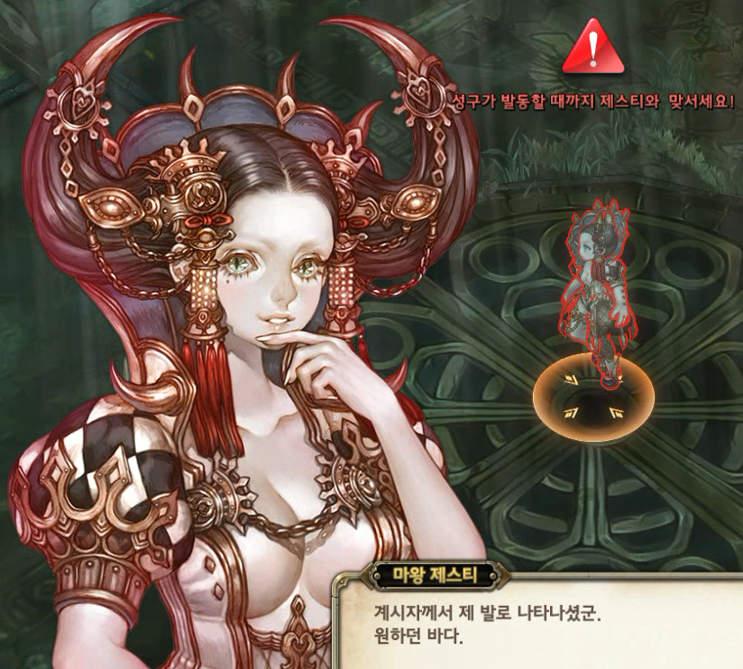 

어라? 제스티는 저의 정체를 아직 오해하고 있습니다.  
물론 공간의 문장을 사용하는 것은 계시자로 충분합니다만...  
제가 구원자라는 것을 알았더라면 경계 근무가 수색으로 바뀌었겠지요. 다행입니다.

&nbsp;

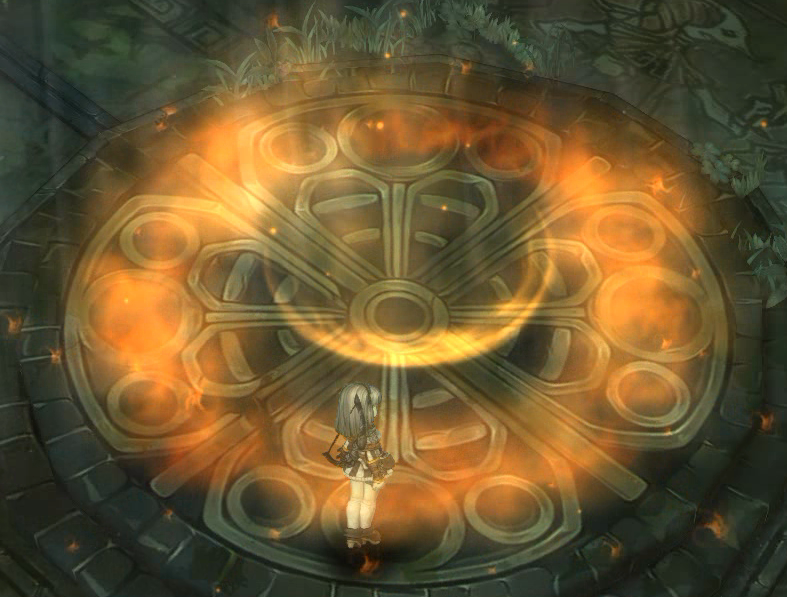 

제스티를 상대하며 버티다 보면, 알기스가 발동한 성구가 제스티를 패퇴시키는데 성공합니다.  
아쉽게도 제스티의 손상된 버르장머리를 복구하는데는 실패했습니다.

&nbsp;

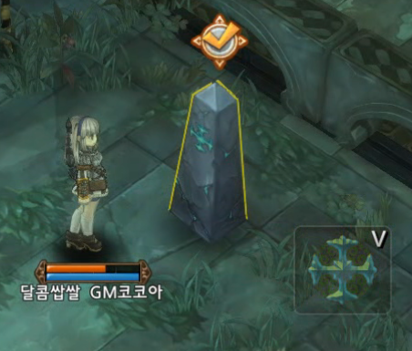 

그렇게 얻은 공간의 문장을 사용하여 숨겨진 성소로 진입합니다.  
숨겨진 성소에 들어간다고 바로 계시가 놓여 있는 것은 아니었어요. 열심히 더듬어야 합니다.

&nbsp;

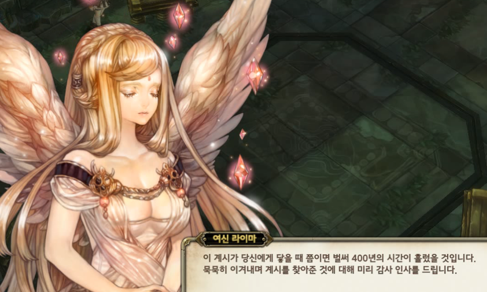 

묵묵하지는 않았어요. 죄송하고 감사합니다.

&nbsp;

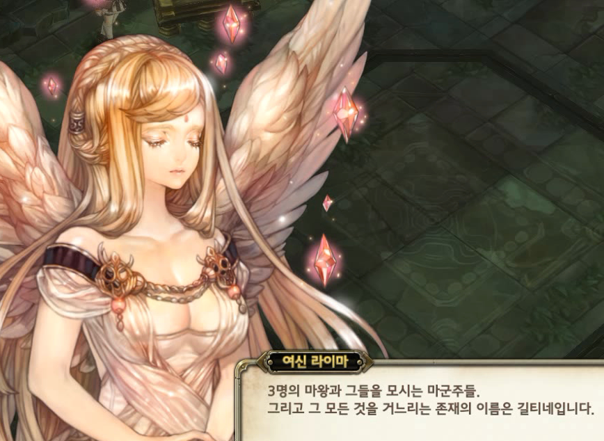 

방금 물리친 제스티 말고도, 마왕은 2명이 더 있었습니다.  
그리고 길티네…

&nbsp;

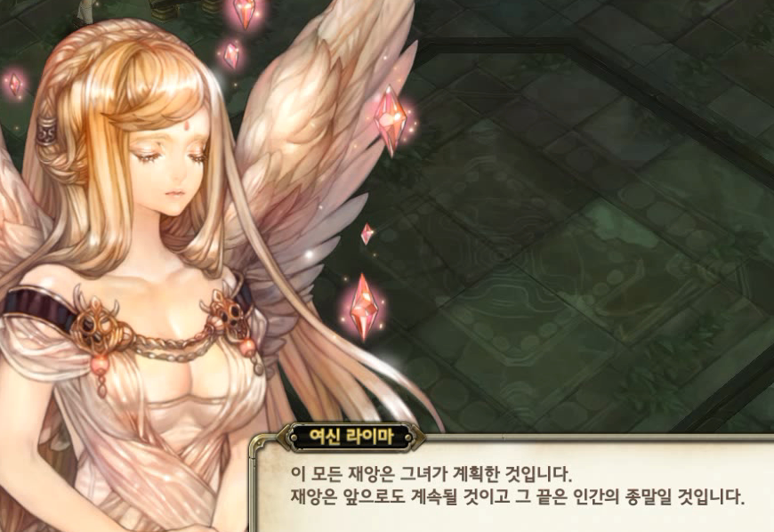 

신수의 날은 재앙의 끝이 아니었습니다. 시작이었죠.  
이 모든 것을 볼 수 있는, 그래서 대비할 수 있는 라이마는 그들에게도 눈엣가시입니다.  
길티네는 라이마를 포함하여, 다른 여신들에게까지 마수를 뻗치고 있습니다만 아직 희망은 남아있습니다.
당신이 있으니까요.
그리고…

&nbsp;

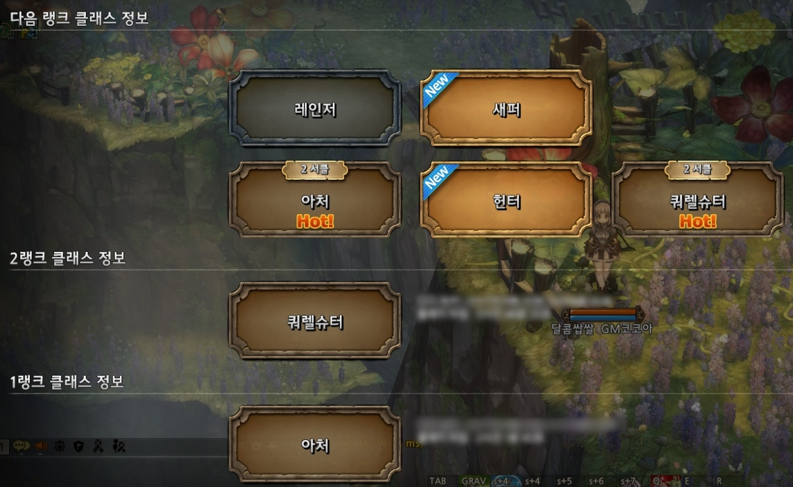 

저는 3랭크로 전직할 레벨이 되었습니다!

**1. 아처 2. 레인저 3. 쿼렐슈터 4. 새퍼 5. 헌터**

중에서 하나를 골라, 댓글로 적어주세요.  
~~제 마음에 드는 클래스가 1위를 할 때까지~~ 게재 후 24시간 뒤, 가장 많이 선택된 클래스로 전직하도록 하겠습니다.

그럼 4화에서 찾아뵙겠습니다.  
감사합니다. (_ _)        