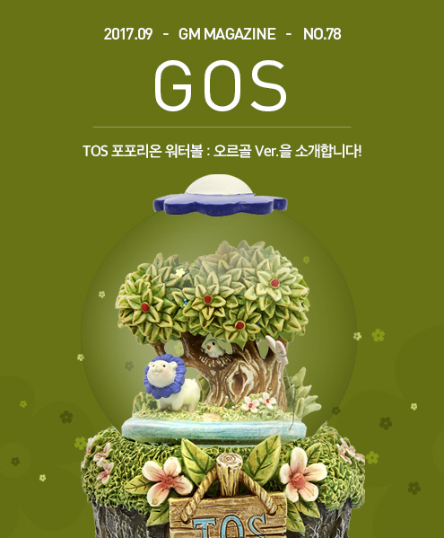
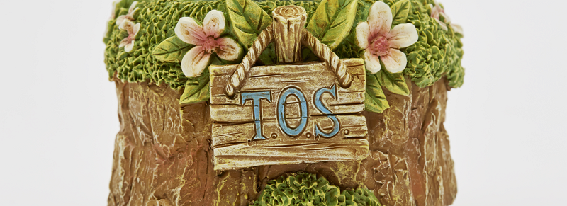
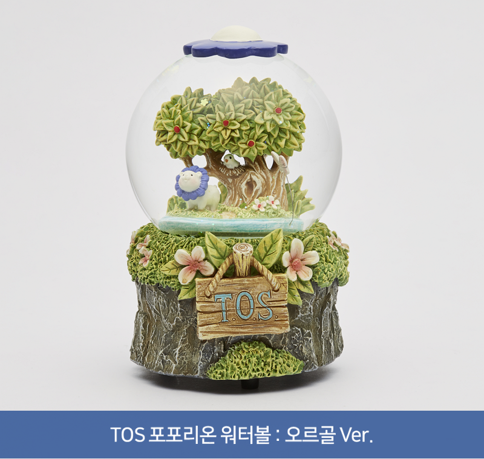
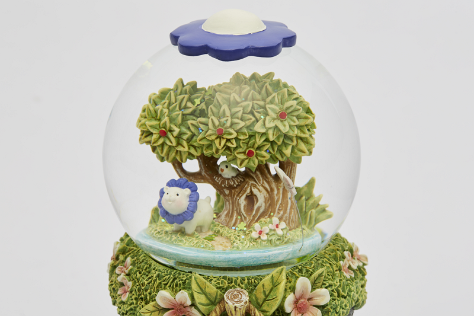
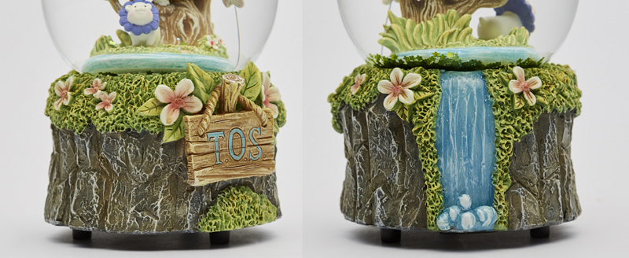
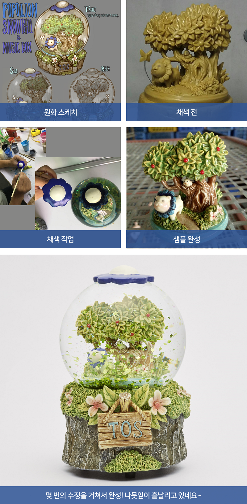

&nbsp;

# TOS 포포리온 워터볼 : 오르골 Ver.을 소개합니다!

안녕하세요. GM헤이즐입니다.  
어느새 가을이 눈앞으로 성큼 다가온 9월, 오랜만에 GOS매거진으로 인사드립니다. 

TOS를 수식하는 말에는 어떤 것이 있을까요?  
다양한 클래스, 아기자기한 캐릭터를 떠올리는 분도 계시겠지만, 뭐니뭐니 해도 **동화 같은 배경**과 **BGM**을 빼놓을 수 없죠!

오늘은 그런 TOS의 배경과 BGM이 현실로 구현된 초레어한 아이템을 소개해 드리고자 합니다.

 

**TOS 포포리온 워터볼 : 오르골 Ver.**은 구원자 여러분께 특별한 재미와 경험을 드리기 위해 제작한 아이템입니다.  
그럼 한번 자세히 살펴볼까요~?

 

가장 먼저 싱그러운 나무와 꽃, 그리고 나무 밑에서 여유를 만끽하고 있는 포포리온이 보입니다.  
자세히 보시면 가지 사이에 둥지를 튼 새도 발견하실 수 있어요. 사진으로 이 디테일을 모두 전할 수 없어 안타깝습니다 ㅠㅠ

하단부에는 오르골이 들어가 있고요, 클라페다 BGM으로 익숙하신 **‘Triste’**가 **18노트의 오르골 버전으로 특별 제작**되었답니다.  
그리고 뒤쪽에는 시원한 폭포가 흐르고 있는 것을 볼 수 있습니다.

게임 속 그 ‘느낌’을 현실로 옮길 수 있도록 많은 노력을 기울였는데요,  
오르골 음악을 들으며 찬찬히 들여다보고 있자니, 마치 제가 TOS 월드에 들어와 있는 것 같은 기분이 드네요.

  

**TOS 포포리온 워터볼 : 오르골 Ver.**은 네코장 상품이며, 곧 여러분 곁으로 찾아갈 예정입니다.  
판매 당일 홈페이지에 별도의 구매 경로가 오픈될 예정이니, 구원자 여러분의 많은 관심과 기대 부탁드립니다!

감사합니다.