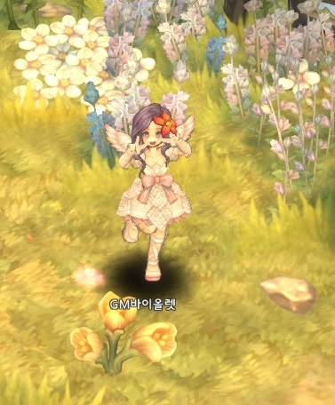
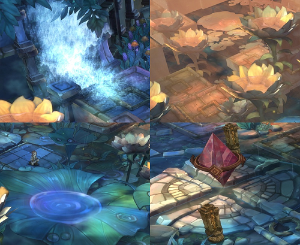
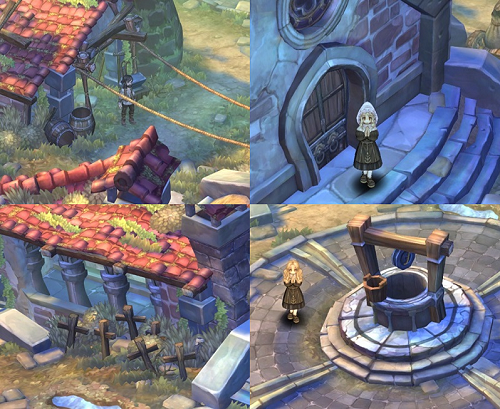
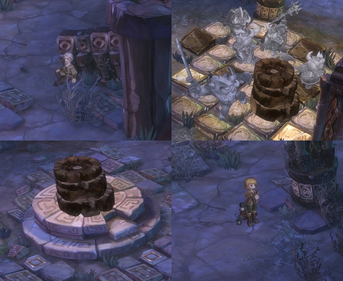
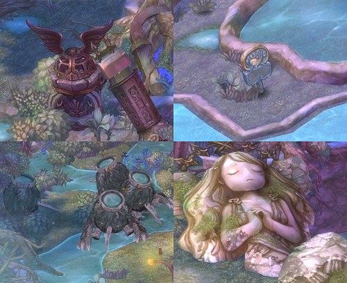
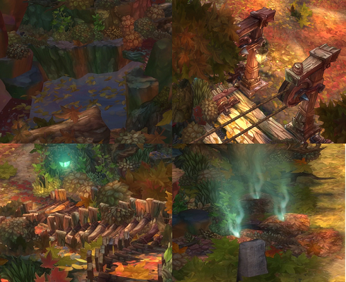
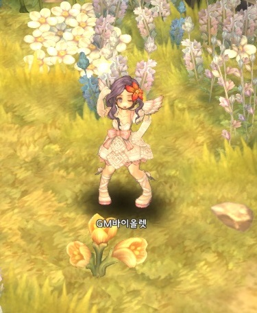

&nbsp;

# TOS 최고의 탐험가를 찾습니다!

안녕하세요!  
구원자님들께 처음 인사드리는 **GM바이올렛**이라고 합니다!
 

이렇게 공식적인 곳에서 인사 드리려니 쑥스러우면서도 너무 기쁩니다~
 
예전부터 구원자님들과 함께할 수 있는 시간을 가지는 것이 저의 꿈이었는데,  
이렇게 GOS 매거진으로 만나 뵙게 되어 정말 영광입니다. (_ _)

&nbsp;

저 GM바이올렛은 트리 오브 세이비어를 참 좋아합니다.

트오세에 반한 여러 가지 이유가 있지만,  
그 중에서도 아름답고 디테일이 살아있는 지역들에 큰 매력을 느껴서라고 할 수 있는데요.

구원자님들은 트리 오브 세이비어의 어떤 매력에 반하셨나요?  
다양한 클래스? 아기자기한 그래픽? 흥미로운 스토리?

다가오는 9월 28일, 모든 구원자님들께서 아시는 것처럼  
최대 레벨 확장 그리고 신규 지역 업데이트가 있을 예정입니다. (♡)

따라서, 신규 지역이 업데이트되면 잠시 기억에서 잊혀질(T^T) 기존 지역들의 아름다움을  
복습할 수 있는 문제로 GOS매거진을 준비해보았습니다.

&nbsp; 

아래의 예시 문제를 봐 주세요~

**예시 문제)**

 

각 문제는 네 개의 블록 안에 해당 지역의 부분 이미지가 주어집니다.

구원자님들께서 블록 안의 부분 이미지를 보고  
정답이라고 생각하시는 지역 이름을 적어 주시면 됩니다.

예시 문제의 정답은 란코 22수역입니다.  
이번 새로 업데이트 될 신규 지역인데요.

묘~한 분위기가 정말 매력적이지 않나요? 예쁜 꽃들이 많은 지역이랍니다~  
이외에도 다양 신규 지역이 추가 될 예정이니, 많은 관심 부탁 드립니다!

자! 그럼 지금부터 GM바이올렛과 함께 지역 복습을 시작해 볼까요?

&nbsp;

**TOS 최고의 탐험가를 찾습니다!**

**문제 1)**

**저는 개인적으로 이곳의 BGM이 가장 마음에 들었습니다. (♡)**

&nbsp; 

**문제 2)**

**저는 이 지역의 메인 퀘스트가 가장 재밌었습니다. 오델을 돌려줘!**

&nbsp; 

**문제 3)**

**저는 가끔 이 지역에서 낚시를 즐기곤 한답니다.**

&nbsp; 

문제 4)

 

**선선한 가을이 다가오고 있어서 가을 풍경을 마지막 문제로 준비했습니다. 모두 환절기 감기 조심하세요!**  
힌트: 스팔빈가스 숲은 아닙니다!
 
&nbsp; 

어떠셨나요? 어려우셨나요? GM바이올렛은 구원자님들의 TOS 지식을 믿습니다!

다음 GOS 매거진도 구원자님들과 함께 즐길 수 있는 컨텐츠를 가득 안고  
다시 돌아오도록 하겠습니다. 약속~

오늘도 TOS와 함께 즐겁고 좋은 하루 되세요.  
그럼! 아디오스 - ★

 

