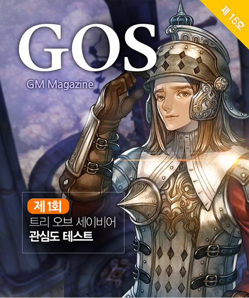
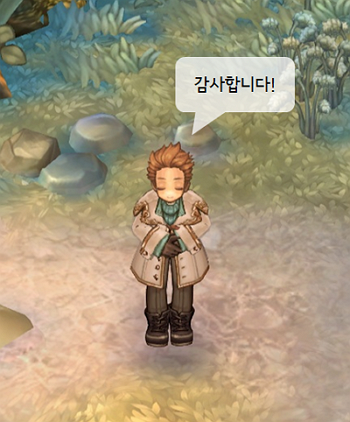
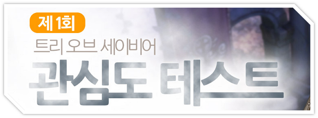
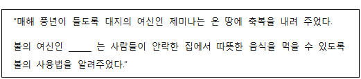
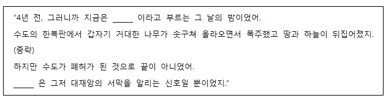
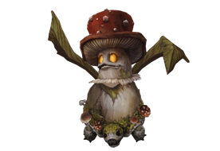

&nbsp;

# 제 1회 트리 오브 세이비어 관심도 테스트

안녕하세요? **GM헤이즐**입니다.  
구원자 여러분의 성원에 힘입어 성황리에 G-STAR 행사를 마친 지 어느새 2주가 지났네요.

시연부스를 찾아주신 구원자님, 아쉽게 현장에는 오지 못하셨지만  
멀리서도 응원해주신 구원자 여러분께, 늦었지만 진심으로 감사의 말씀을 드립니다.

G-STAR에서 공개된 것처럼 **2015년 12월**, TOS가 드디어 **오픈 베타**를 시작하려 합니다.

오픈 베타를 앞두고 지금의 TOS가 있게 한 구원자 여러분께
감사의 마음을 담아 조그마한 이벤트를 준비했습니다.

바쁜 일상 속, '트리 오브 세이비어 관심도 테스트'를 가볍게 풀면서 잠시 쉬어가는 시간을 가져보세요.

정답을 모두 맞힌 구원자 여러분께는 추첨을 통해  
'넥슨캐시'를 드릴 예정이니, 많은 참여를 부탁드립니다.

&nbsp;

### 제 1회 TOS 관심도 테스트 문항

※ 규칙 1. 정해진 기간 안에 정답을 댓글로 등록합니다.  
※ 규칙 2. 풀기 어려운 문제는 게임, 혹은 게임 가이드를 참고합니다.

&nbsp;

**1. 다음 보기 중, 드루이드 마스터의 이름을 고르세요.**

① 루시드 윈터스푼 &nbsp;&nbsp;&nbsp;② 지나 그린 &nbsp;&nbsp;&nbsp;③ 아폴로니야 바르보라 &nbsp;&nbsp;&nbsp;④ 라리사

&nbsp;

**2. 트리 오브 세이비어에는 특별한 물건들이 모일 때 벌어지는 신비한 현상이 있습니다.  
&nbsp;&nbsp;&nbsp;이 현상에 대해 연구하는 단체의 이름은 무엇입니까?**

① 마법협회 &nbsp;&nbsp;&nbsp;② 바이보라의 날개 &nbsp;&nbsp;&nbsp;③ 오컬트 연구회 &nbsp;&nbsp;&nbsp;④ 콜렉션 학회

&nbsp;

**3. 다음 지문의 빈 칸에 들어갈 여신의 이름으로 알맞은 것은 무엇입니까?**

① 바카리네 &nbsp;&nbsp;&nbsp;② 길티네 &nbsp;&nbsp;&nbsp;③ 라이마 &nbsp;&nbsp;&nbsp;④ 가비야

&nbsp;

**4. &#95;&#95;&#95;&#95;&#95;은(는) 강력한 전투력을 발휘하며, 성스러운 힘으로 주변의 동료들을 보호하거나  
&nbsp;&nbsp;&nbsp;마신을 숭배하던 적을 개종시켜 여신을 위해 싸우게 합니다. 이 클래스는 무엇입니까?**

① 파드너 &nbsp;&nbsp;&nbsp;② 팔라딘 &nbsp;&nbsp;&nbsp;③ 네크로맨서 &nbsp;&nbsp;&nbsp;④ 드루이드

&nbsp;

**5. 수백 년 전의 대마법사로서, ‘마법사의 탑’을 세운 인물은 누구입니까?**

① 유스티나 르귄 &nbsp;&nbsp;&nbsp;② 데임 키르케 &nbsp;&nbsp;&nbsp;③ 렉시퍼 &nbsp;&nbsp;&nbsp;④ 아가일라 플러리

&nbsp;

**6. 주로 던전에서 얻을 수 있는 보석으로, 장비에 장착하여 추가 효과를 내는 아이템은 무엇입니까?**

① 루비 &nbsp;&nbsp;&nbsp;② 에메랄드 &nbsp;&nbsp;&nbsp;③ 젬 &nbsp;&nbsp;&nbsp;④ 다이아몬드

&nbsp;

**7. 다음 지문의 빈 칸에 들어갈 단어로 알맞은 것은 무엇입니까?**

① 한 여름 밤 &nbsp;&nbsp;&nbsp;② 신수의 날 &nbsp;&nbsp;&nbsp;③ 크리스마스 &nbsp;&nbsp;&nbsp;④ 식목일

&nbsp;

**8. 아래 몬스터의 이름은 무엇입니까?**

① 머슈카리아 &nbsp;&nbsp;&nbsp;② 하르피아 &nbsp;&nbsp;&nbsp;③ 네더보바인 &nbsp;&nbsp;&nbsp;④ 쓰론위버

&nbsp;

**9. 다음 중 컴패니언이 아닌 것을 고르세요.**

① 벨하이더 &nbsp;&nbsp;&nbsp;② 호글란 &nbsp;&nbsp;&nbsp;③ 매 &nbsp;&nbsp;&nbsp;④ 케파

&nbsp;

**10. 다음 중 트리 오브 세이비어의 오픈 베타 일정으로 옳은 것을 고르세요.**

① 2015년 11월 &nbsp;&nbsp;&nbsp;② 2015년 12월 &nbsp;&nbsp;&nbsp;③ 2016년 1월 &nbsp;&nbsp;&nbsp;④ 2016년 2월

&nbsp;

&nbsp;&nbsp;&nbsp;&nbsp;&nbsp;&nbsp;&nbsp;&nbsp;&nbsp;&nbsp;&nbsp;&nbsp;&nbsp;&nbsp;&nbsp;&nbsp;&nbsp;&nbsp;&nbsp;&nbsp;&nbsp;&nbsp;&nbsp;&nbsp; **-수고하셨습니다.-**

&nbsp;

&nbsp;

**[이벤트 세부 사항]**  
**1. 기간:** 2015년 11월 27일(금) ~ 2015년 11월 30일(월) 까지  
**2. 참여 방법:** 이벤트 기간 동안 ‘15호 GOS 매거진’의 TOS 관심도 테스트 정답을 댓글로 등록  
&nbsp;&nbsp;&nbsp; 댓글 예시) 1) X번, 2) X번, 3) X번 …  
**3. 이벤트 상품:** 10문제 모두 정답을 남겨주신 구원자님 중 50명을 추첨하여 ‘넥슨캐시 5천원’ 지급  
**4. 당첨자 발표:** 12월 04일(금) 오후 05시  

※ 중복으로 댓글을 남기신 경우, 가장 최근에 남긴 댓글로 이벤트에 참여됩니다.

&nbsp;

TOS를 사랑해주시는 여러분의 많은 참여를 부탁드리겠습니다.  
그럼 다음 GOS 매거진에서 뵙겠습니다.

감사합니다.
