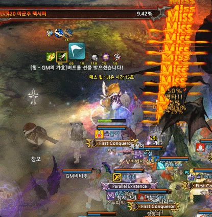
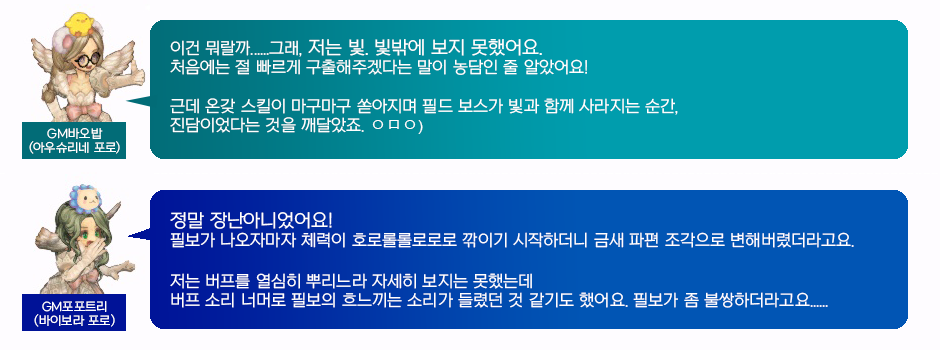

&nbsp;

# GM포포트리의 필드보스 토벌단 후기

때는 2019년 11월 14일, 2020년도 대학수학능력시험이 치뤄지던 어느 날,  
메서운 바람과 함께 나타난 4명의 강력한 필드보스!

4명의 필드보스는 각 서버의 [의문의 레어]에 베이스 캠프를 세우고  
세계를 자신의 손아귀에 넣기 위해 GM들을 납치하기 시작하는데……

세계의 평화를 위해 뭉친 [필드보스 토벌단]은 세계를 감도는 이상한 기운을 눈치채고  
하나둘씩 GM의 기도에 응답해 [의문의 레어]로 모이게 되었다……!

필드보스 역시 [의문의 레어] 안에서 느껴지는 에너지를 감지하였고  
토벌단을 토벌하기 위해 하나둘씩 모습을 드러내기 시작하였는데……

속수무책으로 하나둘 쓰러지는 필드보스!  
토벌단의 막강한 힘 앞에 필드보스는 30초도 버티지 못하고 모두 토벌당하였다!

&nbsp;

필드보스 토벌단과 필드보스 간의 치열했던 난전의 현장을  
당시 현장에서 열심히 버프를 부여하던 GM을 통해 들어보았다.

&nbsp;

필드보스 토벌단은 그렇게 총 4명의 강력한 필드보스를 단 30초만에 끝장을 내버리고  
필드보스의 전리품을 챙겨 유유히 [의문의 레어]를 떠나게 되었던 것이다. 

1차 필드보스 토벌단의 소문은 필드보스 들의 소굴까지 흘러 들어갔고,  
격분한 다른 필드보스들은 후일을 기약하며 열심히 체력 단련을 시작하게 되는데……

**TO BE CONTINUED**