&nbsp;

# 신규/복귀 구원자님을 위한 업데이트 핵심 요약

&nbsp;

21.12.09 점검 후 첫 생성하는 신규 캐릭터는 **[왕국령 모로스 공관]** 퀘스트를 수행해야만 합니다.

해당 퀘스트를 수행하는 캐릭터는 **440레벨**로 생성되며, 퀘스트 클리어 시 **450레벨 점핑권이 지급**됩니다.

튜토리얼을 완료하면 **모로스의 계시자** 신분으로, **바로 에피소드 13-1 시나리오를 플레이**할 수 있습니다.

&nbsp;

▲ 신규 캐릭터는 튜토리얼 퀘스트부터 시작합니다.

&nbsp;

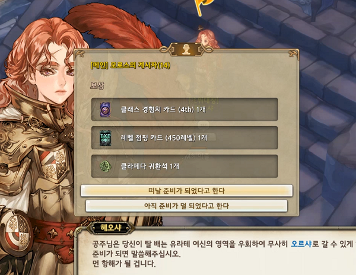

▲ 퀘스트를 완료하면 450레벨 점핑권이 지급됩니다.

&nbsp;

사용자와 함께 성장하는 장비로서 **440레벨까지 성장**하며, 기본 **16강 10초월**입니다.

아래의 두 가지 경로로 획득할 수 있습니다.

▶ 왕국령 모로스 공관 퀘스트

▶ 마을에 위치한 [바이보라의 날개] NPC를 통해 무제한 획득

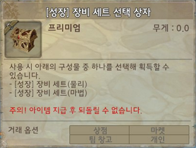

▲ 16강 10초월 성장 장비. 최대 440레벨까지 성장합니다.

&nbsp;

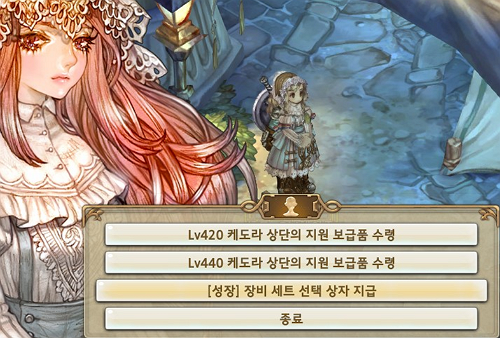

▲ 바이보라의 날개 NPC로부터 무제한 획득 가능합니다.

&nbsp;

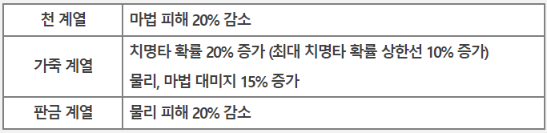

▲ 동일한 계열의 방어구 4개 착용 시 각 방어구별 장착 효과가 적용됩니다

&nbsp;

신규/복귀 구원자님에게 [콘텐츠 초대장(31일)]이 인벤토리로 지급됩니다.

마우스 우클릭 시 사용자의 레벨/장비 수준에 적합한 콘텐츠가 안내됩니다.

콘텐츠 초대장을 통해 안내된 콘텐츠로 즉시 이동할 수 있으며, 5배의 보상이 지급됩니다.

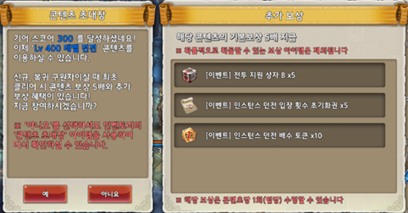

▲ 인벤토리에서 마우스 우클릭 시 적합한 콘텐츠가 추천되며, 즉시 이동 가능합니다. (보상 5배)

&nbsp;

2021.07.08 점검 시 **장착 중인 모든 아이템이 [마켓 수령함]으로 이동**되었습니다.

장비 아이템과 외형 아이템이 보이지 않는다면, **마을에 위치한 마켓 NPC &gt; 마켓 수령함**을 확인하세요.

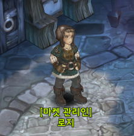

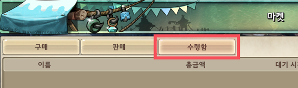

&nbsp;

바실리사 장비는 기존 레전드 등급의 상위 등급인 가디스 등급 장비입니다.

바실리사 장비는 아래의 두 가지 경로로 획득할 수 있습니다.

**▶ 인벤토리 - 가디스 장비 관리 - 제작**

**▶ 인벤토리 - 가디스 장비 관리 - 계승**

8초월 이상의 Lv.440 레전드 등급 장비를 가디스 장비로 계승할 수 있습니다.

▶ 장비 계승 시 초월, 각성, 무기 외형, 소켓, 포텐셜, 세트 옵션, 랜덤 옵션, 장착된 젬이 소멸됩니다.

▶ 계승 전 장비가 11강 10초월 이상일 경우 인챈트 옵션 및 강화 수치가 기존 수치의 2/3만큼 계승됩니다.

**▶ 11강 이상이지만 10초월이 아니거나 10초월이지만 11강 미만인 장비는 0강 0초월로 계승됩니다.**

&nbsp;

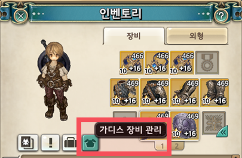

▲ 인벤토리에서 가디스 장비 관리 UI를 열 수 있습니다.

&nbsp;

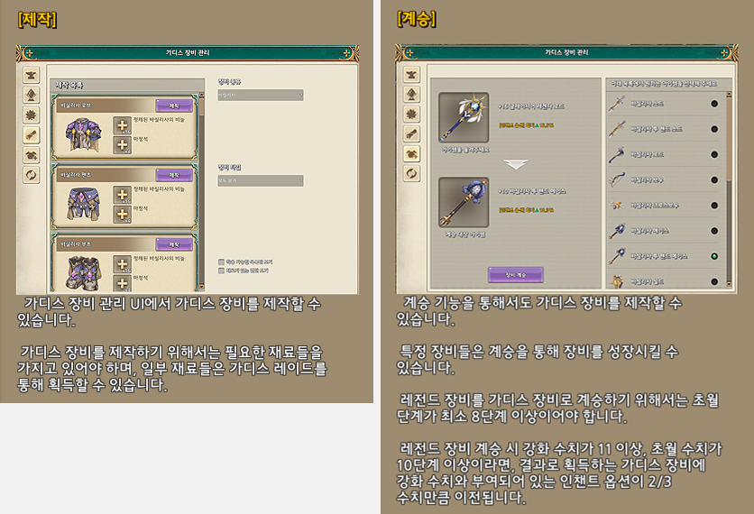

▲ 가디스 장비 관리 UI에서 가디스 장비를 제작 또는 계승할 수 있습니다.

&nbsp;

**미니맵 왼쪽의 NEWS 아이콘**을 누르면 진행 중인 이벤트 정보를 확인할 수 있습니다.

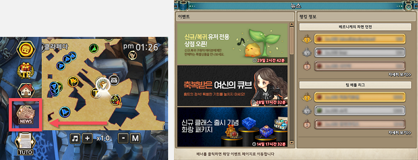

▲ 미니맵 왼쪽의 NEWS 아이콘을 눌러 푸짐한 이벤트 정보를 확인하세요.

&nbsp;

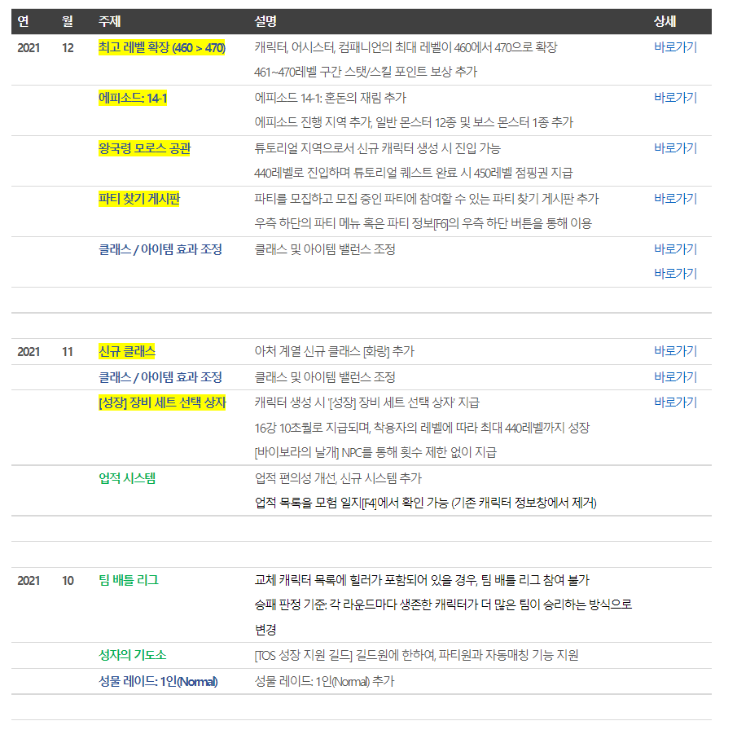

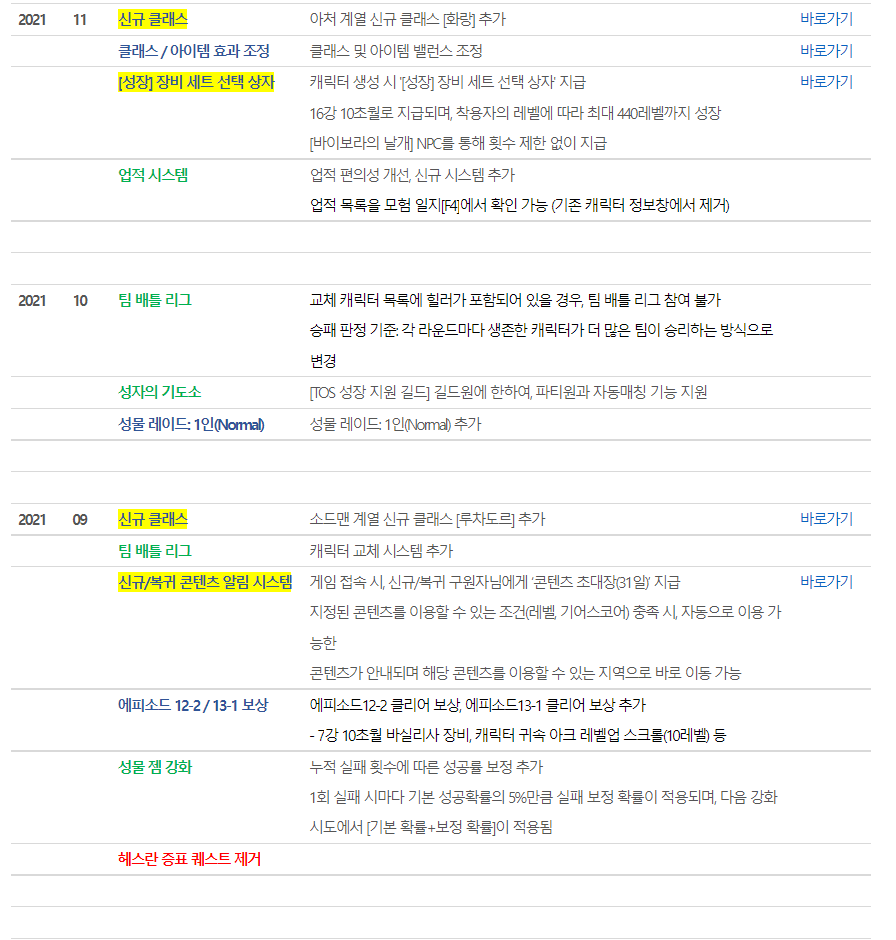

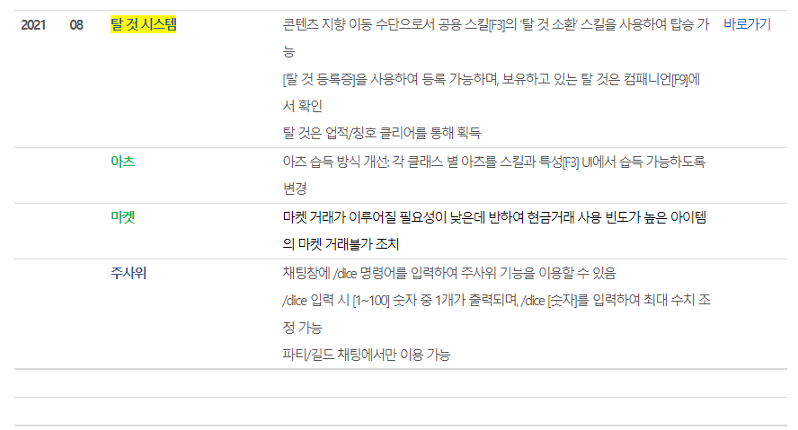

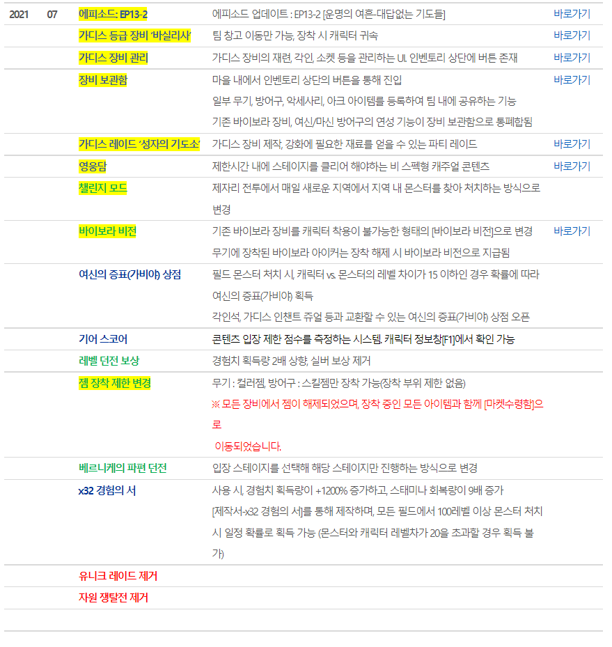

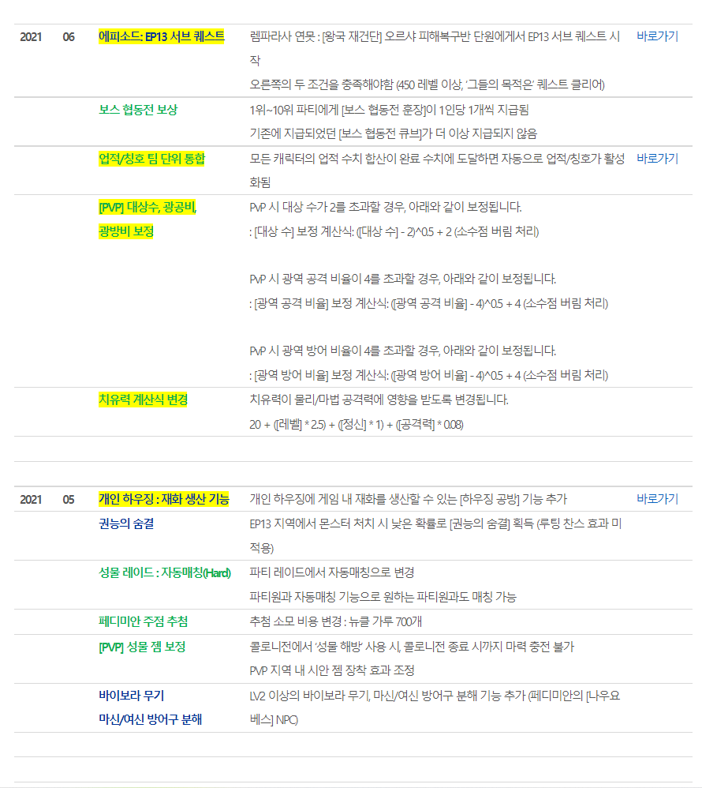

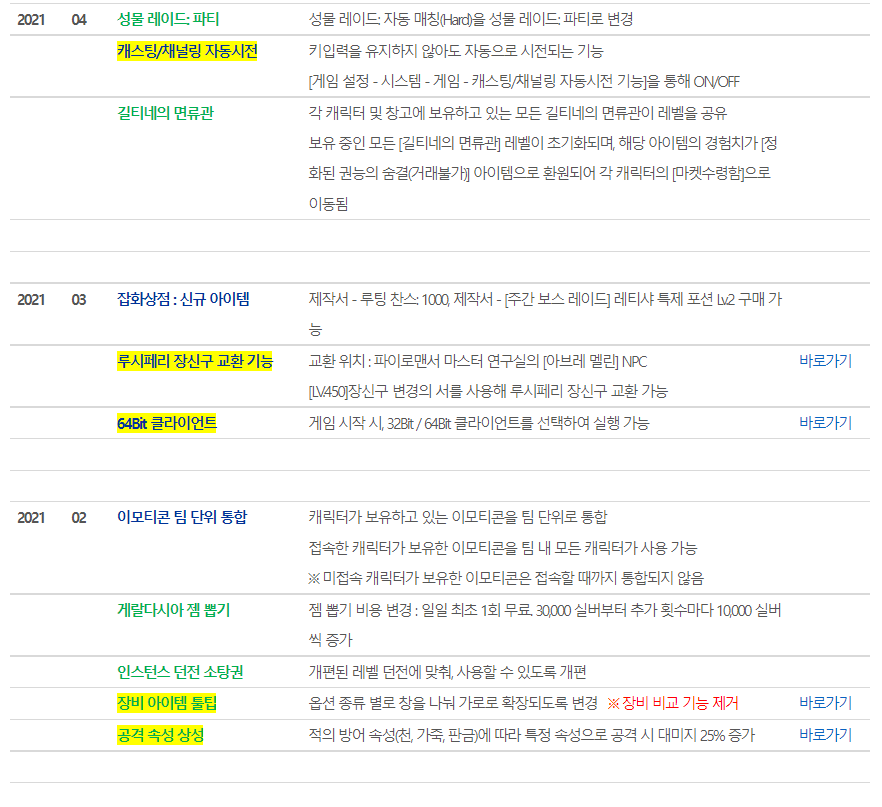

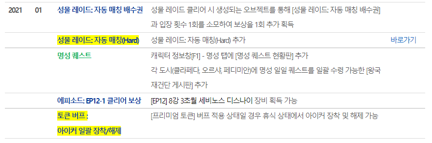

&nbsp;

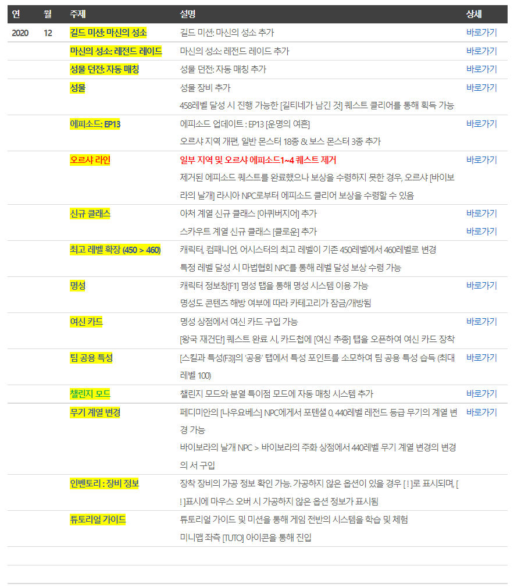

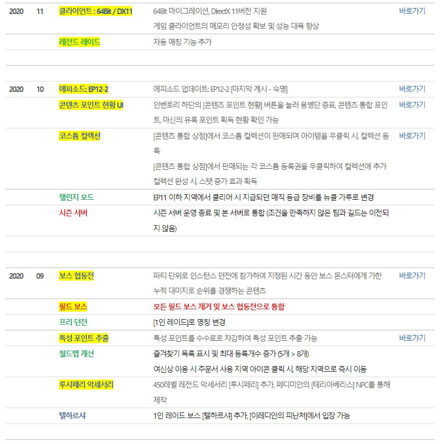

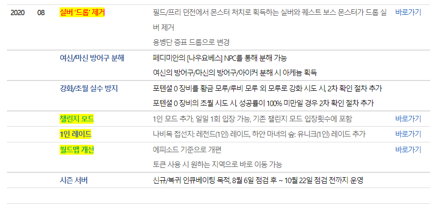

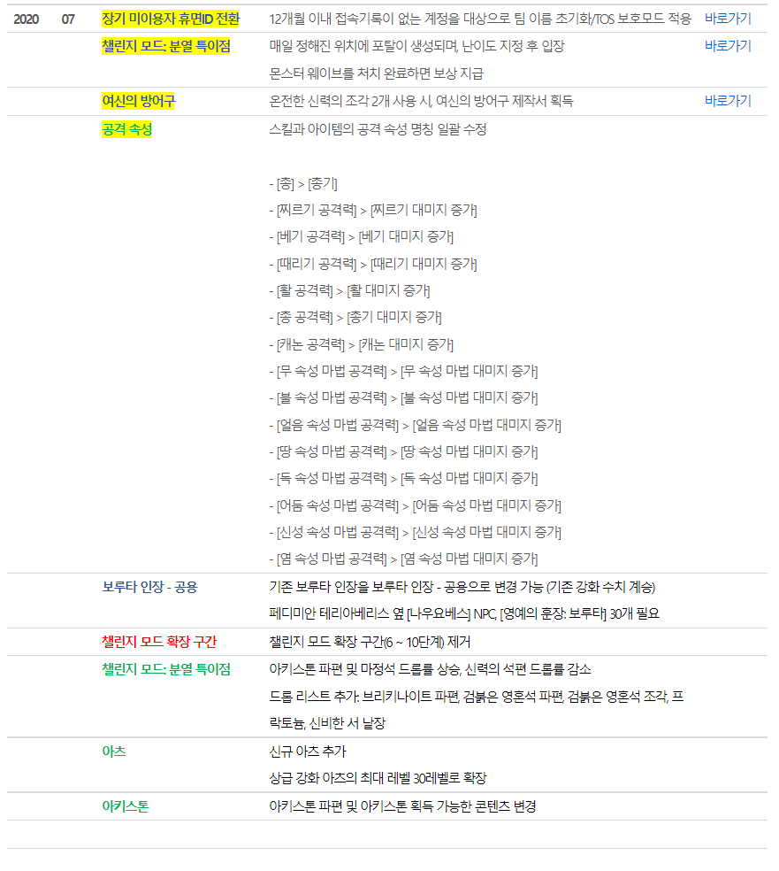

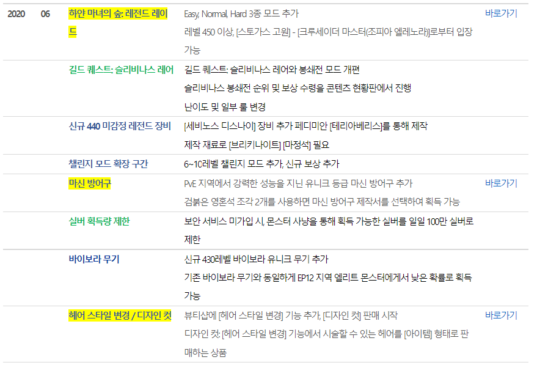