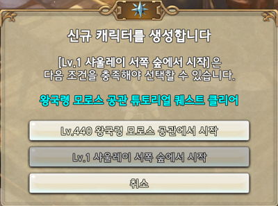

&nbsp;

# 신규/복귀 구원자님을 위한 업데이트 핵심 요약

&nbsp;

21.12.09 점검 후 첫 생성하는 신규 캐릭터는 **[왕국령 모로스 공관]** 퀘스트를 수행해야만 합니다.  
해당 퀘스트를 수행하는 캐릭터는 **440레벨**로 생성되며, 퀘스트 클리어 시 **450레벨 점핑권이 지급**됩니다.  
튜토리얼을 완료하면 **모로스의 계시자** 신분으로, **바로 에피소드 13-1 시나리오를 플레이**할 수 있습니다.

▲ 신규 캐릭터는 튜토리얼 퀘스트부터 시작합니다.

&nbsp;

▲ 퀘스트를 완료하면 450레벨 점핑권이 지급됩니다.

&nbsp;

사용자와 함께 성장하는 장비로서 **440레벨까지 성장**하며, 기본 **16강 10초월**입니다.

아래의 두 가지 경로로 획득할 수 있습니다.

▶ 왕국령 모로스 공관 퀘스트

**▶ 마을에 위치한 [바이보라의 날개] NPC를 통해 무제한 획득**

▲ 16강 10초월 성장 장비. 최대 440레벨까지 성장합니다.

&nbsp;

▲ 바이보라의 날개 NPC로부터 무제한 획득 가능합니다.

&nbsp;

▲ 동일한 계열의 방어구 4개 착용 시 각 방어구별 장착 효과가 적용됩니다

&nbsp;

신규/복귀 구원자님에게 [콘텐츠 초대장(31일)]이 인벤토리로 지급됩니다.  
마우스 우클릭 시 사용자의 레벨/장비 수준에 적합한 콘텐츠가 안내됩니다.  
콘텐츠 초대장을 통해 안내된 콘텐츠로 즉시 이동할 수 있으며, 5배의 보상이 지급됩니다.

▲ 인벤토리에서 마우스 우클릭 시 적합한 콘텐츠가 추천되며, 즉시 이동 가능합니다. (보상 5배)