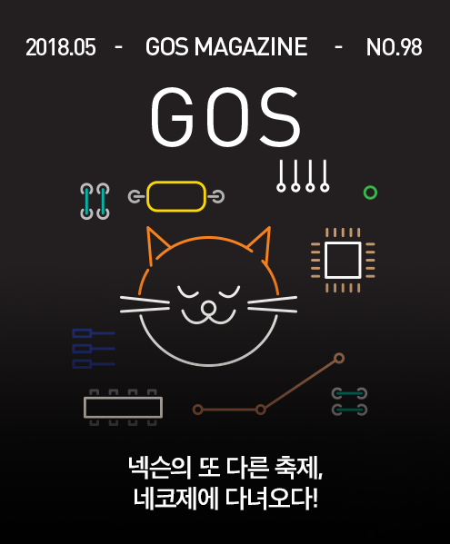

&nbsp;

# 넥슨의 또 다른 축제, 네코제에 다녀오다!

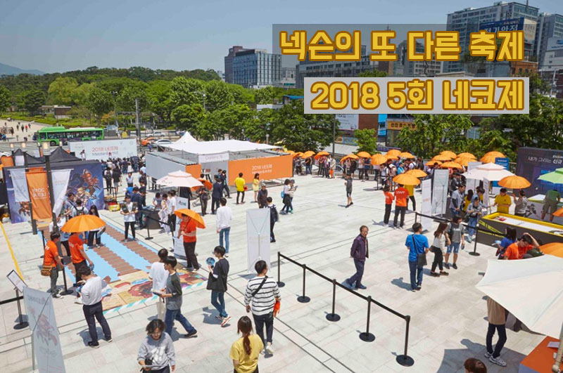

안녕하세요. **GM에리트리나**입니다.

5월의 마지막 무더운 주말, 종로 세운상가에서 열린 네코제에 직접 다녀왔는데요!

네코제는 넥슨 아레나, 세종예술시장, 지스타, 동대문디자인플라자에 이어 5회째 행사를 맞이하고 있는 축제입니다. 이번 5회 네코제는 어떻게 진행되었는지 한번 살펴볼까요?

&nbsp;

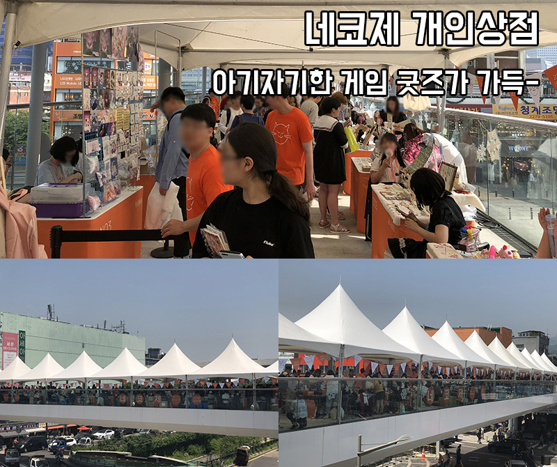

이번 네코제는 야외에서 진행됐으며, 그중에서 개인상점은 세운상가와 연결된 양쪽 다리에서 진행되었는데요.

저 역시 수많은 인파를 뚫고 80여 상점 속에서 트리오브세이비어 개인상점을 찾아다녔습니다. +_+

&nbsp;

개인상점 입구 초반에서 마주친 트오세 개인상점에서는 캐릭터 소망부적, 팔찌, 시계 등 귀엽고 아기자기한 굿즈들을 판매하고 있었습니다.

&nbsp;

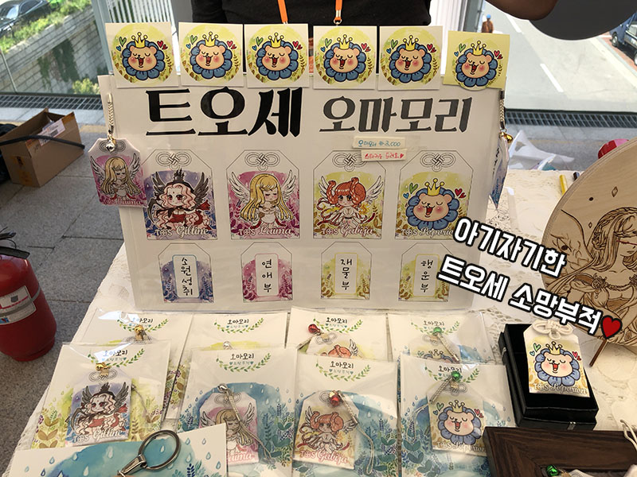 

짜-잔! 처음으로 구경한 TOS 굿즈는 트오세 소망부적이었습니다! 아티스트님들의 금손을 거쳐 완성된 귀요미 트오세 소망부적인데요.

&nbsp;

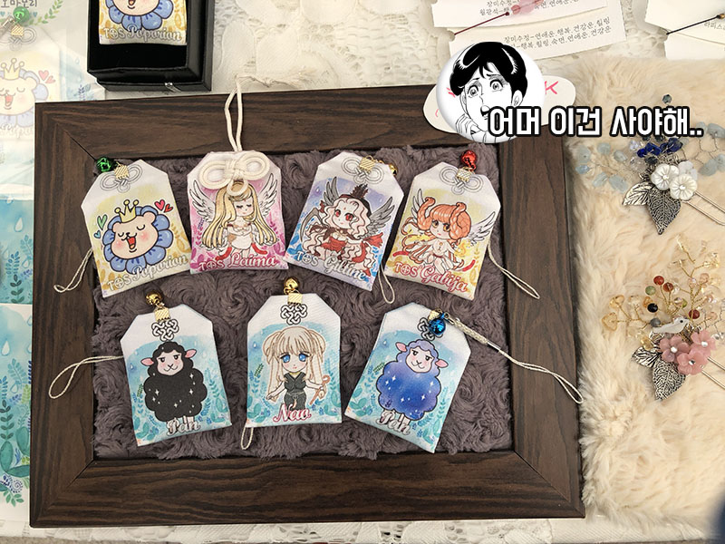 

어머...... 이건 사야 해!

(물건을 구매할 때 아티스트 분께서 조용히 “고고혓”을 외쳐주셨어요! 감사합니다. 트오세 고고혓..!)

저 역시 GM님들에게 선물해드리기 위해서 길티네, 라이마, 포포리온 부적을 구매했습니다. 본래 NPC 원화와는 또 다른 느낌이었는데요. 특히 저는 개인적으로 포포리온 이모티콘이 담긴 부적이 너무너무 귀여웠습니다!

&nbsp;

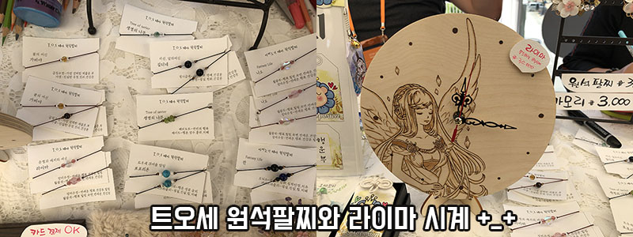

소망부적 외에도 의미가 담긴 트오세 원석팔찌와 직접 만드신 라이마 시계까지! 너무너무 예쁜 굿즈들이 많아서 모두 모두 사고 싶었지만.. 꾸-욱 참느라 혼났습니다. T_T

&nbsp;

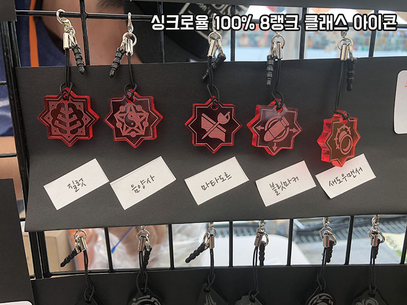
 

두 번째 트리오브세이비어 개인상점에는 8랭크 클래스 아이콘을 판매하고 있었어요. 클래스 아이콘과 싱크로율 100%로 보자마자 우-와하고 감탄사를 외쳤습니다.

&nbsp;

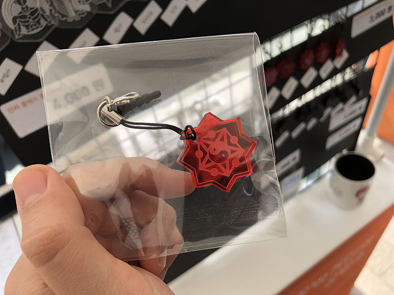

전 그중에서도 ‘음양사’ 클래스 아이콘을 구매했어요. 작은 굿즈 하나하나에서도 아티스트님들의 정성이 느껴졌습니다.

&nbsp;

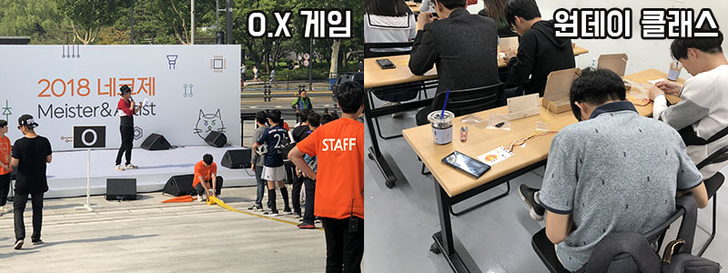

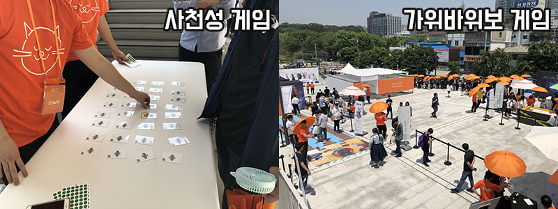

개인상점 외에도 건물 내/외부에서 다양한 프로그램들이 진행되고 있었는데요. O.X 게임과 직접 만들어보는 체험형 원데이 클래스, 사천성 게임, 가위바위보 게임 등 즐길 거리가 가득했습니다.

&nbsp;

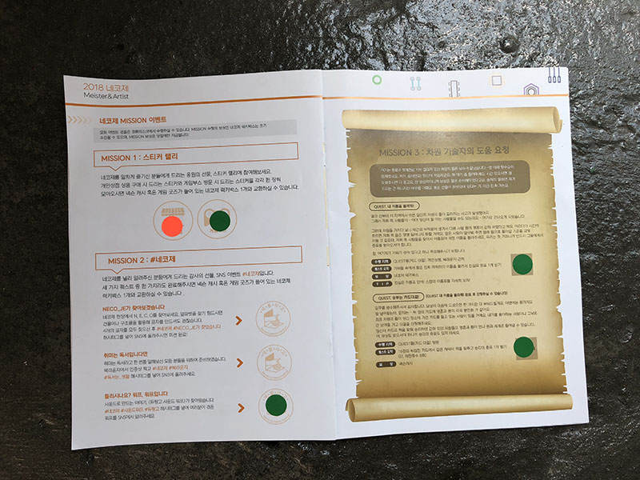

짜-잔! 개인상점에서 굿즈를 구매하거나 프로그램에 참여하면 스티커를 주는데요! 이렇게 동그라미 공란을 채우면 빵빵한 경품도 받을 수 있었습니다.

 &nbsp;

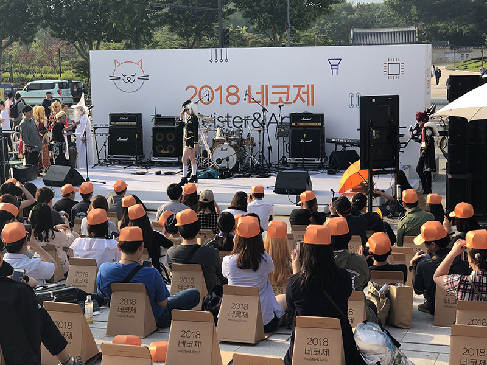 

다음으로는 코스튬 플레이가 진행되었습니다.

&nbsp;

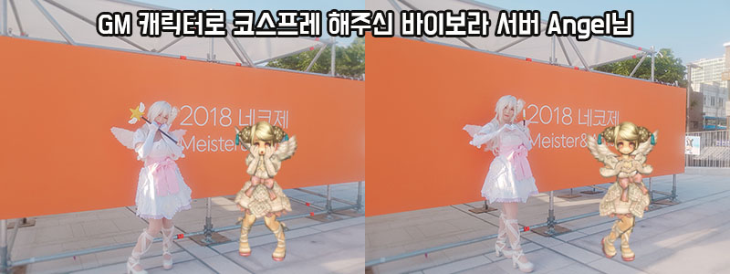

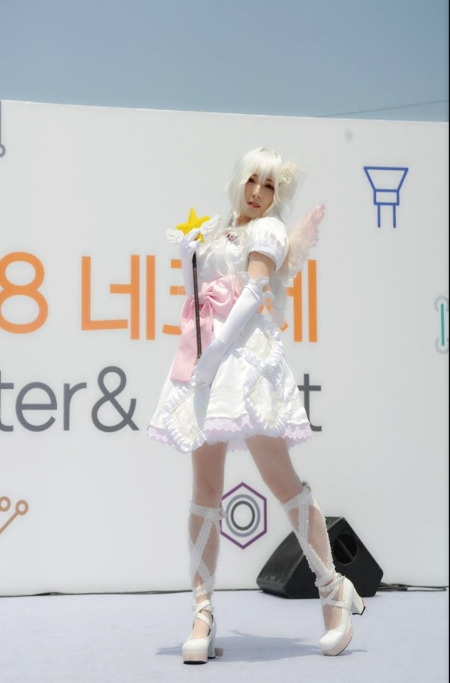

헉! 그중 익숙한 실루엣 발견! 바로 GM 코스튬을 제작해 코스프레 해주신 Angel님이셨습니다. +_+

인게임에서만 뵙던 Angel님을 이렇게 네코제에서 만날 수 있어서 너무 반가웠어요! GM 코스튬과 함께 직접 제작하신 반짝로드도 구경할 수 있었답니다.

마지막으로 네코제의 밤에 게임 OST 연주 공연이 진행되었습니다.

&nbsp;

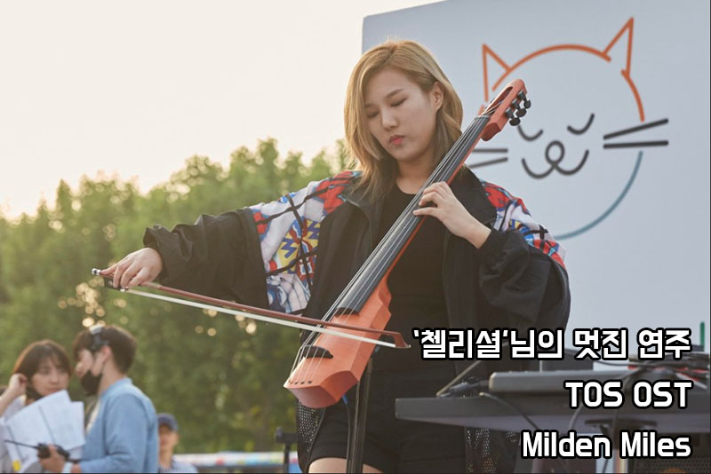

공연이 시작되고 뮤지션 분들께서 OST를 연주해주셨는데요. 그중에서 트리오브세이비어에서는 TOS OST 커버 공모전에서 1등하신 첼리셜님의 연주가 있었는데요. 다시 들어도 너무 멋진 연주였습니다!

 &nbsp;

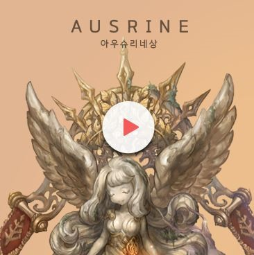

* https://www.youtube.com/watch?v=pE1rMJCuU38

OST 커버 공모전에서 아우슈리네상을 수상하셨던 첼리셜님의 멋진 연주 영상을 준비했는데요. 잠시 감상해볼까요?

아쉽지만 네코제 탐방 후기는 여기까지입니다. 이번 네코제에 참여하면서 예쁜 게임굿즈, 게임 프로그램, 원데이 클래스, 코스튬 플레이 등 다양한 프로그램에 참여하면서 알찬 하루를 보냈는데요. 다음 6회 네코제도 너무너무 기대됩니다!

그럼, 이번에 참여해주신 TOS 아티스트님들께 감사의 인사를 전하면서 네코제 탐방 후기를 마치겠습니다! (_ _)