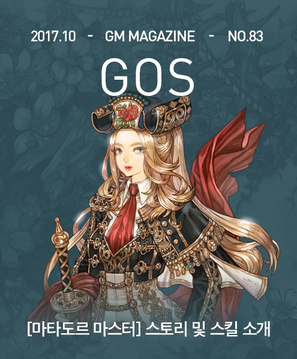

&nbsp;

# [마타도르 마스터] 스토리

**크리델라 오테로 일지1**

작고 초라한 집에서 투박한 침상 위에서 한 남자가 마지막으로 손을 뻗었다. 크리델라는 그 남자 즉, 그녀의 아버지가 내민 손을 잡았다.

&nbsp;

&nbsp;&nbsp;&nbsp;“미안하다. 크리델라. 명색이 귀족으로 태어나 이런 처지에서 죽는 것은 내가 무능한 탓이지만, 네게 해 준 것이 없어서 정말 미안하다.”

&nbsp;

&nbsp;&nbsp;&nbsp;크리델라 오테로는 죽어가는 아비의 손을 잡고 고개를 저으며 말했다.

&nbsp;

&nbsp;&nbsp;&nbsp;“그런 말씀 마시고 어서 기운을 차리세요.”

&nbsp;

&nbsp;&nbsp;&nbsp;“할아버지 시절의 재산만 있었어도 네 미래를 다르게 만들 수 있었을 텐데..”

&nbsp;

&nbsp;&nbsp;&nbsp;“제 미래는 제가 알아서 할게요.”

 
&nbsp;

&nbsp;&nbsp;&nbsp;“미안하다.”

&nbsp;

&nbsp;&nbsp;&nbsp;다시 그 말을 반복한 크리델라의 아버지는 더 이상 기운이 없는 듯 눈을 감고 잠에 빠졌다. 그런 아버지를 보며 두 끼를 굶은 크리델라 역시 피곤과 배고픔을 이기지 못하고 잠들었다.

&nbsp;

&nbsp;&nbsp;&nbsp;그리고 그녀가 잠에서 깼을 때 아버지는 잠자듯 그렇게 세상을 떠나고 말았다.

&nbsp;

&nbsp;

&nbsp;&nbsp;&nbsp;아버지의 초라한 장례를 마을 사람들의 도움으로 간신히 마치고, 아직 십대의 어린 소녀인 크리델라는 이제 혼자 남은 빈집에서 우는 것 말고는 아무 것도 못하고, 마침내 그 눈물마저 말랐을때, 누군가 문을 두드렸다. 크리델라가 대답을 하지 않았지만, 문을 두드리던 사람은 문이 열려있고, 안에 사람의 기척이 있었기에 결국 문을 밀고 들어왔다.

&nbsp;

&nbsp;&nbsp;&nbsp;들어온 사람은 둘이었는데 하나는 마을의 촌장이었고, 다른 한 사람은 처음 보는 남자였다. 그 남자는 크리델라의 상태를 확인하더니 한숨을 쉬며 말했다.

&nbsp;

&nbsp;&nbsp;&nbsp;“아버지가 얼마 전에 이런 상황에서 나 같은 사람을 만나고, 또 별로 듣고 싶지 않은 이야기를 듣는 일이 힘들겠지만…”

&nbsp;

&nbsp;&nbsp;&nbsp;크리델라는 그 말을 다 듣기 전에 눈가를 닦고 굳건한 얼굴을 일부로 과시하며 말했다.

&nbsp;

&nbsp;&nbsp;&nbsp;“오테로 가문은 절망적인 상황이라고 해서 할 일을 미루지도 책임을 회피하지도 않습니다.”

&nbsp;

&nbsp;&nbsp;&nbsp;남자는 그 말을 듣고 얼굴에 약간 놀란 표정을 지으며 말했다.

&nbsp;

&nbsp;&nbsp;&nbsp;“아직 어린 여자 아이치고는 대단하구나. 너희 가문을 두고 하는 말 가운데 초대 마넬Manel 오테로의 자질을 반이라도 이은 자가 없다는 말이 있었다.”

&nbsp;

&nbsp;&nbsp;&nbsp;남자는 이런 말을 하며 크리델라 오테로의 표정을 살폈으나 가문에 모욕적인 말을 들었어도 그녀는 가만히 있었다. 이해하지 못해서가 아니라 자제력이 있어서였다. 남자도 그런 점을 충분히 인식했는지 내심 다시 한번 그녀를 인정했다. 남자는 그런 인식을 지니고 자신이 할 말을 시작하였다.

&nbsp;

&nbsp;&nbsp;&nbsp;“38대 국왕이셨던 테르마넬 국왕께서 이름과 작위를 하사하여 마넬 오테로가 너희 가문의 시조가 된 이후 너까지 5대에 이르는 동안 영지는 이미 3대 전에 팔아 넘겼고, 가문의 재산과 수집품은 모두 팔리거나 저당을 잡혔다. 특히 워델 국왕 시대의 대화가 새커레Sakkurrhe의 그림을 놓고 공연한 자존심을 벌인 탓에 날린 재산은 아쉽기 그지 없는 일이었다. 그 명화들 역시 지금은 헐값에 남의 손에 죄다 넘어갔고, 그나마 네 아버지에게 있던 명목만 남은 귀족의 작위 역시 이제 너와는 상관없다.”

&nbsp;

&nbsp;&nbsp;&nbsp;“저도 알고 있는 사실은 굳이 다시 말해주실 필요가 없습니다. 그보다 그런 말을 하시는 분은 누구신가요?”

&nbsp;

&nbsp;&nbsp;&nbsp;“아! 이런 내 소개를 안 했구나. 이런 실수를 봤나. 나는 케도라 상단에서 나온 크디트Kdit라고 한다. 상황이 안 좋으니 만나서 반갑다고는 할 수 없겠지만, 일단 만날 수밖에 없으니까 말이다. 그런데 아직 나이도 어린데 내가 말한 사실을 알고 있다니 대단하구나. 아무튼 그래도 네가 알아야 할 일이 있다.”

&nbsp;

&nbsp;&nbsp;&nbsp;크리델라 오테로는 별다른 대답 없이 크디트의 말을 기다렸다.

&nbsp;

&nbsp;&nbsp;&nbsp;“일단 네 아버지는 귀족으로 태어나고 돌아가셨지만, 아는지 몰라도, 우리 왕국의 귀족지위 세습은 영구적이지 않다. 오테로 가문은 시조의 사후 대대로 왕국에 어떤 공헌도 못했고, 가문의 명성과 재산을 날려왔다. 그래서 이제 네 대에 이르러서는 귀족이 아니다. 따라서 네게는 귀족이 누리는 여러 혜택과 특히 세금 문제에 대한 특혜가 없다. 그런데 사실 이게 문제가 안 되는 것이 너희 집안에는 재산이 없다. 이 집과 여기 속한 그릇 하나도 이제는 우리 케도라 상단의 것이다. 그래도 다행히 네 아버지는 다른 곳이 아닌 케도라 상단에서 대출을 할 정도의 분별은 지니고 있었다. 그리고 우리 케도라 상단은 손해를 몇 푼 더 줄여보겠다고 고아 소녀의 모든 재산을 탈탈 터는 사람도 아니다. 그렇지만 네가 여기서 계속 살게 둘 수는 없다. 돈 때문이 아니라도 그건 어차피 안 될 일이다. 따라서 너는 성인이 될 때까지 너를 돌봐줄 후견인에게 보내질 것이다.”

&nbsp;

&nbsp;&nbsp;&nbsp;“후견인이요?”

&nbsp;

&nbsp;&nbsp;&nbsp;“아니면 성직자들이 운영하는 고아원에 보내야 하는데 그보다는 후견인이 낫다고 생각한다. 대개는 자기가 속한 지역의 영주님에게 보내지고 거기서 잡일도 하고 교육도 받는다. 성인이 되면 스스로 살 수 있도록 대개는 기술을 배우거나 하지만, 재능이 있다면 뭐든지 배울 수 있다. 왕국법상 지방 영주는 아무리 비싼 교육이라도 그 비용을 다 지급할 의무가 있다. 물론 기본적인 교육에 포함될 수준이 아닌 비싼 학습은 공짜가 아니기 때문에 네가 성인이 되면 천천히라도 다 갚아야 한다.”

&nbsp;

&nbsp;&nbsp;&nbsp;“그럼 저는 여기 영주님의 성으로 가게 되나요?”

&nbsp;

&nbsp;&nbsp;&nbsp;“그게 조금 다른데.. 원래는 그게 맞지만, 네 경우는 다르다. 다른 후원자가 나섰다.”

&nbsp;

&nbsp;&nbsp;&nbsp;“어떤 분이신가요?”

&nbsp;

&nbsp;&nbsp;&nbsp;“그것은 여기서는 밝힐 수 없다. 그렇지만 걱정할 필요는 없다. 후견인 자리는 하고 싶다거나 돈이 많다거나 해서 아무나 할 수 있는 일이 아니고, 우리 케도라 상단도 돈만 따지면서 남의 일이라고 신경 쓰지 않는 그런 단체도 아니다.”

&nbsp;

&nbsp;&nbsp;&nbsp;크디트가 잠시 쉬었다가 다시 말을 이었다.

&nbsp;

&nbsp;&nbsp;&nbsp;“생업에 바쁜 동네 사람들을 대신해 우리 상단이 너를 후견인에게 데려다 주겠다. 이런 말 우습지만, 비록 우리 상단 화물 수송을 맡은 사람들과 같이 겸사겸사 보내는 것이긴 해도 돈만 따지면 이건 손해다. 이 낡은 집과 가재 도구로는 어차피 네 아버지의 대출금에도 못 미치니 사실은 시작부터 손해기도 하고, 그렇지만 집안에 있는 것은 무엇이든 가져가도 좋다. 아, 물론 집밖에 뭐 숨겨놓은 것이 있어도 마찬가지고, 단 네가 들거나 지고 갈 수 있는 무게만큼만이다. 가방을 하나 택해서 거기다 필요하다고 생각하거나 소중한 추억이 담긴 것을 챙겨라. 설령 그 안에 숨겨둔 금괴 덩어리를 넣는다고 해도 나나 상단은 신경 쓰지 않을 테니 가능한 많이 챙기길 권한다. 물론 그것을 제외하고 여기 남겨진 모든 것은 우리 상단이 접수해서 활용하든지 매각하든지 할 것이다. 몇 시간 시간을 줄 테니 우리가 다시 올 때는 떠날 준비를 마쳤으면 한다.”

&nbsp;

&nbsp;&nbsp;&nbsp;그런 말을 듣고 크리델라가 알겠다는 인사를 하자 크디트가 나갔고, 남은 촌장은 마을 주민이 죽고 어린 딸만 남았을 때 할만한 위로와 인사를 건네고는 그 역시 집을 나섰다. 촌장이 밖으로 나가니 케도라 상단원 크디트는 멀리 가지 않고, 주변에 있었다. 크리델라에게 자리를 비워주기로 했으므로 두 사람은 더 멀리 가지 위해 함께 걸음을 옮기기 시작했다. 어느 정도 걸었을 때 촌장이 말했다.

&nbsp;

&nbsp;&nbsp;&nbsp;“케도라 상단이 이 정도로 자비로운 단체인지는 몰랐습니다.”

&nbsp;

&nbsp;&nbsp;&nbsp;크디트는 겸연쩍게 웃으며 말했다.

&nbsp;

&nbsp;&nbsp;&nbsp;“저희 상단은 절대 손해를 보는 일은 하지 않습니다. 어딘가에서 크게 베풀면 어딘가에서는 크게얻어서 전체적으로 균형을 맞추는 것입니다. 좋게 생각하면 어딘가에서 크게 베풀기 위해서 어딘가에서 효율적으로 돈을 번다고도 할 수 있겠습니다.”

&nbsp;

&nbsp;&nbsp;&nbsp;촌장은 크디트가 한 말의 나쁜 측면을 쉽게 말할 수 있었지만, 굳이 그것을 입밖에 내지는 않았다. 대신 이렇게 말했다.

&nbsp;

&nbsp;&nbsp;&nbsp;“그나저나 후원자가 나섰다니 크리델로에게는 다행입니다. 저희 마을 처지에서도 그렇고요. 저희 마을이 돌보지 못하면 영주님에게 보내야 하는데 그러면 평생 이런저런 잡일이나 하다가 남의 땅이나 가는 처지로 평생을 살 텐데..”

&nbsp;

&nbsp;&nbsp;&nbsp;“그런 인생도 나쁘지는 않을 텐데요?”

&nbsp;

&nbsp;&nbsp;&nbsp;“그래도 한 때는 귀족이었던 집안의 여식인데 다른 길이 있다면 그 길을 가는 게 좋다고 생각합니다.”

&nbsp;

&nbsp;&nbsp;&nbsp;크디트는 말 없이 고개를 끄덕이는 것으로 그 말에 동의했다. 다만 속으로는 이렇게 생각하고 있었다.

&nbsp;

&nbsp;&nbsp;&nbsp;‘하지만 자신의 가치를 후견인에게 증명하지 못하면 이런 촌구석 소작농의 아내가 되는 편이 나았다고 생각하겠지. 그러나 지금 크리델라에게는 스스로 그 어떤 인생도 선택할 기회도 없지. 다만 내비친 심지와 태도를 보면 미래에는 어떨지 모르지만…‘