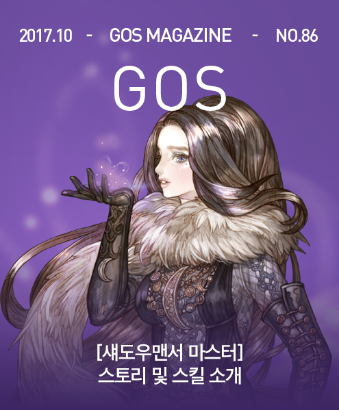

&nbsp;

# [섀도우맨서 마스터] 스토리

**섀도우맨서 마스터의 실험기1**

유빅은 심호흡을 한 번 하고 뒤를 돌아보았다. 마련된 자리에 나란히 앉은 마법마스터들이 보였다. 심드렁한 태도를 보이는 사람도 기대를 가지고 바라보는 사람도 있었다. 그러나 어떤 사람에게도 자신이 실패하는 모습을 보여주고 싶지는 않았다.

&nbsp;

&nbsp;&nbsp;&nbsp;마음의 준비를 마친 유빅은 제자에게 손짓을 보냈다. 우리에서 튀어나올 때까지 뭔지 알 수 없는 그리고 튀어 나온 지금도 저 몬스터가 뭔지 순간적으로 기억이 나지 않은 몬스터가 밖으로 나와 달리기 시작했다.

&nbsp;

&nbsp;&nbsp;&nbsp;몬스터의 이름 따위 나중에 천천히 기억해내면 될 일이었다. 하지만 시범은 때를 놓치면 망신이 되고 만다. 유빅이 신중하게 빠른 솜씨로 캐스팅을 마쳤다.

&nbsp;

&nbsp;&nbsp;&nbsp;몬스터의 뒤를 쫓던 그림자에서 네 개의 뾰족한 그림자 화살이 일어섰다. 그 화살들은 화살이라기보다는 마치 바늘처럼 뒤에 그림자의 줄기를 달고 있었다.

&nbsp;

&nbsp;&nbsp;&nbsp;그 네 개의 그림자 화살 줄기가 각각 몬스터의 네 발등을 뚫고 나왔다. 몬스터는 비명을 질렀지만, 일단 네 발이 모두 그림자에 의해 땅에 묶였다. 이제 일단 몬스터를 묶었으니 약간의 시간이 더 있었다.

&nbsp;

&nbsp;&nbsp;&nbsp;발등을 뚫었던 그림자 화살 줄기가 몬스터의 다리를 타고 올라와 무릎을 뒤에서 앞으로 꿰고 각 줄기가 가지를 치더니 8개의 화살 줄기로 변하면서 어떤 것은 아래에서 위로 어떤 것은 위에서 아래로 어떤 것은 횡으로 움직이며 몬스터의 신체 여덟 곳을 관통하면서 도합 16개의 구멍을 만든 뒤 몬스터의 등위로 솟아올랐다.

&nbsp;

&nbsp;&nbsp;&nbsp;솟아오른 8개의 그림자 화살 줄기가 하나로 합쳐지자 그것은 더 이상 그림자 화살이 아니라 그림자 창이 되었다. 그리고 그렇게 합쳐져 큰 창이 된 그림자 줄기는 그대로 아래로 방향을 정하고 몬스터의 머리를 꿰뚫어서 아직 숨이 남아 비명을 지르던 몬스터의 숨통을 끊어 절명시켰다.

&nbsp;

&nbsp;&nbsp;&nbsp;섀도우맨서 마스터 유빅은 시연을 마치자 몸을 돌려 배후에 단상에 앉아 감상한 여러 마스터를 돌아보았다. 가장 먼저 입을 열어 평가를 한 사람은 소서러 마스터 데임 키르케였다.

&nbsp;

&nbsp;&nbsp;&nbsp;“그 섀도우쏜은 마스터 수준에서나 가능한 것 아닌가요? 당신 제자들이나 다른 섀도우맨서들이 그 정도까지 숙달하지 못할 것이라 생각되는데요. 마스터 수준에서 할 수 있는 묘기를 보여주기 위해서라면 이 자리에 너무 많은 마스터를 모은 것 같군요.”

&nbsp;

&nbsp;&nbsp;&nbsp;유빅은 속으로는 ‘저것이!’ 하는 마음이 들었지만, 그런 말은커녕 표정도 나태내기 전에 위칸 셀레스틱이 그 말을 받아서 이렇게 말했다.

&nbsp;

&nbsp;&nbsp;&nbsp;“키르케님의 말이 맞습니다. 수준 높고 위력적인 기술이지만 다른 섀도우맨서가 쉽게 따라할 수 없는 마스터 수준의 기술 응용이라면 마법학적 가치 밖에 없다고 봅니다. 아울러 소서러 마스터께서 마족의 영혼적 그림자를 반영하는 기술을 구사하시는 능력을 고려하면 소서러 마스터님이 소환한 소환수에게는 발동조차 못할 겁니다.”

&nbsp;

&nbsp;&nbsp;&nbsp;유빅은 저 녀석은 키르케 일이라면 아무데나 나선다고 생각하고 있을 때 위노나 엔데가 그 의견에 반론을 제기하였다.

&nbsp;

&nbsp;&nbsp;&nbsp;“하지만 유빅님이 키르케님과 싸울 것도 아니고, 모든 소서러가 키르케님 수준에서 마족의 영혼을 다루는 것도 아니죠. 전혀 의미가 없지는 않다고 생각합니다.”

&nbsp;

&nbsp;&nbsp;&nbsp;일리 테리드가 그 뒤를 이었다.

&nbsp;

&nbsp;&nbsp;&nbsp;“모두 맞는 말씀이기는 한데 지금은 일단 다음 시범을 더 봅시다. 하나 볼 때마다 토론을 하면 오늘 하루가 모자랄 겁니다.”

&nbsp;

&nbsp;&nbsp;&nbsp;그 말에 유빅은 몸을 돌리고 다시 제자에게 신호를 보냈다. 준비된 두 번째 몬스터가 튀어나왔다.

&nbsp;

&nbsp;&nbsp;&nbsp;이번에는 유빅이 뭔가를 하지도 않은 것 같은데 순간적으로 몬스터가 땅에 붙은 듯이 움직이지 않았다. 이번에는 쏘마터지 마스터 라리사가 가장 먼저 입을 열었다.

&nbsp;

&nbsp;&nbsp;&nbsp;“그냥 평범한 섀도우페터 아니에요? 상대의 그림자를 땅에 못박아 움직이지 못하게 하는 섀도우맨서들의 기술말에요.”

&nbsp;

&nbsp;&nbsp;&nbsp;유빅이 “그렇습니다.” 라고 말하며 정해진 신호를 하였다. 그러자 제자들이 사방에 준비된 마법 화염을 켰다 끄기를 반복하였다. 낮이어도 화염이 강해서 몬스터의 그림자가 추가로 더 생겼다. 그러자 꼬리가 몸통을 흔든다고 할 일이 일어났다.

&nbsp;

&nbsp;&nbsp;&nbsp;몬스터가 새로 생긴 그림자로 끌려가고 있었다. 본체가 새로 생긴 그림자로 끌려 다니기 시작했다. 몬스터는 자신의 그림자가 못박혀서 거기에 구속된 상태인데 그림자가 갑자기 다른 곳에 생기거나 그림자의 크기와 방향이 달라짐에 따라 본체가 오히려 구속을 받아 위치가 옮겨지면서 강제로 이동 당하고 있었다. 문제는 그렇게 끌려 다닐 때마다 땅에 쳐 박히는 물리적 충격은 그대로 받는다는 점이었다.

&nbsp;

&nbsp;&nbsp;&nbsp;단단한 땅에 수십 번 충돌하고 때로는 공중으로 떴다가 낙하하는 일이 반복되자 결국 몬스터는 죽고 말았다. 유빅은 다시 몸을 돌려 다른 마스터들의 감상평을 기다렸다.

&nbsp;

&nbsp;&nbsp;&nbsp;이번에도 소서러 마스터 키르케가 먼저 입을 열었다.

&nbsp;

&nbsp;&nbsp;&nbsp;“이건 싸울 때마다 조명을 미리 준비해야 한다는 것인데 그건 문제가 있지 않나요?”

&nbsp;

&nbsp;&nbsp;&nbsp;링커 마스터 위노나 엔데가 뒤를 이어 발언했다.

&nbsp;

&nbsp;&nbsp;&nbsp;“링킹 기술을 잘 이용하고, 파이어볼이든 뭐든 빛나는 물체를 사방에 마법으로 순간적으로 배치하면 사전 준비 없이 할 수 있겠네요. 이건 처음부터 다른 마법사와 협력하여 전투하는 합동 전투를 위한 기술 응용이네요.”

&nbsp;

&nbsp;&nbsp;&nbsp;유빅은 위노나가 링커 마스터답게 자신이 생각한 연계 공격을 언급한 점이 마음에 들었다. 그러나 그런 기분은 오래 가지 않았다. 사이코키노 일리 테리드가 곧 이어 이렇게 말했기 때문이다.

&nbsp;

&nbsp;&nbsp;&nbsp;“그런데 적에게 저런 식으로 물리적 충격을 줄 작정이면 그냥 이렇게 하면 되지 않나?”

&nbsp;

&nbsp;&nbsp;&nbsp;그렇게 말하면서 일리 테리드는 텔레키네시스로 죽은 몬스터의 시체를 붙잡아 이리저리 휘둘렀다. 위칸 셀레스틱이 때를 놓칠세라 끼어들었다.

&nbsp;

&nbsp;&nbsp;&nbsp;“물론 필요한 순간에 텔레키네시스나 사이코키노의 도움을 받을 수 없는데 꼭 저렇게 할 필요가 있는 상황이 있을 수도 있지만, 그래도 그렇게 효율적으로는 보이지 않습니다.”

&nbsp;

&nbsp;&nbsp;&nbsp;데임 키르케 소서러 마스터가 위칸에게 미소를 한 번 지어주고는 자리에서 일어나면서 말했다.

&nbsp;

&nbsp;&nbsp;&nbsp;“섀도우맨서 마스터께서 섀도우맨서 마법의 고차원 수준의 인상적인 응용을 하실 수 있다는 점은 잘 알겠어요. 하지만 그걸 다른 마법 마스터들이 꼭 참관할 필요가 있었는지는 모르겠네요. 뭐 더 보고 싶은 마음도 없지 않아 있지만, 불행히도 제가 바빠서요. 오늘은 이만 보고 갈게요.”

&nbsp;

&nbsp;&nbsp;&nbsp;데임 키르케가 일어서자 위칸 셀레스틱도 자리에서 나름대로 인사말을 건네며 자리를 떴다. 다른 마법 마스터들 가운데 몇은 흥미를 지니고 더 보고 싶은 마음도 있는 것 같았지만, 분위기가 파장 분위기가 되자 어떻게 할까 고민하는 태도를 보였다.

&nbsp;

&nbsp;&nbsp;&nbsp;그 때 조용히 있던 크로노맨서 마스터 루시드 윈터스푼이 자리에서 일어났다. 가장 연장자인 그녀가 일어서자 다른 마스터들도 분분히 자리에서 일어났다. 그리고 모두 유빅에게 예의를 차린 인사를 하고는 그 자리를 떠나기 시작했다.

&nbsp;

&nbsp;&nbsp;&nbsp;그런데 먼저 일어섰던 루시드 윈터스푼은 유빅에게 다가서며 말했다.

&nbsp;

&nbsp;&nbsp;&nbsp;“내가 자리에서 일어나는 바람에 파장을 앞당긴 것 같지만, 그건 내 의도의 절반에 불과합니다.”

&nbsp;

&nbsp;&nbsp;&nbsp;유빅은 그 말을 듣고 루시드 윈터스푼을 보면서 말했다.

&nbsp;

&nbsp;&nbsp;&nbsp;“그러면 그냥 우연히 일어나신 것이 아니라 자리를 파하려고 일부러 그러셨다는 말씀인가요?”

&nbsp;

&nbsp;&nbsp;&nbsp;“네, 그런 의도도 있어요. 하지만 그것이 다는 아닙니다. 단 둘이 조용히 이야기하고 싶은 일이 있어서이기도 했죠.”

&nbsp;

&nbsp;&nbsp;&nbsp;유빅은 이 살아있는 마법의 대가가 무슨 말을 할지 기대 반 걱정 반으로 마음으로 다음 말을 기다렸다. 루시드 윈터스푼이 말했다.

&nbsp;

&nbsp;&nbsp;&nbsp;“방금 보여준 마법 말인데요. 결과적으로는 못박힌 그림자의 본체를 다른 곳으로 보냈어요. 그렇다면 이것을 한 단계 더 발전시키면 순간이동 기술로 응용할 수 있을 것 같은데 어떻게 생각하나요?”

&nbsp;

&nbsp;&nbsp;&nbsp;“하지만 그렇게 하려면 도착시의 물리적 충격 문제를 해결해야 합니다. 더 멀리 갈수록 충격이 커질 테니 적을 일부러 멀리 날려보내서 그만큼 큰 충격을 줄 작정이 아니라 자신이나 자신이 원하는 대상의 우호적인 순간이동으로 쓸려면 말입니다.”

&nbsp;

&nbsp;&nbsp;&nbsp;루시드 윈터스푼이 그 말에 미소를 지으며 말했다.

&nbsp;

&nbsp;&nbsp;&nbsp;“문제는 그것만이 아니지만 그 문제는 비교적 쉽게 해결할 수 있을 것 같네요.”

&nbsp;

&nbsp;&nbsp;&nbsp;유빅은 잠시 생각하다가 말했다.

&nbsp;

&nbsp;&nbsp;&nbsp;“또 다른 문제는 더 멀리 보내고 싶을수록 더 강한 조명을 써야 합니다. 그리고 너무 멀리 떨어지면 가고 싶은 곳에 조명을 설치해봐야 본체는 그곳에 있지 않고 본체의 그림자를 그곳으로 먼저 보낼 방법이 없으니 결과적으로 본체가 직접 가야 하니까 의미가 없네요. 아까도 사키코키노 마스터 일리 테리드가 말했지만 이것도 그냥 텔레포테이션이 더 낫다는 평가를 들을 것 같습니다.”

&nbsp;

&nbsp;&nbsp;&nbsp;“반드시 자기 그림자를 이용할 필요는 없지요. 다른 사람이나 사물의 그림자에 올라탈 수 있다면 어떨까요?”

&nbsp;

&nbsp;&nbsp;&nbsp;“그런 응용은 생각한 적이 없어서 가능한지 여부도 모르겠네요. 앞으로 시간을 들여 연구해서 가능하다는 결론이 난다고 하여도 마찬가지 아닌가요? 내 그림자든 다른 사람이나 사물의 그림자든 멀리 보내려면 아까와 동일한 문제가 있어요. 더 강한 조명과 그림자를 먼저 도달시킬 방법이 없으며 그림자를 도달시키려면 결국 본체가 먼저 그 장소에 가있어야 한다는 모순이죠.”

&nbsp;

&nbsp;&nbsp;&nbsp;루시드 윈터스푼이 다시 한 번 미소를 지으며 말했다.

&nbsp;

&nbsp;&nbsp;&nbsp;“그 그림자가 달의 그림자라면?”

&nbsp;

&nbsp;&nbsp;&nbsp;그 말에 유빅의 표정이 달라졌다.

&nbsp;

&nbsp;&nbsp;&nbsp;“맙소사! 월식이나 일식의 그림자에 올라탈 수 있다면 세상의 끝이라도 단숨에 갈 수 있겠죠! 그런 생각은 하지 않았어요.”

&nbsp;

&nbsp;&nbsp;&nbsp;루시드 윈터스푼이 다시 말했다.

&nbsp;

&nbsp;&nbsp;&nbsp;“그래 봐야. 텔레포테이션의 저급하고 비효율적인 열화판이라는 평가를 들을 수도 있겠지만, 그래도 해보기 전에는 모르는 일이죠. 당분간 이 마법 연구를 해보는 것이 어때요? 나도 틈나는 대로 돕도록 하죠.”

&nbsp;

&nbsp;&nbsp;&nbsp;“네 왜 아니겠어요? 오늘부터 당장 이 일을 시작해야겠어요. 정말 감사합니다. 정말 멋진 착상입니다. 루시드님.”

&nbsp;

&nbsp;&nbsp;&nbsp;이 날 그런 이유로 섀도우맨서 마스터 유빅은 이클립스라는 말을 자신의 이름으로 삼아 이후 이클립스 유빅으로 불리게 되었다.