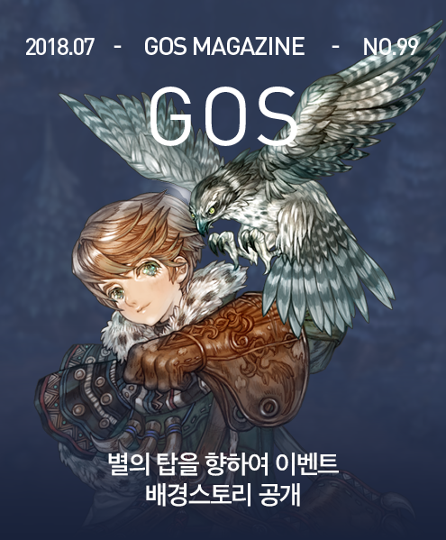

&nbsp;

# 별의 탑을 향하여 이벤트 배경 스토리 공개

**어떤 비밀회담에 관한 이야기**

&nbsp;

&nbsp;&nbsp;&nbsp;특유의 힘찬 날갯짓 소리와 함께 전서응이 젠클라스 메타이의 팔에 내려앉았다. 응사 마스터인 그는 발목의 표시를 확인하기도 전에 매의 털빛과 모양만 보고도 그것이 대장군 라민에게서 온 전서응이라는 사실을 알 수 있었다.

&nbsp;

&nbsp;&nbsp;&nbsp;과연 발목의 표시와 통을 보니 틀림없었고, 봉인이 훼손되지 않았는지 꼼꼼하게 점검한 후 매에게서 서신을 꺼냈다. 그는 매를 횃대로 옮기는 절차를 끝내자 천천히 받은 서신을 읽기 시작했다. 서신의 내용이 이상하였기 때문에 그는 잠시 고개를 갸웃거렸다. 메타이와 대장군 사이에 오고 가는 서신은 모두 암호문으로 쓰여있어 다른 사람은 읽을 수 없었다. 하지만 메타이는 암호문을 푸는 방법을 완전히 숙지하고 있었기 때문에 보통의 글을 읽는 것보다 약간 느린 속도로 별도의 해석 없이 원본을 읽을 수 있었다.

&nbsp;

&nbsp;&nbsp;&nbsp;하지만 메타이는 읽은 내용을 그대로 믿을 수가 없었다. 따라서 그는 실로 오랜만에 암호표를 찾아 자신이 잘못 읽은 내용이 있는지 점검하였다. 검토 결과 그가 잘못 해석한 내용은 없었다. 덕분에 오히려 고민만 깊어졌을 뿐이었다. 대장군의 암호서신에 대해 고민하던 그는 마침내 그 서신의 내용에 대해 상의를 해야겠다고 결심하고 움직였다.

&nbsp;

&nbsp;&nbsp;&nbsp;일단은 클라페다 기사단장 우스카 장군에게 전달해야 하겠지만, 메타이가 진짜로 의논하고 싶은 상대는 헌터 마스터 피오나였다. 그는 해석본을 잘 챙긴 다음 헌터 마스터 피오나를 만나기 위해 나섰다.

 

&nbsp;

&nbsp;&nbsp;&nbsp;피오나 이에바는 응사 마스터 메타이가 그녀에게 건넸던 서신을 모인 사람들에게 회람시켰다. 참석자들은 그 서신을 천천히 몇 번이고 돌려가며 읽더니 다시 메타이에게 돌려주었고, 플레처 마스터가 가장 먼저 질문을 하였다.

&nbsp;

&nbsp;&nbsp;&nbsp;“지금 이 사실을 아는 사람이 누가 더 있지?”

&nbsp;

&nbsp;&nbsp;&nbsp;“일단 우스카님이 있습니다. 클라페다의 기사단장이자 왕국군의 장군이시고, 템플러 마스터에다 시장 대행까지 겸하고 있으니까요. 어차피 대장군의 지시를 실행할 담당자이기도 하고 말입니다. 그리고 마스터 이에바님이 두 번째로 본 사람입니다.”

&nbsp;

&nbsp;&nbsp;&nbsp;“이 문서의 내용으로 보면 바세닌 장군도 회람 대상자인데?” 니모켄의 말이었다.

&nbsp;

&nbsp;&nbsp;&nbsp;“군부는 우스카님이 알아서 하실 겁니다. 문제는 우리입니다.” 응사 마스터 메타이가 이렇게 말하자 헌터 마스터 피오나가 질문하였다.

&nbsp;

&nbsp;&nbsp;&nbsp;“드라군 마스터 측에는 알리지 않을 생각인가?”

&nbsp;

&nbsp;&nbsp;&nbsp;“일단 현직 군인도 아니고, 히밀 가문이 별의 탑을 나온 지 오래입니다. 지금도 이 지시를 아는 사람이 너무 많다고 생각합니다. 왕국군 장교를 겸하고 있는 마스터분들만 따져도 새퍼와 캐노니어 그리고 채플린 마스터에게도 연락이 갈 테니 아는 사람이 적지 않습니다.”

&nbsp;

&nbsp;&nbsp;&nbsp;“응사 마스터께서 사실 문제는 우리라고 했지만, 실은 문제가 생긴 것은 이그나스 그 자이지. 솔직히 말하면 잘 됐다 싶기도 한데 말이지.” 플레처 마스터의 말이었다.

&nbsp;

&nbsp;&nbsp;&nbsp;동석한 소드맨 마스터가 고개를 저으며 말했다.

&nbsp;

&nbsp;&nbsp;&nbsp;“안 됩니다. 라민 대장군의 계획은 위험합니다. 왕국군을 동원해 별의 탑 이그나스를 응징하는 일은 부작용이 큽니다. 성공한다는 보장도 없습니다. 별의 탑은 난공불락입니다. 마군주 솔콤이 수백 년을 노력했지만, 탑 근처에도 못 가봤지 않습니까? 심지어 아가일라 플러리가 지키던 마법사의 탑도 헬가 세르클을 상대로 그렇게까지 완벽하게 방어한 적이 없을 정도였지 않습니까?”

&nbsp;

&nbsp;&nbsp;&nbsp;“그야 샤펜스타가 제대로 작동할 때 이야기죠. 샤펜스타는 단합된 조직력을 가진 단체고 마법사들은 원래 일사불란하게 전쟁을 하는 집단이 아닙니다. 마법사의 탑은 마법을 연구하는 연구소를 겸하는 장소였지만, 별의 탑은 근본적으로 요새로 지어진 곳이었고요. 아무튼 지금의 샤펜스타는 저항군과 이그나스 라는 두 세력으로 나뉘어 있습니다. 거기에 우리 마스터들이 저항군을 돕고 당대 제일의 명장 라민 대장군이 직접 왕국군을 지휘하여 저항군과 연합하여 공격하면 실패할 수가 없습니다. 정 불안하시면 지금이라도 히밀 가문도 부르죠. 그 사람들 득달같이 달려올 겁니다. 그리고 세력은 없지만 메켄도 부르죠. 그 녀석 알고 보니 그렇게 엇나간 사람 아니었습니다. 아예 본격적으로 마스터 그에라와 크리크도 고용합시다. 여기 모인 분들이 갹출하시면 나머지는 블랙가문이 마련하겠습니다. 협상 잘하면 칼날서약단과 황금노래단을 동시에 고용하는 전무후무한 일도 저렴하게 할 수 있을 겁니다. 까짓거 앞으로 용병단에 제가 화살 싸게 공급하면 됩니다. 이 정도 전력이면 저항군도 버거워서 어쩌지 못하고 있는 이그나스 녀석 따위 간단히 날려버릴 수 있습니다.”

&nbsp;

&nbsp;&nbsp;&nbsp;플레처 마스터가 열변을 토했다. 그러나 여전히 소드맨 마스터는 쉽게 고개를 끄덕이지 않았고, 헌터 마스터가 그의 심정에 공감하여 입을 열었다.

&nbsp;

&nbsp;&nbsp;&nbsp;“우리가 이제까지 이그나스가 나쁜지 몰라서 가만있었던 것이 아니지 않습니까? 심증은 있지만, 물증이 없습니다.”

&nbsp;

&nbsp;&nbsp;&nbsp;“라민 대장군님 말씀대로 증거는 반드시 찾을 수 있습니다. 일단 이기면 충분히 찾을 수 있습니다. 못 찾으면 내 마스터 자리라도 내놓겠습니다. 그리고 이건 비밀이긴 한데 조금 전에 말한 메켄이 증거는 아니지만, 증인은 맞습니다. 그 녀석의 증언만으로도 최소한의 명분은 있다는 말입니다.”

&nbsp;

&nbsp;&nbsp;&nbsp;플레처 마스터가 다시 자기 주장을 펼치자 이번에는 레인저 마스터 니모켄이 나섰다.

&nbsp;

&nbsp;&nbsp;&nbsp;“그 말씀이 사실이라고 생각하지만, 그럼에도 그건 최소한입니다. 그리고 문제는 그것만이 아닙니다. 신수의 날 이래 불안한 왕국은 이전까지와 달리 충분한 군사력이 없습니다. 겨우 임시수도를 정하고 안정을 찾아가고 있는데 대규모 병력을 빼내어 움직인다면 명분과 승패에 상관없이 그 자체로 문제가 됩니다. 왕국군이 없는데 카오닐라 공주님에게 혹시라도 무슨 일이 생긴다면 어쩝니까?”

&nbsp;

&nbsp;&nbsp;&nbsp;“그러니까 최소한의 병력만 움직이자는 것이 라민 대장군님의 계획 아닙니까? 그러니 이 자리의 우리 마스터들도 전부 나서 달라는 것이고, 마스터 우스카님을 필두로 이 지역 왕국군도 동원하겠다는 것이고…” 플레처 마스터의 말을 막은 것은 소드맨 마스터였다.

&nbsp;

&nbsp;&nbsp;&nbsp;“대장군님의 공식 명령이라면 새퍼, 캐노니어, 채플린 마스터 등 현역 군인인 마스터들이 모두 자리를 비우게 됩니다. 왕국 남부 지역 클라페다의 기사단장이지만 동시에 남부지역 왕국군의 총사령관인 우스카 장군일지 부사령관인 바세닌 장군일지 혹시 두 분 다 일지 모르지만, 참전하셔야 할 테고, 대장군께서는 늙은 이 몸이 한시적으로 그 공백을 메우게 하려고 하시지만, 그럼에도 서신의 내용이 그대로 실행되면, 하이랜더 마스터를 포함하여, 한 사람만 남고 이 넷 가운데 세 분이 참전합니다. 따라서 왕국 남부에는 전현직을 막론하고 장성은 한 사람만 남게 됩니다. 아마도 늙은 이 몸이 남을 것 같고 말입니다. 하지만 모두 아시다시피 신수의 날 이후, 어딘들 아니겠습니까만, 왕국 남부의 사정 역시 불안합니다.”

&nbsp;

&nbsp;&nbsp;&nbsp;헌터 마스터가 그 말을 받았다.

&nbsp;

&nbsp;&nbsp;&nbsp;“정리하면 이렇습니다. 대장군의 계획은 심정적으로는 지지하고 싶지만, 법률적으로나 군사적으로나 왕국과 우리의 지역적 상황으로나 큰 무리가 있습니다. 그리고 이 자리에 모인 분들이 다 같은 심정이겠지만, 개인적으로 저는 왕국군과 샤펜스타 사이에 무슨 이유로건 전쟁이 벌어지는 일은 막고 싶습니다. 이것은 비단 감성적인 이유만이 아닙니다. 후대를 생각해서라도 왕국군이 지방 영주와 본격적인 전쟁에 나서는 사례를 만들어서는 안 됩니다. 허먼메데일 사건 이후 왕국군의 봉신에 대한 직접적인 전투는 한 번도 없었습니다. 허먼메데일은 제2대 국왕이신 제로멜Zeromel1세 시대 일이니 왕국이 정착되는 과정에서의 정립 과정이었다 할 수 있었지만, 지금은 안 됩니다. 더구나 이런 대재앙의 시기에는 더욱 그렇습니다. 그렇지만..”

&nbsp;

&nbsp;&nbsp;&nbsp;헌터 마스터 피오나가 잠시 말을 끊었다가 다시 이었다.

&nbsp;

&nbsp;&nbsp;&nbsp;“그렇지만 그러한 군사 행동의 필연성도 분명히 존재합니다. 현명한 라민 대장군께서 제가 지적한 사항들을 모두 아시면서도 이러한 군사 행동을 할 수밖에 없는 상황이라는 점은 이그나스와 별의 탑의 사정을 아는 사람이라면, 그리고 그로 인해 앞으로 벌어질 뻔한 일을 예측할 수 있는 간단한 지성만 있다면, 누구도 부인할 수 없다는 말입니다.”

&nbsp;

&nbsp;&nbsp;&nbsp;“그래서? 네가 그런 식으로 말하면 나름대로 생각이 있다는 것 같은데?” 레인저 마스터 니모켄이 말했고 헌터 마스터 피오나가 다시 말을 이었다.

&nbsp;

&nbsp;&nbsp;&nbsp;“대장군을 설득하십시다. 왕국군을 동원하기 전에 샤펜스타 자체적으로 해결된다면, 그것이 최선이니까 말입니다. 물론 지금까지 해결하지 못했던 문제를 갑자기 해결하려면 지금까지와는 다른 행동과 노력이 필요합니다. 이 자리에 관계자들이 모인 김에 그렇게 하십시다. 이 자리에 모인 사람들이 왕국군을 도와 참전하기 전에 그 힘으로 저항군을 돕는다면, 그것만으로도 이그나스를 몰아내거나 처치할 수 있다고 봅니다. 그렇게 하고도 안 된다면 뜻대로 하시라는 조건이면 라민 대장군도 당분간은 참고 기다려 주리라 봅니다.”

&nbsp;

&nbsp;&nbsp;&nbsp;“흐음.. 저항군과 우리 선에서 해결될 수 있다면, 굳이 거창하게 갈 필요도 없지..”

&nbsp;

&nbsp;&nbsp;&nbsp;플레처 마스터마저 수긍하자 모두가 동의하는 분위기가 되었다.

&nbsp;

&nbsp;&nbsp;&nbsp;“하지만 공식적으로 저항군을 도울 수는 없습니다. 누가 뭐래도 형식상으로는 이그나스가 샤펜스타의 공식단장이니까 말입니다. 더더구나 마스터의 신분으로 그렇게 하는 것은 더욱 불가합니다.”

&nbsp;

&nbsp;&nbsp;&nbsp;응사 마스터 젠클라스 메타이가 언급하였다.

&nbsp;

&nbsp;&nbsp;&nbsp;“당연한 일이다. 그러니 비밀리에 우회적이면서도 저항군을 충분히 지원할 방법을 찾아야 한다. 물론 그전에 이런 우리의 의견을 대장군에게 전달해 인정을 받아야 한다.”

&nbsp;

&nbsp;&nbsp;&nbsp;헌터 마스터의 말이었다.

&nbsp;

&nbsp;&nbsp;&nbsp;“일단 응사 마스터의 전서응을 통해 이 자리에 모인 마스터들과 그 외 뜻을 같이하는 다른 마스터들이 연명으로 서신을 보내도록 하지요.” 레인저 마스터 니모켄이 말하자 소드맨 마스터가 그 말을 받았다.

&nbsp;

&nbsp;&nbsp;&nbsp;“그래야 하겠지만, 내용은 암호문으로 써도 서명은 그럴 수 없소. 그리고 행여 그 문서를 지닌 전서응이 사고를 당해 서신이 엉뚱한 사람에게 흘러 들어간다면, 내용은 못 읽어도 저명한 마스터들의 서명이 줄줄이 적힌 글은 문제가 될 수 있소.”

&nbsp;

&nbsp;&nbsp;&nbsp;“하지만 서명이 없으면, 그 내용이 연명한 마스터들의 공통된 의견이라는 사실을 무엇으로 증명하죠?”

응사 마스터의 질문이었다. 전서응을 관리하는 그가 이렇게 물었으니 그가 전서응을 다루는 방식이나 암호를 작성하는 방식으로는 방법이 없다는 뜻도 되었다.

&nbsp;

&nbsp;&nbsp;&nbsp;그런데 레인저 마스터 니모켄이 방법을 제시하였다.

&nbsp;

&nbsp;&nbsp;&nbsp;“믿을 만한 마법사 마스터를 하나 정해 마법으로 임시수도에 전달하도록 하지.”

&nbsp;

&nbsp;&nbsp;&nbsp;“임시수도의 왕궁까지 정신교감을 자유롭게 하려면 루시드 윈터스푼님 말고는 없을 것 같은데요. 거리도 문제지만, 왕실 전체에는 아무나 마법을 함부로 쓰지 못하도록 항상 방해하는 주문이 걸려있으니 말입니다.”

&nbsp;

&nbsp;&nbsp;&nbsp;“그분은 속세의 일에 간섭하지 않으려 하시니 탈이지. 일단 말은 해봐야 하겠지만..”

&nbsp;

&nbsp;&nbsp;&nbsp;플레처 마스터의 한숨 섞인 말에 응사 마스터가 다시 제안을 내놓았다.

&nbsp;

&nbsp;&nbsp;&nbsp;“차라리 링커 마스터 위노나 엔데에게 부탁하죠. 연결이라면 링커 마스터도 한 가락 할 텐데요.”

&nbsp;

&nbsp;&nbsp;&nbsp;“그렇다면 이렇게 하지. 내 친구 림가일레가 들은 바에 따르면 오위니아 딜벤Owynia Dilben이 중요한 임무 때문에 니코폴리스에 와있다고 하는데 딜벤 일족은 왕실 수석 마법사 오윈 딜벤과 언제든지 정신교감이 된다고 하니까 그녀에게까지만 접촉하면 마법의 대가는 굳이 필요 없을지도 몰라.” 니모켄이 이렇게 말하자 응사 마스터가 이렇게 받았다.

&nbsp;

&nbsp;&nbsp;&nbsp;“그렇다면 오위니아 딜벤과 전서응 등등 할 수 있는 방법은 다 써보죠. 물론 비밀유지에는 각별히 신경 쓰면서 말입니다.”

&nbsp;

&nbsp;&nbsp;&nbsp;플레처 마스터가 그 말을 듣고 이렇게 말하였다.

&nbsp;

&nbsp;&nbsp;&nbsp;“이왕 할 수 있는 방법을 다 쓴다면 이 일에 도움이 될 사람을 더 찾아보아도 좋지 않을까?”

&nbsp;

&nbsp;&nbsp;&nbsp;“누구 염두에 두고 있는 사람이 있습니까?”
니모켄이 물었다.

&nbsp;

&nbsp;&nbsp;&nbsp;“요즘 꽤 이름을 날리는 계시자가 있다는데 모두가 좋다면 도움을 요청해도 좋을 듯한데..”

&nbsp;

&nbsp;&nbsp;&nbsp;소드맨 마스터가 그 말에 이렇게 반응하였다.

&nbsp;

&nbsp;&nbsp;&nbsp;“나쁘지 않은 것 같군.”

&nbsp;

&nbsp;&nbsp;&nbsp;그 말에 헌터 마스터가 결론을 내었다.

&nbsp;

&nbsp;&nbsp;&nbsp;“그렇다면 반대하시는 분이 없다면 그렇게 결론을 내리고 지금 논의한 일을 모두 추진하도록 합시다. 우스카와 다른 마스터들에게는 내가 나서서 필요한 협조와 동의를 얻어내겠습니다. 그 후에 다시 모여서 구체적인 실행 방법을 논의합시다.”

&nbsp;

&nbsp;&nbsp;&nbsp;모두가 동의하는 가운데 그날의 회의는 그런 결론을 내리고 헤어졌다.