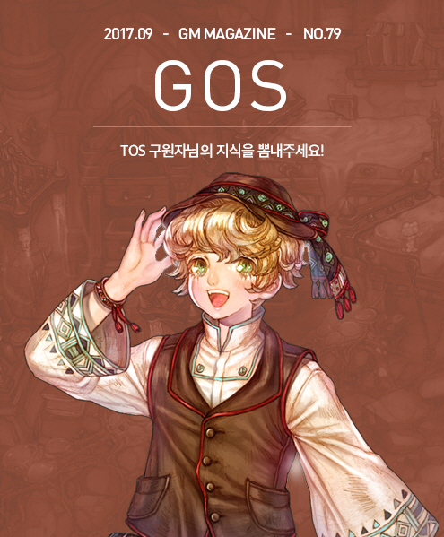
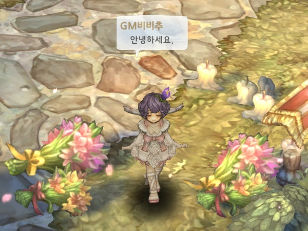
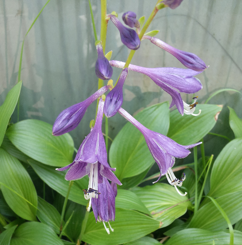
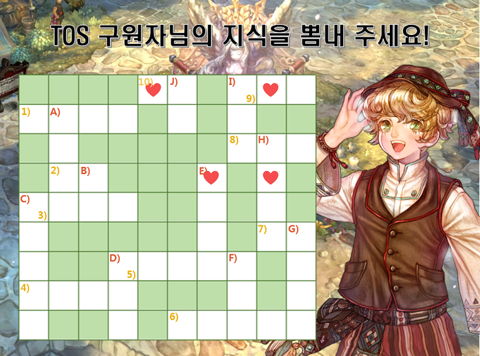
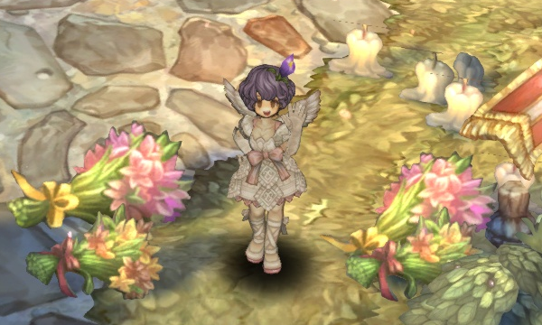
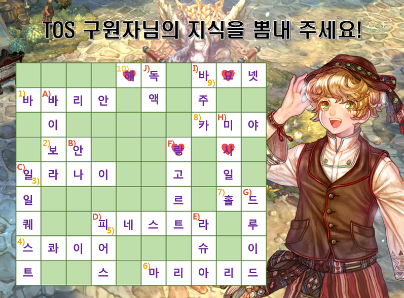

&nbsp;

# TOS 구원자님의 지식을 뽐내주세요!

안녕하세요, 구원자님!  
구원자님께 처음 인사드리는 **GM비비추**입니다.

&nbsp;

비비추가 무엇인지 모르는 분들이 많으실 것 같은데요,  
비비추는 백합을 축소시킨 느낌의 보라색 꽃입니다.

By Grrewa - 자작, CC BY-SA 3.0, https://commons.wikimedia.org/w/index.php?curid=20438676

&nbsp;

**[이것이 바로 비비추!]**

비비추는 아름다운 꽃말을 가지고 있는데요,  
**신비한 사랑, 좋은 소식, 하늘이 내린 인연**이 꽃말이라고 합니다.  
GM비비추도 꽃말처럼 구원자님들과 좋은 추억을 만들어 가고 싶어요!

&nbsp;

하늘이 내린 인연을 기념하는 첫 만남에  
어떤 내용의 매거진을 준비하면 좋을지 많이 고민해보았습니다.

구원자 분들께 재미있는 경험을 제공해드리기 위해  
제가 트오세를 플레이하면서 알게 된 용어들을 조합하여  
간단한 **가로세로 낱말 퀴즈**를 만들어 보았어요!

낱말 퀴즈를 만들다 보니 자연스럽게 저의 취향이 녹아들게 되었는데요,

저는 소드맨을 주력 캐릭터로 키우는 소드맨 덕후라  
낱맡 퀴즈에 비교적 소드맨 계열 내용이 많은 점, 참고 부탁드립니다. ( _ _ )  
**▶ 퍼즐을 푸실 때 많은 도움이 될 수 있습니다.**

또한, **문제를 푸시고 네 개의 하트를 조합하시면**  
GM 비비추가 전해드리고 싶은 말을 찾으실 수 있습니다.

저의 마음이 여러분께 전해졌으면 좋겠어요..!

&nbsp;

### 가로

**1) 승리를 위해선 형식에 구애 받지 않고 무엇이든 하는 저돌적이고 호전적인 전사이며 전사 계열 3랭크에 해당합니다.**

**2) 계정을 보호하기 위해 OO서비스인 U-OTP 또는 플레이 패스를 설치해야 합니다.**

**3) 오르샤 대장장이 NPC 이름.**

**4) 동료의 장비를 손질하여 성능을 향상시키거나 거점을 설치해 동료들의 활동을 도와주는 보조계 전사이며, 전사 계열 5랭크에 해당합니다.**

**5) 적극적으로 공격하는 창문자세 스탠스로 전환하는 하플라이트의 스킬 이름입니다.**

**6) 펠타스타 마스터 NPC 이름.**

**7) 소환한 악마를 지정한 위치에 대기하며 그 자리를 지킬 것을 명령하는 소서러의 스킬 이름입니다.**

**8) 로델레로 마스터 NPC 이름.**

**9) 장총에 장착한 OOO으로 근접한 적을 찔러 공격하는 머스킷티어의 스킬.**  
Hint) OOO 쓰러스트

**10) 동료의 중독 상태를 지워주는 무고사의 스킬.**

&nbsp;

### 세로

**A) 바카리네, 가비야, 제미나, 라이마 서버가 통합된 서버 이름.**

**B) 페디미안 대장장이 NPC 이름.**

**C) 100레벨이 되면 클라페다 도시에 있는 접수원 도네스 NPC를 통해 하루 5번 클리어 할 수 있는 퀘스트를 말합니다.**

**D) 창으로 적을 강하게 찔러 피해를 주는 스킬로 적의 크기가 클수록 연타 보너스가 적용되는 스킬.**

**E) 방패와 검을 동시에 찔러 적의 공격을 방어함과 동시에 공격하는 펠타스타의 스킬.**

**F) 소드맨 마스터 NPC 이름.**

**G) 자연의 힘을 이용하고 땅에 핀 풀을 조종하여 아군에 도움을 주거나 직접 몬스터로 변신하여 몬스터가 가진 기술을 사용할 수 있으며, 성직자 6랭크에 해당합니다.**

**H) 일정 시간 동안 자신과 파티원에게 미사일 공격과 마법 탄환 공격의 피해를 극소화하는 효과를 부여하는 세이지의 스킬.**

**I) 집중력을 높이기 위해 앉은 채로 공격을 해 발사하는 캐노니어의 스킬.**

**J) 독을 모아놓은 병이며, 강력한 독을 제조하는데 사용됩니다. 무고사 마스터에게서 구입할 수 있는 아이템입니다.**

&nbsp;

구원자님들께 전하고 싶은 GM비비추의 메시지는 무엇일까요?  
네 개의 하트를 조합한 메시지를 댓글로 남겨 주세요
 
&nbsp;

그럼 더 재미있고 유익한 GOS매거진으로 다시 찾아 뵙겠습니다!
 
오늘도 TOS와 함께 즐거운 하루 보내시길 바랍니다.  
감사합니다.

&nbsp;

&nbsp;

안녕하세요, **GM비비추**입니다.

‘TOS 구원자님의 지식을 뽐내주세요!’ 가로세로 낱말 퀴즈의 정답을 공개하기 위해 다시 찾아왔습니다. J

예상보다 많은 분들께서 비비추의 마음 속 메시지를 찾아주셨는데요,  
혹시 헷갈리는 문제가 있으셨다면 아래 정답판을 통해 정확한 답을 확인하실 수 있습니다.

GM비비추가 여러분들께 드리고 싶었던 말은, 바로바로  
**"사 랑 해 요"** 였습니다.

구원자님께 GM비비추의 마음이 전해지길 바라며,  
저는 더 재미있는 매거진으로 다시 찾아오도록 하겠습니다.

감사합니다.