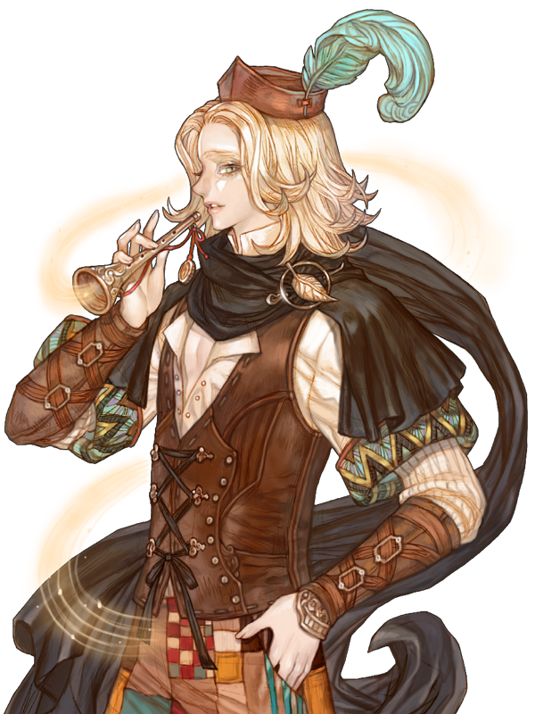

&nbsp;

# 파이드 파이퍼 클래스 배경 스토리

&nbsp;  

**파이드 파이퍼 마스터의 계약**

&nbsp;

&nbsp;&nbsp;&nbsp;“요즘의 왕국은 평화와 번영의 시기 같군.”

&nbsp;

&nbsp;&nbsp;&nbsp;깊은 숲 속 도저히 사람이 있을 만한 장소가 아닌 곳에 모닥불을 피우고 마주 앉아 늦은 밤에 이뤄지는 대화가 있었다. 한 쪽이 왕국의 평화와 번영을 언급하자 마주 앉은 남자가 손보던 피리를 갈무리하면서 말했다.

&nbsp;

&nbsp;&nbsp;&nbsp;“네 확실히 소셀 국왕은 라엘 국왕 이후 가장 뛰어난 명군입니다. 일단 지난 3대에 걸친 왕위계승분쟁의 소지를 없앴고, 왕국은 그야말로 부국강병의 시기입니다. 저 같은 방랑자에게는 어차피 의미 없는 일이라곤 해도, 확실히 그의 시대에 태어나 살고 있다는 것은 대부분의 왕국 백성들에게 좋은 일이라고 하겠습니다.”

&nbsp;

&nbsp;&nbsp;&nbsp;“그러고 보니 그대는 소셀 국왕의 등극 이후에 태어났으니 다른 국왕 시절은 경험하지 못했겠군.”

&nbsp;

&nbsp;&nbsp;&nbsp;“그러고 보니 당신은 아예 왕이 없던 시절도 경험했겠군요.”

&nbsp;

&nbsp;&nbsp;&nbsp;“틀린 말은 아니지만, 그건 나만 그런 것은 아니지 글리헬 국왕과 컴뮤렐Kommurel 국왕 사이에 2년간의 공백기가 있었지. 제3차 왕위계승분쟁은 그 전의 두 차례에 비해 그만큼 길고 치열했다는 말이기도 하고..”

&nbsp;

&nbsp;&nbsp;&nbsp;“이미 그쪽이 말한 대로 나는 소셀 국왕이 이미 통치를 시작한 이후 태어났습니다. 그러니 소셀 국왕의 전대왕인 컴뮤렐 국왕이나 그 분이 등극하기 위해 겪은 3차 왕위계승분쟁 역시 책에서나 접할 수 있는 내용입니다.”

&nbsp;

&nbsp;&nbsp;&nbsp;“그러나 내게는 다르다네. 나는 그 모든 일을 다 관찰했으니까.”

&nbsp;

&nbsp;&nbsp;&nbsp;“그쪽 분들은 대개 인간사에 무관심한 편 아닙니까? 거의 어떤 인간들이 짐승을 멸시하거나 무시하는 수준으로 인간을 본다고 알고 있습니다만..”

&nbsp;

&nbsp;&nbsp;&nbsp;“사실이지만, 나는 다르지. 그러니 나를 부르는 명칭이 주시자 아니겠나?”

&nbsp;

&nbsp;&nbsp;&nbsp;“물론 본명은 따로 있고요?”

&nbsp;

&nbsp;&nbsp;&nbsp;“아 물론. 하지만 그 이름은 오랜 시간 불려지지 않았고, 지금은 주시자란 이름이면 충분해.”

&nbsp;

&nbsp;&nbsp;&nbsp;“그렇군요. 그런데 고위 마족이자 모든 것을 관찰하는 주시자가 한적한 숲 속을 방랑하는 나 같은 사람에게 나타난 이유가 궁금하니 이제 그 이야기를 할 때가 아닌가 합니다.”

&nbsp;

&nbsp;&nbsp;&nbsp;“역시 두려움이 없군. 마스터라면 굳이 전투형 직업이 아니더라도 두려움 따위는 없다는 것인가? 뭐 아무튼 파이드 파이퍼 마스터와 계약을 하나 하고 싶어서 찾아왔지.”

&nbsp;

&nbsp;&nbsp;&nbsp;“듣기로는 하우벅이란 마군주가 아가일라 플러리님과 계약을 맺었다가 길티네의 명을 받은 헬가 세르클에게 갈갈이 찢겨 죽었다고 들었는데. 인간 따위하고 계약을 맺는 일 그거 마족 상층부에서 싫어하는 일 아닙니까?”

&nbsp;

&nbsp;&nbsp;&nbsp;“내가 바로 그 상층부지. 내 위의 상관은 길티네 님뿐이네. 그런데 나에게는 마계의 첩보를 총괄하는 자로서 상당한 재량권이 있지. 그저 힘이나 쓰고 다니는 자들하고는 다르지.”

&nbsp;

&nbsp;&nbsp;&nbsp;“그리고 비밀을 숨기는데도 탁월하고 말입니다.”

&nbsp;

&nbsp;&nbsp;&nbsp;“그렇기도 하고.”

&nbsp;

&nbsp;&nbsp;&nbsp;“그럼 이 계약에도 숨은 의도와 비밀이 있겠군요.”

&nbsp;

&nbsp;&nbsp;&nbsp;“하지만 계약 대상자에게 불이익을 주는 이면의 내용은 없다고 장담하네. 나의 비밀은 나에게 관련된 일이니까. 믿어도 좋아.”

&nbsp;

&nbsp;&nbsp;&nbsp;“악마를 믿으라는 말입니까?”

&nbsp;

&nbsp;&nbsp;&nbsp;“악마는 몰라도 악마와의 계약은 믿어도 좋지.”

&nbsp;

&nbsp;&nbsp;&nbsp;“이런 말 참 우습지만, 그것 참 신뢰할 만한 말입니다. 그래서 원하는 것이 뭡니까?”

&nbsp;

&nbsp;&nbsp;&nbsp;“파이드 파이퍼의 어떤 곡조를 배우고 싶네.”

&nbsp;

&nbsp;&nbsp;&nbsp;“갑자기 파이드 파이퍼나 음악가로 변장해서 정보를 캘 일이라도 생긴 겁니까? 그렇게 변장시킬 부하들 훈련용입니까?”

&nbsp;

&nbsp;&nbsp;&nbsp;“그런 일 아니네.”

&nbsp;

&nbsp;&nbsp;&nbsp;“참 궁금하군요.”

&nbsp;

&nbsp;&nbsp;&nbsp;“소문에 따르면 최고의 경지에 도달한 파이드 파이퍼가 연주하면 산이라도 자리에서 일어나 그 뒤를 따라 걷게 할 수 있다는 말이 있지. 아직은 누구도 한 번도 그런 수준에 오른 사람이 없으니 주시자로서 내 긍지를 걸고 말하지만 그건 전설적인 헛소문에 불과하다라고 하지만..”

&nbsp;

&nbsp;&nbsp;&nbsp;주시자가 말을 끊자 파이드 파이퍼 마스터가 새삼 그를 주목하며 표정으로 뒷말을 재촉하였다.

&nbsp;

&nbsp;&nbsp;&nbsp;“하지만 대개의 소문이란 어느 정도 근거를 지니고 있지. 따라서 산은 몰라도 자네 수준에서라면 귀가 달린 존재라면 누구든 자네의 뒤를 따르게 하는데 문제가 거의 없지 않나?”

&nbsp;

&nbsp;&nbsp;&nbsp;“그 적은 문제 가운데 하나가 지금 저와 모닥불을 사이에 두고 대화를 나누고 있군요. 나는 당신 정도의 마족을 행진하도록 만들 재주는 없습니다.”

&nbsp;

&nbsp;&nbsp;&nbsp;주시자의 외눈 안경이 갑자기 빛을 발했다. 누가 봐도 그건 절대 모닥불이 적절한 각도로 반사되어 생긴 빛이 아니었다. 주시자가 입을 열었다.

&nbsp;

&nbsp;&nbsp;&nbsp;“사실 자네 마음으로 하고 싶었던 말이 더 있었지 않은가? 내가 사람의 마음을 읽을 수는 없어도 그 정도는 짚어낼 권능이 있지. 아니 그런 능력 따위 없어도 평범한 인간이라도 나 정도 살면서 정보를 다루다 보면 그 정도는 눈치는 있네. 어떤가? 하고 싶었던 말을 마저 끝내는 것이..”

&nbsp;

&nbsp;&nbsp;&nbsp;“대단하군요. 알겠습니다. 사실 귀가 안 달린 존재라도 영혼이 있는 존재라면 어지간하면 움직일 자신이 있습니다.”

&nbsp;

&nbsp;&nbsp;&nbsp;“나도 그렇게 알고 있지. 내가 필요로 하는 것도 그것이네. 귀가 안 달린 존재라도 움직이게 만들 그 곡조!”

&nbsp;

&nbsp;&nbsp;&nbsp;“그건 뭐랄까 일종의 영업 비밀입니다. 마족에게 넘겨주기에는 매우 위험한 비밀이기도 하고 말입니다.”

&nbsp;

&nbsp;&nbsp;&nbsp;“약속하네. 인간이나 여신에게 사용하는 일은 절대 없네. 나는 그저 내가 잃어버린 어떤 물건을 되찾고 싶을 뿐이네.”

&nbsp;

&nbsp;&nbsp;&nbsp;“물건이요?”
&nbsp;

&nbsp;&nbsp;&nbsp;“여기까지 공개하고 싶지 않지만, 신뢰를 위해서 말하지. 나는 오래 전에 내 것이었으나 지금은 잃어버린 살아있는 장갑을 찾고 있네. 마계에는 그 모조품이나 그 힘이 조금 투영된 진품 아닌 존재들이 여럿 있지. 하지만 사정이 있어서 나는 진짜든 가짜든 그것을 찾아내기 어렵고, 찾아도 진짜인지 알기 어렵고, 알아도 그 스스로 의지를 지닌 그 장갑을 내게 다시 귀속시키기 어렵지. 그래서 나는 그 장갑을 되찾기 위해 대상을 조종할 수 있는 파이드 파이퍼의 최고 비전을 원하네. 다시 말하지만 그 곡조를 알아도 여신과 인간에게 직접적으로 사용해 위해가 될 일은 없을 걸세.”

&nbsp;

&nbsp;&nbsp;&nbsp;“알겠습니다. 그 말이 사실이라 치고 내가 이 거래에 응하면 무엇을 얻을 수 있습니까?”

&nbsp;

&nbsp;&nbsp;&nbsp;“내가 줄 수 있는 것은 무엇이든.”

&nbsp;

&nbsp;&nbsp;&nbsp;파이드 파이퍼 마스터 요가일라는 꽤 오래 침묵하며 생각에 잠겼다. 주시자는 빨리 선택하라고 재촉하지 않고, 조용히 상대의 결정을 기다리고 있었다. 마침내 파이드 파이퍼 마스터가 입을 열었다.

&nbsp;

&nbsp;&nbsp;&nbsp;“오래 전 럼펠스틸스킨이라는 마족을 리디아 샤펜님이 퇴치하시기 전에 있던 일의 기록이 있습니다. 계약의 허점을 이용해 계약자가 죽자 자기 하고 싶은 대로 한 일입니다. 나는 그런 실수를 하고 싶지 않습니다. 그러니 당신이 계약을 영원히 지킬지 알아야 하겠습니다.”

&nbsp;

&nbsp;&nbsp;&nbsp;주시자가 웃으며 답했다.

&nbsp;

&nbsp;&nbsp;&nbsp;“후후후. 그거 일석이조의 속셈이군. 나도 감시하고 암지나스가 되겠다는 뜻이니 말이야. 암지나스가 되어 한 500년 더 수련하면 정말 산이라도 일으켜 세워 따라다니게 만들 수 있겠군. 그걸 보기 위해서라도 이 계약은 성립일세.”

&nbsp;

&nbsp;&nbsp;&nbsp;그리하여 파이드 파이퍼의 비밀한 곡조가 주시자에게 넘어갔고, 마스터 요가일라는 영생을 누리게 되었다. 다만 주시자가 그 곡조를 사용할 기회를 얻었는지는 확실하지 않다.